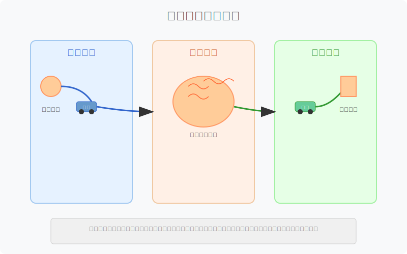
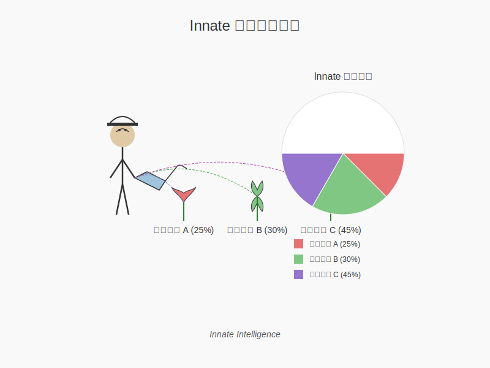
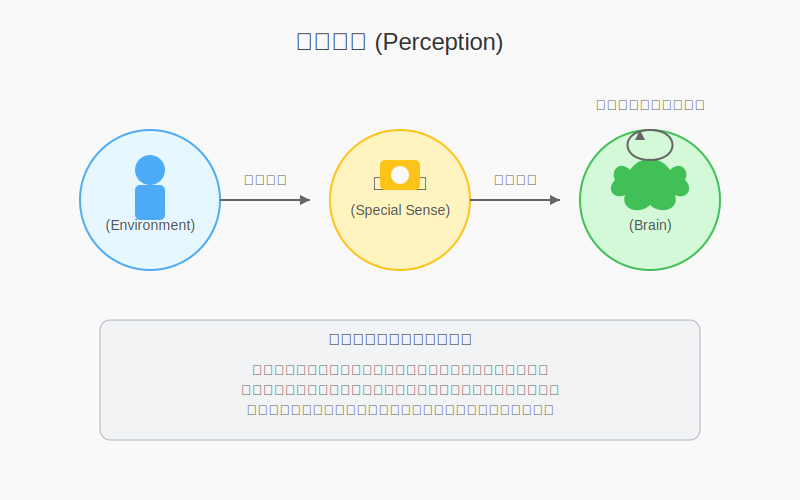
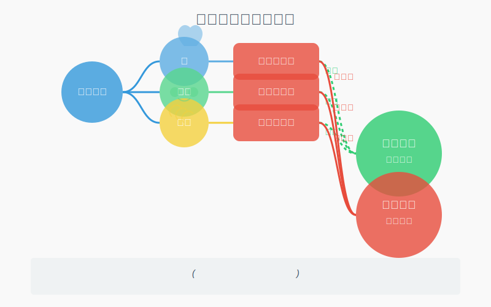
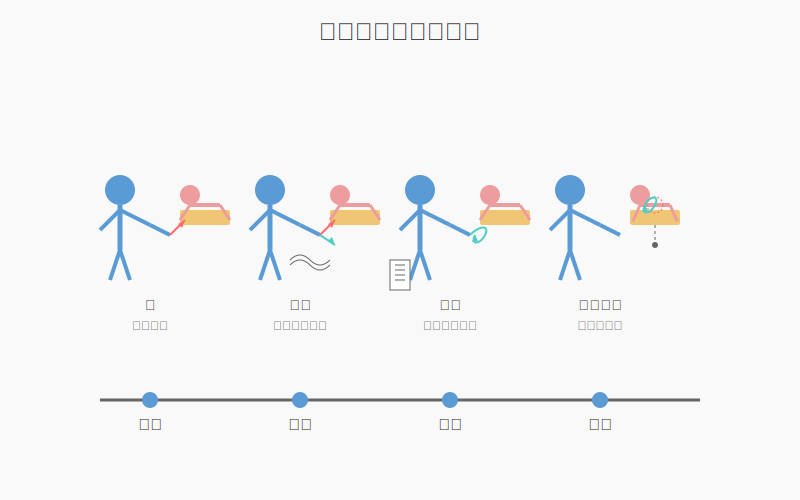
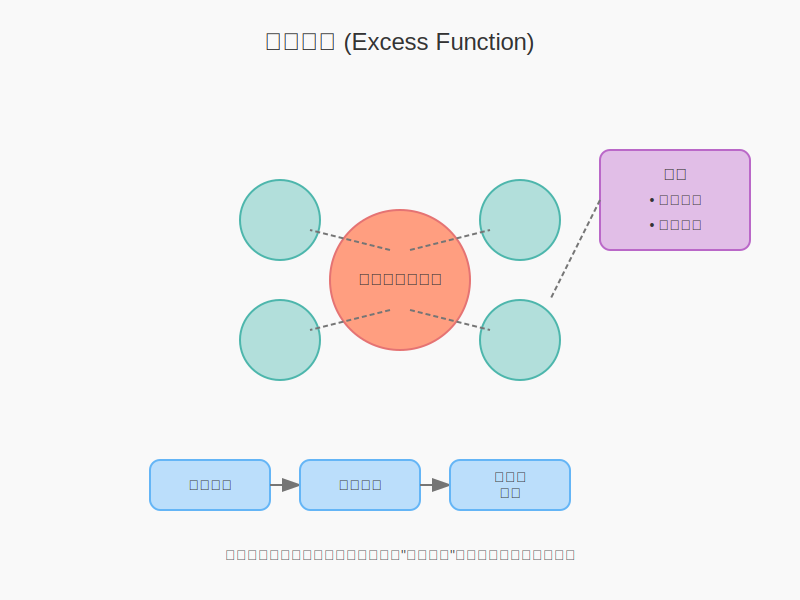
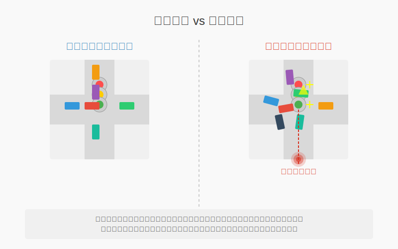
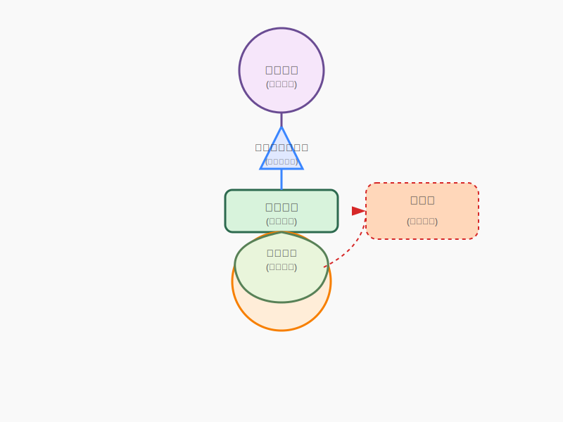
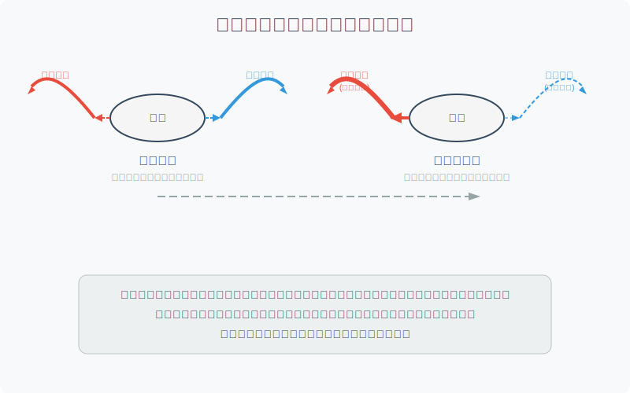

Source: Stephenson 1927

# Part 1 **体液与毒素：解读内在**
## 核心内容总结：毒素、体液与脊骨神经医学

本文探讨了在脊骨神经医学（Chiropractic）视角下，何为毒素、体液平衡（“湿人”与“干人”状态）、以及脊骨神经医学对血清循环的独特见解。文章深入解读了先天智慧（Innate Intelligence）在身体代谢和毒素排除中的作用，并阐明了脊骨神经医学与传统医学在毒素认知、食物与营养方面的差异。

**你能获得：**

*   理解脊骨神经医学对毒素、体液失衡的独特定义。
*   区分脊骨神经医学与传统医学在健康和营养方面的不同观点。
*   了解先天智慧在身体自我调节中的核心作用。

---

**核心内容：**

1.  **毒素 (Poison) 的定义：** 任何先天智慧无法用于代谢的物质，无论是进入身体的还是在身体内产生的。

* **详细解释：** 脊骨神经医学认为，毒素并非仅限于传统医学定义的有害物质，而是任何无法被身体有效利用的物质。这包括错位的、过量的、或被错误运输的腺体分泌物。
* **详细解释：** 黄疸是由于胆红素这种腺体分泌物在不应该存在的地方出现，从而成为一种毒素。
2.  **血清的毒素可能性：** 包括错位的腺体产物、过量的腺体产物、被运输的腺体产物，以及先天智慧无法用于身体总体代谢的物质。

* **详细解释：** 脊骨神经医学强调，腺体产物只有在先天智慧指定的位置才能被有效利用。如果腺体产物出现在不应该存在的地方，或者数量过多，都会成为毒素。此外，从一个身体引入另一个身体的腺体产物也是一种毒素。
* **详细解释：** 注射的血清可能被视为一种毒素，因为它来自于另一个身体，并非该身体自身产生的。
3.  **血清循环的终结：** 文章未明确描述血清循环的终结，需要查阅原文前后章节获取完整信息。
4.  **肾脏在血清循环中的作用：** 文章未明确描述肾脏在血清循环中的作用，需要查阅原文前后章节获取完整信息。
5.  **尿素 (Urea) 与尿液 (Urine) 的区别：** 文章未明确描述尿素与尿液的区别，需要查阅原文前后章节获取完整信息。
6.  **皮肤在血清循环中的作用：** 文章未明确描述皮肤在血清循环中的作用，需要查阅原文前后章节获取完整信息。
7.  **“湿人 (Wet Man)” 的含义：** 指的是由于血清异常潮湿导致的组织不健康状态，包括水肿、seredema（组织中尿素滞留导致的水肿）、uredema（尿毒症性水肿）等。

* **详细解释：** “湿人”状态可以表现为身体组织的“湿性精神错乱”，例如身体组织水肿；也可以表现为大脑组织的“湿性精神错乱”，例如脑积水（hydrocephalus）。
8.  **“干人 (Dry Man)” 的含义：** 指的是由于血清异常干燥导致的组织不健康状态，例如尿崩症患者的身体细胞状态。

* **详细解释：**  “干人”状态可以表现为身体组织的“干性精神错乱”；也可以表现为大脑组织的“干性精神错乱”。
9.  **“湿人”可能发生的途径：** 文章未明确描述“湿人”可能发生的途径，需要查阅原文前后章节获取完整信息。
10. **“干人”可能发生的途径：** 文章未明确描述“干人”可能发生的途径，需要查阅原文前后章节获取完整信息。
11. **Seredema 的定义：** 指的是组织中尿素未被清除，滞留在细胞或细胞附近的状况。有时也被称为传入性中毒（Afferent Poisoning），因为废物滞留在细胞的传入电流中，流动不够迅速。

* **详细解释：** Seredema 与水肿（Edema）不同，虽然可能表现出水肿症状，但研究重点是尿素中毒。
* **类比：** 植物也会排出废物，例如通过根部向土壤中排出固体废物，有些植物甚至会“毒害”自己的土地。
12. **消除 (Elimination) 与排泄 (Excretion) 的区别：** 文章未明确描述消除与排泄的区别，需要查阅原文前后章节获取完整信息。
13. **脊骨神经医学的发现：** 脊骨神经医学声称发现了血清循环，即血流、血清和淋巴系统之间的循环连接。
14. **传统医学对毒素的认知局限：**  传统医学 (Educated) 对毒素的认知依赖于经验积累，无法确定新物质是否为毒素，直到先天智慧给出判断。

* **详细解释：** 传统医学通过经验得知某些物质是有毒的，例如 carbolic acid（石炭酸）。但对于新的化学物质，必须经过实践检验，才能确定其是否为毒素。
15. **先天智慧对毒素的认知：** 先天智慧通过解读组织细胞的振动来识别毒素，并启动消除过程。

* **详细解释：** 先天智慧知道身体需要什么，不需要什么。传统医学只是先天智慧运作的一个生理过程，无法与先天智慧相提并论。
16. **食物 (Food) 的定义：** 指的是进入身体，经过消化和准备后，为组织细胞提供健康营养的物质。

* **详细解释：** 先天智慧会通过正常的饥饿、口渴和渴望来表达对必要元素的需要。
* **警告：** 错误地解读这些需求可能会导致疾病。
17. **饮食 (Diet) 的定义：**  通常理解的“节食”并非脊骨神经医学的观点。节食是试图通过后天方法来调节先天智慧，或者违背先天智慧的意愿。

* **详细解释：** 脊骨神经医学反对为了治疗疾病而节食，因为疾病的根本原因在于脊椎问题。脊骨神经医学认为，应该消除病因，而不是仅仅缓解症状。
18. **脊骨神经医学的饮食观：常识：** 给予身体先天智慧所需要的元素和数量，并通过正常的饥饿或口渴表达需求。

* **详细解释：** 不要试图确定卡路里或决定先天智慧应该使用哪些元素。

---

**问答：**

* **Q: 脊骨神经医学如何看待现代医学？**
* A: 脊骨神经医学并不鄙视现代医学的知识，但认为其对毒素的认知有限，更倾向于参考先天智慧的判断。某些现代医学药物在脊骨神经医学的视角下会被认为是毒素。

* **Q:  什么是先天智慧？**
* A:  先天智慧是身体内部的自我调节机制，它知道身体需要什么，不需要什么，并负责代谢、排毒等过程。

* **Q:  脊骨神经医学认为健康的关键是什么？**
* A:  脊骨神经医学认为健康的关键在于保持脊椎的正确排列，从而保证先天智慧的正常运作。

# Part 2 **神经系统：结构与功能**
## 神经系统解剖与功能概述

本文介绍了神经系统的基本结构，包括传入神经（Afferent Nerve Cells）、大脑（Brain）、脊髓（Spinal Cord）、脊神经（Spinal Nerves）和内脏神经系统（Visceral System），并阐述了脊椎神经学（Chiropractic）对神经系统的独特理解。阅读本文，你将了解神经系统的构成、功能以及脊椎神经学如何通过调整脊椎来影响神经功能，进而协调身体各器官的运作，提升身体健康。

### 核心内容

1.  **传入神经（Afferent Nerve Cells）的排列和功能**: 传入神经将感觉信息从身体外周传递到中枢神经系统。

* 传入神经的轴突（axons）从细胞体延伸到中枢神经系统，细胞体通常位于特殊感觉器官附近。例如，视网膜（retina）的多层结构中包含神经细胞体和神经纤维。
* 这些组织也由传出神经（Efferent Nerves）供应，部分传出神经通过海绵窦丛（cavernous plexus）从躯干的内脏系统（Visceral System）延伸而来。

2.  **大脑（Brain）的结构和功能**: 大脑是身体的控制中心，由大脑半球、小脑和脑干组成。

* 大脑由大脑（cerebrum）和小脑（cerebellum）组成。大脑分为左右半球，主要由灰质构成，负责高级认知功能。胼胝体（corpus callosum）连接两个大脑半球，由白质构成。小脑位于大脑下方，由灰质和白质组成，负责协调运动和平衡。
* 脑干（pons and medulla oblongata）连接大脑和脊髓，由白质纤维束构成，负责传递神经信号。
* 大脑被脑膜（meninges）覆盖，脑膜由三层坚韧的膜组成，保护大脑免受损伤。

3.  **脊髓（Spinal Cord）的结构和功能**: 脊髓是连接大脑和身体其他部分的神经通路。

* 脊髓是一条长圆柱形的神经纤维束，周围环绕着灰质。它从枕骨大孔（foramen magnum）延伸到第二腰椎（lumbar vertebra）。
* 脊髓也被脑膜覆盖，并通过终丝（filum terminale）固定在尾骨（coccyx）上。
* 脊髓内部通过齿状韧带（dentate ligaments）悬挂，并被结缔组织和脂肪保护。

4.  **脊神经（Spinal Nerves）的组成和分类**: 脊神经由前后根组成，分为传入神经和传出神经，负责传递感觉和运动信号。

* 脊髓的横截面显示灰质呈“H”形或“蝴蝶形”，四个末端称为角（horns）。前角发出传出神经（efferent nerves），后角进入传入神经（afferent nerves）。
* 脊神经由前根和后根联合而成，后根上有神经节（ganglion）。这些神经从椎间孔（intervertebral foramina）发出。

5.  **周围神经系统（Peripheral Nervous System）的分类**: 周围神经系统分为浅层神经系统、颅神经系统和内脏神经系统。

* 浅层神经系统（Superficial Nervous System）供应身体的浅层组织，包括肌肉、骨骼和皮肤。
* 颅神经系统（Cranial System）包括从大脑发出的12对颅神经，负责头面部的感觉和运动功能。
* 内脏神经系统（Visceral System）负责调节内脏器官的功能，包括交感神经和副交感神经。

6.  **内脏神经系统（Visceral System）的功能和重要性**: 内脏神经系统通过神经节链和神经丛控制内脏器官的功能。

* 内脏神经系统由神经节链和神经丛组成，这些结构位于颈部、胸部、腹部和盆腔内。
* 脊神经的轴突通过交通支（rami communicantes）进入神经节链，并与内脏神经细胞形成突触。
* 通过内脏神经系统，脊椎调整可以恢复内脏器官的协调，并影响颅脑器官的功能。

7.  **功能性神经（Functional Nerves）和代谢性神经（Metabolistic Nerves）的区别**: 功能性神经负责协调身体各部分，代谢性神经影响组织的“生命”质量。

* 功能性神经主要存在于脊神经中，负责协调身体各部分的活动。
* 代谢性神经主要存在于颅神经和内脏神经中，影响组织的营养和代谢。
* 对功能性神经的压迫会导致器官活动不协调，而对代谢性神经的压迫可能导致病理变化。

8.  **颅神经（Cranial Nerves）的特性和功能**: 颅神经从大脑发出，负责头面部和躯干的感觉和运动功能。

* 颅神经共有12对，包括嗅神经（olfactory）、视神经（optic）、动眼神经（oculomotor）、滑车神经（trochlear）、三叉神经（trigeminal）、外展神经（abducent）、面神经（facial）、听神经（acoustic）、舌咽神经（glosso-pharyngeal）、迷走神经（vague）、副神经（accessory）和舌下神经（hypoglossal）。
* 听神经不离开颅腔，其他颅神经通过颅骨上的孔进入头面部和躯干。
* 颅神经部分为传出神经，部分为传入神经，与内脏系统通过颈动脉丛（carotid plexus）和海绵窦丛（cavernous plexuses）相连。

9.  **神经作为通路（Conduits）的概念**: 神经不是单一的通路，而是包含许多轴突的束，这些轴突通往不同的组织区域。

* 一个神经包含数百个轴突，这些轴突可能通往不同的组织区域。
* 神经像电缆一样，包含许多导线，每根导线通往不同的目的地。
* 神经会多次分支，但轴突不会，除非在神经节（ganglia）中形成树突（arborizations）。

10. **神经丛（Plexuses）的作用**: 神经丛是神经的交叉或网状结构，有助于实现充分的神经分布。

* 神经丛是身体各处神经的交叉或网状结构，有助于实现充分的神经分布。
* 例如，臂丛（brachial plexus）和腰骶丛（lumbosacral plexus）负责上肢和下肢的神经供应。

### 问答

* **脊椎神经学如何看待大脑的功能？**

    脊椎神经学不仅认为大脑是思维的场所，还是先天智能（inborn intelligence）控制身体的总部，无论这种智能是否驻留在大脑中。

* **内脏神经系统与脊椎调整有什么关系？**

    内脏神经系统通过脊神经与脊髓相连，脊椎调整可以通过影响脊神经的功能，进而调节内脏神经系统的活动，恢复内脏器官的协调。

* **功能性神经和代谢性神经受到压迫后分别会导致什么问题？**

    功能性神经受到压迫会导致器官活动不协调，例如肌肉无法同步收缩；代谢性神经受到压迫可能导致病理变化，例如肌肉细胞异常增殖或营养吸收不良。

# Part 3 **神经冲动：传递与干扰**
## 神经节与神经传导

本文探讨了脊骨神经医学中神经节（Ganglia）的定义、神经传导（Transmission）的机制以及神经力（Innate Forces）传导受干扰的问题（Interference with the Transmission of Innate Forces）。通过阅读本文，你将了解：

*   神经节的组成和功能。
*   神经冲动的传导方式。
*   干扰神经传导的潜在原因及影响。

### 核心内容

#### 1. 神经节的定义与作用

神经节是神经细胞体和神经纤维聚集的部位，主要由灰质构成。可以理解为内在智能（Innate）的电话交换中心，其中包含神经生理学家所称的突触（synapses）。

* **突触（synapses）的脊骨神经医学（Chiropractic）理解：** 突触提供神经细胞之间的连接，生理学表明，即使没有明显的解剖学连接，神经纤维和树突之间也存在真实的“电话”连接。
* **神经通路：** 从脑细胞（Brain Cell）到组织细胞（Tissue Cell）的路线是明确的，要经过多个突触。可以将神经轴突（nerve axon）比作服务于多条道路的州际公路，而神经节中的神经纤维分支（arborizations）则可以比作道路分叉的地方。

#### 2. 神经传导的机制与理论

神经传导是指精神力（mental force）通过神经轴突的传导或输送。正常情况下，由普遍供给产生的精神冲动由神经细胞传导。如果精神冲动是 100% 正常的，则不会对神经造成任何伤害。文章提出了三种关于神经传导的理论：

* **能量理论：** 精神冲动是一种能量形式，由内在智能选择各种能量来平衡或增强组织细胞中已存在的能量。精神冲动必须具有针对特定组织细胞在特定时刻的正确能量百分比，并且必须毫无损失地传递到组织细胞，否则将无法按照内在智能的智力适应（Intellectual Adaptation）来平衡。
* **信息传递理论：** 神经中存在一种能量流，它是精神冲动的载体，类似于电话线通过电流来传递声音。精神冲动是一种思想，通过能量来传递。如果能量受到干扰，信息可能会受损。
* **信息本身理论：** 精神冲动不是能量，而是一种信息。信息只能由心智产生并被心智接收。组织细胞通过其适应性来接收信息。内在智能赋予神经细胞一种“冲动”，使其传递到组织细胞，组织细胞则以与“冲动”意图成比例的方式做出反应。

#### 3. 神经力传导的干扰

普遍力（universal forces）的传递会受到干扰，内在力（Innate forces）也不例外。神经组织非常敏感，无法承受粗暴的对待，例如挤压或碰撞。神经受压时，其分子或原生质活动会不正常，导致精神冲动在神经轴突上传递受阻，失去能量。文章同样从三种理论解释神经受压带来的影响：

* **能量理论：** 神经受到压迫导致不正常时，精神冲动会损失部分能量，变成不完整的能量单元，无法“安静地”通过神经，而是“叮当作响”。
* **信息传递理论：** 能量流动受到干扰，信息传递受损。
* **信息本身理论：** 神经细胞无法准确地传递内在智能的“冲动”，导致组织细胞接收到的信息不完整或错误。

*   即使电力传输也并非没有损耗，一部分能量会转化为热能。类似地，在神经中，精神能量也会在神经不正常的部分被浪费掉，产生热量。
*   局部半脱位（local subluxation）或局部受压（local impingement）是指神经轴突在离开椎间孔（foramen）时受到压迫。
*   少量热量不会影响相邻的神经轴突。
*   椎骨（bone）比软组织（softer wet tissue）更容易保持热量，因此在脊柱上难以感知热量。
*   在椎间孔处更容易感知热量，因为这是神经发热部位第一个可触及的地方，且只有软组织阻碍热量辐射。
*   精神冲动受到干扰时，不再是完美的内在力，因此会产生热量。

### 问答

* **问：神经传导的干扰是否会对身体造成长期影响？**

* 答：是的，如果神经传导长期受到干扰，组织细胞无法接收到正确的精神冲动，可能导致功能失调，引发疾病。
* **问：如何避免神经传导受到干扰？**

* 答：保持良好的姿势，避免长时间保持同一姿势，定期进行脊骨神经医学检查，及时纠正脊椎半脱位，都有助于维护神经系统的健康。

# Part 4 **脊骨神经医学索引**
**索引内容总结：**

该索引涵盖了脊骨神经医学（Chiropractic）的核心概念，从神经系统、心智、物质到脊椎半脱位（Subluxation）等，旨在帮助读者快速查找和理解相关主题。通过查阅索引，读者可以深入了解脊骨神经医学的哲学、科学和艺术，以及身体的自我修复机制。

预期收获：

*   快速定位脊骨神经医学的关键概念和术语。
*   深入理解脊骨神经医学的哲学基础。
*   掌握脊椎半脱位（Subluxation）的定义、成因和影响。

**核心内容：**

1.  **心智与智能 (Mind and Intelligence):** 探讨了“先天心智”（Innate Mind）、“后天心智”（Educated Mind）在生命活动中的作用，以及“普遍智能”（Universal Intelligence）与“身体智能”（Innate Intelligence）之间的关系。

* 先天心智：是与生俱来的，负责维持身体的正常运作。
* 后天心智：是通过学习和经验获得的，用于适应环境。
* 普遍智能：存在于所有物质中，是生命力的源泉。
* 身体智能：是普遍智能在生物体内的体现，负责协调身体的各个系统。
* **行动建议：** 培养积极的心态，通过学习和实践提升后天心智，同时尊重和信任身体的先天智能。

2.  **神经系统 (Nervous System):** 详细描述了传入神经（Afferent Nerves）和传出神经（Efferent Nerves）的功能，以及神经周期（Nerve Cycle）和神经的传导能力（Carrying Capacity）。

* 传入神经：负责将感觉信息从身体各处传递到大脑。
* 传出神经：负责将大脑的指令传递到身体各处。
* 神经周期：是指神经冲动产生、传递和消退的完整过程。
* 神经的传导能力：是指神经传递信息的效率和速度。
* **行动建议：** 保持良好的生活习惯，避免损伤神经系统的行为，如过度劳累、精神压力过大等。

3.  **脊椎半脱位 (Subluxation):** 解释了脊椎半脱位的定义、分类（如后侧半脱位 Posterior Subluxations、旋转 Rotations、倾斜 Tilted Vertebra），以及它与疾病（Dis-ease）之间的关系。

* 脊椎半脱位：是指脊椎骨的位置偏离正常，导致神经受到压迫或干扰。
* 脊椎半脱位会影响神经系统的正常功能，从而导致各种疾病。
* **行动建议：** 定期进行脊骨神经医学检查，及时发现和纠正脊椎半脱位。

4.  **生命迹象 (Signs of Life):** 列举了生命的基本特征，如组织（Organization）、适应性（Adaptation）、繁殖（Reproduction）等。

* 组织：是指生物体具有复杂的结构和功能。
* 适应性：是指生物体能够适应环境的变化。
* 繁殖：是指生物体能够产生新的个体。
* **行动建议：** 关注自身的生活方式，保持身体的活力，促进身体的自我修复能力。

**问答：**

* **什么是脊骨神经医学？**
    脊骨神经医学是一种以调整脊椎为主要手段，通过恢复神经系统的正常功能，从而促进身体健康的医学。

* **脊椎半脱位是如何产生的？**
    脊椎半脱位可能由多种因素引起，如外伤、姿势不良、精神压力等。

* **脊骨神经医学能治疗哪些疾病？**
    脊骨神经医学主要通过调整脊椎来改善神经系统的功能，从而缓解与神经系统相关的各种症状，如头痛、颈椎病、腰椎间盘突出等。但需要注意的是，脊骨神经医学并非万能，对于一些严重的疾病，仍需要寻求其他医疗手段的帮助。

# Part 5 **脊骨神经：生命周期与智能**
**《新生课本》核心内容总结**

本章主要阐述了脊骨神经医学中“正常完整周期”的概念，强调感觉是 Innate（天赋智能）对能量转化的产物，以及 Innate 如何通过感觉、意念和智力适应来维持身体的平衡。了解 Innate 在身体中的运作机制，有助于理解健康和疾病的本质。

**预期收获：**

*   理解脊骨神经医学中 Innate 的作用。
*   掌握“正常完整周期”的运作流程。
*   认识健康与疾病之间的联系。

**核心内容：**

1.  **感觉是 Innate 的产物：** 感觉是一种精神过程，始终存在于大脑中，是 Innate 对接收到的信息进行解释的结果。感觉本身永远不会异常，但可能感知到异常的事物。

* **详细解释：** 当你触摸一个物体时，感觉似乎在手指上，但实际上感觉是在大脑中产生的。手指的细胞只是将信息传递给大脑，如果没有大脑的 mental process（精神过程），这些信息将毫无意义。

2.  **正常完整周期：** Universal Intelligence（宇宙智能）赋予物质属性和作用，Innate Intelligence（天赋智能）维护身体的活跃组织，通过智力适应来协调身体各部分。

* **详细解释：** 宇宙智能是所有能量的来源，而天赋智能是宇宙智能在有机体中的体现。天赋智能通过大脑细胞向组织细胞发送 mental impulse（精神冲动），维持身体的平衡和协调。组织细胞的活动会产生 physical forces（物理力量），通过 afferent nerve（传入神经）将信息传递给大脑，Innate 根据这些信息进行智力适应。

3.  **智力适应（Intellectual Adaptation）：** Innate 根据接收到的印象，制定计划来适应环境，利用 universal forces（宇宙力量）和物质。智力适应是 mental process（精神过程），而适应（adaptation）是智力适应的 physical personification（物理体现）。

* **详细解释：** 当 Innate 接收到组织细胞的 material conditions（物质条件）和 forces（力量）的信息后，会根据这些信息进行判断，并制定相应的 response（响应），以维持身体的和谐。

4.  **Innate 的持续变化：** 从 brain cell（脑细胞）到 tissue cell（组织细胞）的 mental flow（精神流动）不是 constant（恒定不变）的，而是 always is changing（不断变化）的。Innate Intelligence（天赋智能）的关注度始终是 100%，但这并不代表数量，而是代表 perfection of change（变化的完美）。

* **详细解释：** 身体的每一个组织细胞都需要 Innate 的关注，但每个组织细胞的需求是不同的，因此 Innate 会根据每个组织细胞的需求进行调整。

5.  **需求与供应：** tissue cell（组织细胞）的 actions（活动）会产生 physical forces（物理力量），这些力量会影响 afferent nerve（传入神经），传入神经会将 impressions（印象）传递给“clearing house”（信息处理中心），Innate 在这里了解组织细胞的需求。

* **详细解释：** 组织细胞越活跃，需要的 adaptation（适应）就越多。例如，muscle cell（肌肉细胞）比 bone cell（骨细胞）更活跃，因此需要更多的 forces（力量）和 material supply（物质供应）。

6.  **Universal Intelligence（宇宙智能）是能量之源：** Universal Intelligence 是所有奇迹的源头，它是无限的，无法完全描述，也无法定义。它是 Normal Complete Cycle（正常完整周期）的开始和结束。

**问答：**

* **问：什么是 afferent Transmission（传入传递）？**
* 答：Afferent Transmission 是 impressions（印象）通过 Afferent Nerve（传入神经）传递的过程。

* **问：什么是 Ideation（意念）？**
* 答：Ideation 是 Innate 根据 sensation（感觉）对 tissue cell（组织细胞）状况形成的正确图像，它是 intelligence（智能）的 possession（所有物）。

* **问：mental impulse（精神冲动）是 physical force（物理力量）吗？**
* 答：有一些理论认为 mental impulse 是一种 physical force，但它是一种 adapted form（适应形式），不会对 tissue（组织）造成伤害。

**行动建议：**

1.  仔细研究 Chiropractic 的 principles（原则），理解每个原则的含义。
2.  尝试用自己的语言描述 Normal Complete Cycle（正常完整周期）的运作流程。
3.  思考如何将 Chiropractic 的 principles（原则）应用到日常生活中。

希望这些总结能帮助你更好地理解《新生课本》的核心内容。

# Part 6 **环境与疾病：身体内外之战**
本文探讨了环境因素如何影响人体健康，以及脊骨神经医学（Chiropractic）对疾病、细菌、免疫等概念的独特见解。理解环境与健康的关联，颠覆对疾病的传统认知，掌握脊骨神经医学的健康哲学。

核心内容：

1.  **环境因素对健康的影响:** 不利的气候、恶劣的卫生条件、腐败物质的气体（Effluvia）等都会对人体健康产生负面影响。

* **不利气候:** 气候过于潮湿会降低空气中的氧气含量，影响身体散热和排汗。
* **恶劣卫生:** 不良卫生条件会污染空气、水源和食物，滋生细菌。
* **腐败气体:** 腐败的有机物会释放有毒气体，通过肺部进入血液循环，导致中毒。

2.  **脊骨神经医学对细菌的看法:** 脊骨神经医学并不否认细菌的存在，但认为细菌是清道夫，只在异常组织或分泌物上滋生，疾病的根源在于脊椎半脱位（Subluxation）。

* 脊骨神经医学认为有些细菌是有益的，甚至对人体是必需的。
* 细菌只有在人体抵抗力下降、出现异常组织时才会大量繁殖并产生毒害。
* 疾病的根本原因是脊椎半脱位，导致组织异常，为细菌滋生提供温床。

3.  **寄生虫与免疫:** 寄生虫会掠夺宿主的营养，健康的身体可以通过分泌物驱逐寄生虫。

* 寄生虫与清道夫细菌不同，它们需要活体组织或营养物质才能生存。
* 身体的抵抗力下降会导致寄生虫入侵，而健康的身体可以通过自身机制（如分泌物）来清除寄生虫。
* 脊骨神经医学认为，脊椎矫正可以增强身体的抵抗力，从而清除寄生虫。例如，通过脊椎矫正可以杀死绦虫。

4.  **流行病 (Epidemics)、传染 (Contagion) 与感染 (Infection):** 脊骨神经医学认为，流行病是攻击抵抗力差的人群的不利环境因素。传染和感染是疾病传播的途径，但疾病的根本原因仍然是脊椎问题。

* 流行病是各种不利环境因素的综合体现，如恶劣的水质、天气、食物等。
* 脊骨神经医学认为，脊椎半脱位是导致身体无法适应这些不利因素的原因。
* 传染和感染是疾病传播的途径，但脊骨神经医学强调，细菌和毒素并非疾病的根本原因，脊椎问题才是。

5.  **血液中毒 (Blood Poison):** 脊骨神经医学认为血液本身不会生病，但血液循环可以携带毒素。

* 脊骨神经医学不认为血液像结缔组织一样会发生疾病。
* 血液作为体液循环的一部分，可以携带体内产生的或外部引入的毒素。

6.  **免疫 (Immunity):** 免疫是组织细胞的适应性抵抗力，依赖于完美的精神冲动传递。

* 免疫力取决于组织细胞的健康状态和适应能力。
* 组织细胞的完美状态依赖于精神冲动的完美传递，而精神冲动的传递受到脊椎的影响。

7.  **周期性和复发性疾病 (Periodical and Recurrent Dis-eases):** 毒素积累超过了消除能力，导致周期性发作。

* 毒素积累到一定程度，身体会通过危机（如癫痫发作、高烧）来释放。
* 脊椎半脱位可能导致身体在特定季节或环境下需要更多适应时出现问题。

8.  **发烧 (Fevers) 的哲学:** 脊骨神经医学认为，发烧是身体试图通过肺部排出毒素的过程，但由于排毒通道受阻，导致体温升高。

* 毒素在血液循环中积累，身体会感到寒冷。
* 身体试图通过肺部将毒素转化为二氧化碳排出，这个氧化过程会产生热量。
* 如果身体的正常排毒通道（如肾脏、皮肤）不畅通，热量无法散发，导致体温升高。
* 脊椎矫正可以恢复排毒器官的功能，从而缓解发烧。

9.  **B.J. Palmer 的发烧周期:** 将发烧过程分为三个阶段：入侵（Chill）、潜伏（Fever）和恢复（Sweat），每个阶段都对应着特定的生理和脊椎状态。

    | 阶段     | 方面       | 脊椎状态 |
    | -------- | ---------- | -------- |
    | 入侵     | 寒战       | E-       |
    | 潜伏     | 发烧       | C+       |
    | 恢复     | 出汗       | O        |

10. **强烈情绪 (Strong Emotions) 的毒素:** 强烈的情绪，如忧虑、恐惧、愤怒等，会产生毒素，影响血液循环。

* **理论1:** 强烈的情绪会产生冲击力，作用于脊椎区域的组织。
* **理论2:** 强烈的情绪会影响身体的分泌物，使其产生毒性。
* **理论3:** 强烈的情绪会导致大脑产生过多的二氧化碳和其他废物，进入血液循环。

11. **疲劳 (Fatigue) 的毒素:** 无论是脑力疲劳还是体力疲劳，都会产生废物，如果这些废物不能及时排出，就会对身体产生毒害。

12. **刺激 (Stimulation):** 分为直接刺激（作用于死亡组织）和间接刺激（活体组织对刺激的适应性反应）。

* 直接刺激是作用于死亡组织的，会导致组织产生类似功能的活动，但这种活动是无适应性的。
* 间接刺激是活体组织对入侵刺激的适应性反应，这种反应可能会被误认为刺激本身引起了活动。
* 脊骨神经医学认为，精神冲动不是刺激，刺激不具有适应性特征。

13. **抑制 (Inhibition):** 抑制是指通过药物等作用抑制组织细胞的活动，同时增加其工作负担。脊骨神经医学认为，真正的抑制剂是毒药，会导致细胞做出剧烈反应，随后精疲力竭。

问答：

* **问：脊骨神经医学如何看待细菌？**
* 答：脊骨神经医学不否认细菌的存在，但认为细菌是清道夫，只在异常组织或分泌物上滋生。疾病的根源在于脊椎半脱位，它导致组织异常，为细菌滋生提供温床。

* **问：脊骨神经医学对发烧的解释是什么？**
* 答：脊骨神经医学认为发烧是身体试图通过肺部排出毒素的过程。由于排毒通道受阻，导致体温升高。通过脊椎矫正，可以恢复排毒器官的功能，从而缓解发烧。

# Part 7 脊椎半脱位：定义与成因
### 脊椎半脱位：定义、成因及内外力作用

**核心内容：**

本书深入探讨了脊椎半脱位（Subluxations）的定义、类型、成因以及相关内外力的作用。通过阅读，您将了解：

1.  **脊椎半脱位的定义：** 脊椎失去与相邻椎骨的正常位置关系，压迫神经并干扰精神冲动的传递。
2.  **脊椎半脱位的类型：** 后方半脱位（Posterior Subluxations）是最常见的类型，通过棘突的位置（P., P.R., P.L., P.S., P.I., P.R.S., P.R.I., P.LS., P.L.I.）进行描述。
3.  **脊椎半脱位的成因：** 由不平衡的阻抗力应对侵入性穿透力导致。
4.  **内外力的作用：** 外部力量（External Forces）和穿透力量（Penetrative Forces）可能导致半脱位，而内部力量（Internal Forces）和阻抗力量（Resistive Forces）则用于抵抗这些力量。

**详细解释：**

* **脊椎半脱位的定义：**
* 脊椎半脱位是指椎骨与其上方或下方的椎骨失去正常的生理位置关系，但程度小于完全脱位（luxation）。
* 半脱位压迫神经，干扰大脑通过神经传递的信息（精神冲动），这是脊椎矫正学定义的核心。
* 解剖学或手术定义：关节元素位移，关节不在正确位置。
* **脊椎半脱位的类型：**
* 后方半脱位是最常见的类型，其主要位移方向是向后的。
* 通过棘突的位置来描述，棘突可能向右或向左旋转（“外侧性”），或向上或向下。
* 描述位置的方法是使用方向的首字母，例如 P.（后方）、P.R.（后方右旋）等。
* 矫正时的推动方向与描述的方向相反。
* **脊椎半脱位的成因：**
* 半脱位是不平衡的阻抗力对侵入性穿透力反应的结果。
* 阻抗力不平衡是由于物质的限制或侵入力的性质。
* 根据牛顿第三定律，每个作用力都有一个相等且相反的反作用力。
* 先天的力量（Innate）会适应性地产生阻力，以应对侵入性的力量。
* 脊柱是吸收身体大部分反应的部位，因此最容易受到影响。
* **内外力的作用：**
* **外部力量：** 环境、宇宙或物理力量，不是由先天智慧组装的，主要特点是不具有适应性。
* **穿透力量：** 侵入性力量，强行进入身体，先天力量试图驱逐或阻止其作用。可能以物理、化学或机械形式存在。
* **内部力量：** 先天力量制造的力量，用于身体内部，为了适应其他宇宙力量。
* **阻抗力量：** 内部力量（先天力量）被调用来对抗穿透力量，可能以物理、化学或机械形式存在。

**例子：**

* **跳跃的例子：** 一个人习惯从平台上跳下，如果地面突然变成柔软的羽毛坑，那么他很可能会出现半脱位，因为他身体预期的是坚硬的地面，而实际情况不符。
* **举重的例子：** 当一个人试图举起过重的物体时，脊柱会承受巨大的压力。如果超过了组织的承受能力，最薄弱的地方会突然失效，导致椎骨间的不平衡力。

**行动建议：**

*   了解脊椎半脱位的定义和成因，有助于更好地理解脊椎矫正的原理。
*   注意日常生活中的姿势和动作，避免不平衡的力量作用于脊柱。
*   在进行体力活动前，做好充分的准备，以减少受伤的风险。

**问答：**

* **问：脊椎半脱位一定会引起症状吗？**
* 答：不一定。有些脊椎半脱位可能不会引起明显的症状，但长期存在可能会影响神经功能和身体健康。
* **问：脊椎矫正是否可以治疗所有的脊椎半脱位？**
* 答：脊椎矫正可以帮助纠正脊椎半脱位，恢复脊椎的正常功能。但是，对于一些严重的或复杂的病例，可能需要结合其他治疗方法。
* **问：如何预防脊椎半脱位？**
* 答：保持正确的姿势、进行适当的运动、避免过度劳累和外伤、定期进行脊椎检查等，都有助于预防脊椎半脱位。

# Part 8 **生命力 (Life Force) 与疾病**
本文阐述了脊骨神经医学（Chiropractic）中**先天力量 (Innate Forces)**、**创伤 (Trauma)**、**疾病 (Disease)** 和 **不适 (Dis-ease)** 的概念，以及它们之间的关系。通过了解这些概念，能更好理解脊骨神经医学的理论基础，掌握身体如何应对内外压力，并对疾病的产生和治疗有更深入的认识。

## 核心内容：

1.  **先天力量 (Innate Forces)**：人体内在的、用于适应环境和维持功能的通用力量。
* 是身体适应内外环境的关键，分为适应性力量和抵抗性力量。
* 适应性力量帮助平衡和调节身体功能。
* 抵抗性力量对抗入侵力量，如机械力或化学物质。
* 抵抗性力量若不协调，可能导致身体损伤。

2.  **创伤 (Trauma)**：因意外或中毒造成的组织细胞损伤，不一定导致疾病。
* 创伤后的组织细胞未受感染，若神经传导正常，愈合迅速。
* 与脊骨神经医学关注的**不协调 (incoordination)** 不同，创伤主要属于外科处理范畴。
* 脊骨神经医学的介入仅限于创伤引起椎骨半脱位 (subluxations)，干扰神经脉冲传递的情况。

3.  **疾病 (Disease) vs. 不适 (Dis-ease)**：医学和脊骨神经医学对“不健康”的不同理解。
* 医学将疾病视为需要诊断和命名的实体。
* 脊骨神经医学关注的是“不适 (Dis-ease)”，即身体缺乏正常运作所需的要素。
* 脊骨神经医学的目标是恢复身体的协调性、健康和功能，达到100%的最佳状态。

4.  **不适 (Dis-ease) 的根本原因**：神经脉冲传递受阻。
* 椎骨半脱位 (subluxation) 是导致神经脉冲传递受阻的物理表现。
* 神经脉冲传递受阻会阻止身体进行适应性调节，导致组织细胞功能异常和不健康。
* 不受控制的通用力量会对组织细胞造成损害，导致不协调和不适 (Dis-ease)。
* 只有通过内在的先天力量 (Innate Forces) 才能恢复组织细胞的健康，外部治疗无法从根本上解决问题。

5.  **异常周期 (Abnormal Cycle)**：包括大脑到器官以及大脑到椎体的异常循环。
* 神经传递异常导致分子活动异常，影响组织细胞的正常功能。
* 受损的组织细胞释放出异常的振动，通过传入神经传递回大脑。
* 先天智能 (Innate Intelligence) 通过解释这些信息，制定补偿计划以应对异常情况。

6.  **特殊感官适应 (Special Sense Adaptation)**：通过特殊感官接收环境信息的过程。
* 正常情况下，感官接收信息，传递给大脑，大脑进行解释并做出适应性反应。
* 异常情况下，传入神经或传出神经受到干扰，影响感官信息的传递和身体的反应。

7.  **将异常周期应用于症状学 (Symptomatology)**：以慢性椎骨半脱位 (subluxations) 和急性椎骨半脱位 (subluxation) 引起的鼻炎 (coryza) 为例。
* 解释了如何将异常周期应用于具体的疾病症状，包括直接和间接的影响。
* 强调了椎骨半脱位 (subluxations) 对神经传递和身体功能的影响。

## 问答：

* **问：什么是椎骨半脱位 (subluxation)？它为什么会导致不适 (Dis-ease)？**

* 答：椎骨半脱位 (subluxation) 是椎骨轻微错位，压迫神经，干扰神经脉冲的正常传递。神经脉冲传递受阻会影响身体的正常功能，导致组织细胞无法正常工作，从而产生不适 (Dis-ease)。

* **问：脊骨神经医学如何治疗不适 (Dis-ease)？**

* 答：脊骨神经医学主要通过手法调整椎骨半脱位 (subluxation)，解除神经压迫，恢复神经脉冲的正常传递。 从而激发身体的自愈能力，使组织细胞恢复正常功能，最终消除不适 (Dis-ease)。

# Part 9 **天人合一：健康之道**
**营养卫生、内在智慧与环境因素**

本文强调营养卫生是常识而非节食，主张恢复自然环境，通过内在智慧（Innate Intelligence）指导饮食，避免人为干扰。同时，强调适量运动和清洁环境对健康的重要性，以及恶劣环境对健康的潜在危害。

阅读本文，你将了解到：

*   如何通过常识而非盲目节食来维护健康。
*   内在智慧在饮食和生活方式选择中的重要作用。
*   如何识别和避免环境中的潜在危害，从而改善健康状况。

***

### 核心内容

1.  **营养卫生是常识的回归**

    营养卫生并非刻意的节食，而是回归正常、自然的环境状态。通过理智的思维方式，配合人体内在的智慧（Innate Intelligence），恢复因不良生活习惯造成的身体异常。

* **内在智慧（Innate Intelligence）**：指人体内在的、与生俱来的智慧，能够指导身体的各种功能，包括对食物的需求。
* **教育性思维（Educated mind）**：指通过后天学习和经验获得的知识和思维方式，应与内在智慧协调一致。

2.  **内在智慧主导，教育性思维辅助**

    人体的营养应由内在智慧主导，教育性思维辅助。内在智慧通过正常的饥饿和口渴来表达对物质的需求，通过对运动或精神锻炼的渴望来表达对非物质的需求。

* **教育性思维的作用**： 在选择食物时，教育性思维应起到辅助作用，而不是阻碍内在智慧。

3.  **食物与水的选择原则**

    不必要的食物和水是毒药；身体需要时，拒绝提供食物和水是对内在智慧的侮辱。人工食品和消毒过的水也是“毒药”，因为它们不天然，身体的进化结构不熟悉它们。

* **自然原则**： 遵循自然原则，选择未经过度加工的天然食物和水。
* **食物多样性**： 人类是杂食动物，应摄入肉类和蔬菜。
* **倾听身体**： 尊重身体对食物的渴望，避免盲目听从不合理的饮食建议。

4.  **运动的重要性**

    运动是身体及其各部分自然、正常的活动，以获得正常的适应。适度的运动带来自然的疲劳，过度运动则导致有害的疲惫。

* **自然运动**： 强调自然、均衡的身体发展，而非过度或不自然的锻炼。
* **户外运动**： 推荐户外运动，以获得新鲜空气和阳光。

5.  **卫生与文明的平衡**

    卫生在脊骨神经医学（Chiropractic）中，指的是恢复因文明生活而变得不自然的健康环境条件。在无法完全恢复自然条件的情况下，必须做出补偿。

* **文明的代价**： 文明生活需要个人在喜好和必需品上做出牺牲，以实现社区生活。
* **补偿措施**： 针对文明生活带来的不健康因素，如不规律的工作时间、不健康的食物、缺乏阳光和新鲜空气等，采取相应的补偿措施。

6.  **环境毒素的影响**

恶劣的环境条件会影响健康，使正常的适应变得困难甚至不可能。环境毒素并非疾病的直接原因，但会进一步限制身体的适应能力。

* **环境毒素来源**： 不纯净的水、空气、食物，恶劣的气候，不良的卫生条件，以及细菌等。
* **个体差异**： 身体虚弱的人更容易受到环境毒素的影响。
* **适应能力**： 身体的适应能力有限，过度暴露于恶劣环境中可能超出身体的承受范围。

7.  **水、食物和空气作为环境因素**

不纯净的水、食物和空气都可能对身体产生毒害作用。纯净的水应含有无害的矿物质和细菌；纯净的食物应不含化学物质和毒气。

* **水**： 不纯净的水可能含有腐烂物质、有毒气体或有害矿物质。
* **食物**： 不纯净的食物可能含有化学物质、有毒气体或已发生化学变化。
* **空气**： 不纯净的空气可能含有过多的二氧化碳、过少的氧气、有害细菌或有毒气体。

***

### 问答

* **Q: 为什么药物被认为是“毒药”？**

    A: 因为药物并非天然物质，且通常用于缓解症状而非解决根本问题。长期使用可能导致身体依赖，并掩盖潜在的健康问题。

* **Q: 内在智慧如何表达对食物的需求？**

    A: 内在智慧通过正常的饥饿感和口渴感来表达对食物和水的需求。对某些食物的渴望也可能是内在智慧在发出信号。

* **Q: 脊骨神经医学（Chiropractic）对节食有什么看法？**

    A: 脊骨神经医学（Chiropractic）不反对通过节食来改变体型，但认为这更多是出于时尚而非健康的原因。更提倡通过均衡饮食和适量运动来达到健康的体型。

# Part 10 脊骨神经医学论文写作指南
### Ph.C. 论文写作指南

本节介绍了撰写 Ph.C.（哲学博士，Doctor of Philosophy）论文的规范、流程、评分标准及选题建议，旨在提高论文质量，降低被拒率，并鼓励学生通过写作论文来加深对脊骨神经医学（Chiropractic）的理解，成为更优秀的脊骨神经医师（Chiropractor）。

**你能获得：** 掌握 Ph.C. 论文的写作技巧，了解评分标准和选题方向，提升论文质量，顺利毕业并成为优秀的脊骨神经医师。

**核心内容：**

1.  **格式规范：**

* 左侧留边至少 1.25 英寸。
* 段落首行缩进。
* 可以为主题添加标题，但不建议为子主题或段落添加标题。
2.  **校对：** 仔细检查排版错误，确保内容准确无误，不要依赖打字员的专业知识。
3.  **装订：**

* 在顶部或左侧装订。
* 最好使用结实的封面纸。
* 务必签名，写上序列号、地址，毕业后提供邮寄地址。
4.  **提交：**

* 提交或发送到 P.S.C.（可能是 Palmer School of Chiropractic）的哲学系（Department of Philosophy）。
* 评分后，系里会通知结果，如果需要修改，则需修改后缴纳毕业证书费用等。
5.  **评分标准：**

* 主要基于脊骨神经医学的知识。
* 考察陈述的真实性、作者的知识水平、写作原则的运用以及对主题的坚持。
* 评分方法由系里自行决定。

6.  **Field Writers（实地从业者）的要求：** 与在校学生的要求相同，提交论文后，待收到接受通知书后再支付支票，支票用于支付羊皮纸文凭的费用。

7.  **选题建议：** 提供了一系列论文选题，包括：

* The Serous Circulation（浆液循环）
* The Circulations of the Body（身体的循环）
* Local and Condition（局部与状况）
* Poison（毒素）
* The Method of Chiropractic Analysis（脊骨神经医学分析方法）
* Chiropractic Hygiene（脊骨神经医学卫生）
* Function（功能）
* The General Principles of Chiropractic（脊骨神经医学的一般原则）
* The Specific Principles of Chiropractic（脊骨神经医学的特定原则）
* Intellectual Adaptation（智力适应）
* Immunity（免疫力）
* Cause and Effect（因果关系）
* The Normal Complete Cycle（正常完整周期）
* Chiropractic Cycles（脊骨神经医学周期）
* The Universal Cycle（宇宙周期）
* The Sex Cycle（性周期）
* Evolution and Heredity（进化与遗传）
* Internal and External Forces（内部与外部力量）
* Inductive and Deductive Methods（归纳与演绎方法）
* Practical Philosophy（实用哲学）
* The Philosophy of Chiropractic Analysis（脊骨神经医学分析哲学）
* The Simplicity of Chiropractic（脊骨神经医学的简单性）
* Theories and Facts of Chiropractic（脊骨神经医学的理论与事实）
* The Philosophy of Adjusting（调整的哲学）
* The Philosophy of Technic（技术的哲学）
* The Art of Chiropractic（脊骨神经医学的艺术）
* The Science of Chiropractic（脊骨神经医学的科学）
* Chiropractic Veterinarians（脊骨神经医学兽医）
* Insanities（精神错乱）
* The Philosophy of Restoration（恢复的哲学）
* Transmission（传递）
* Abnormal Function（异常功能）
* Coordination（协调）
* Deductions of Chiropractic（脊骨神经医学的推论）
* Concrete Subjects of Chiropractic（脊骨神经医学的具体主题）
* The Mental Realm（精神领域）
* Germs（细菌）
* Innate—Contractor and Builder（内在智能——缔造者和建设者）
* Innate—Caretaker（内在智能——守护者）
* Universal Intelligence—Designer（宇宙智能——设计者）
* Clinical Facts（临床事实）
* The Philosophy of Anatomy（解剖学哲学）
* Chiropractic Etiology（脊骨神经医学病因学）
* The Seven Point Drill（七点练习）
* As a Man Thinketh（一个人所思）
* The Physical Realm（物理领域）
* The Conductors of Mental Force（精神力的导体）
* Mind（精神）
* The Cause of Dis-ease（疾病的原因）
* The Law of Demand and Supply（供需定律）
* 选择本书中给出的 33 条原则中的任何一条来展开。

8.  **论文提纲示例：** 以 “Innate—Contractor and Builder（内在智能——缔造者和建设者）” 为例，展示了如何从初步的“想说的事情”列表，到形成最终的论文提纲的过程。提纲包括：

* Introduction（介绍）
* Life（生命）
* Evolution values（进化价值）
* The Germ（胚芽）
* The Blastoderm（胚盘）
* The Signs of Life（生命的迹象）
* Development of the body（身体的发育）
* Evidence of Innate’s work in every place（内在智能在每个地方工作的证据）
* Conclusion（结论）

9.  **强调原创性：** 鼓励学生撰写自己的论文，避免抄袭，并指出撰写论文是学习脊骨神经医学的最佳方式。

**详细解释：**

* **格式规范：** 统一的格式能够提高论文的可读性，方便读者理解和评估论文的内容。左侧留边是为了方便装订和阅读，段落缩进是为了区分不同的段落，主题标题是为了突出文章的重点。
* **校对：** 论文的准确性至关重要，任何错误都可能影响论文的质量和可信度。作者需要仔细检查论文，确保没有语法、拼写或排版错误。
* **装订：** 装订能够保护论文，使其易于保存和查阅。使用结实的封面纸可以提高论文的耐久性。签名和地址是为了方便联系作者，以便在论文被引用或需要进一步讨论时能够及时沟通。
* **提交：** 按照规定的流程提交论文，可以确保论文能够及时被评审，并获得相应的反馈。
* **评分标准：** 评分标准是评估论文质量的依据。了解评分标准可以帮助作者更好地撰写论文，提高论文的得分。
* **Field Writers 的要求：** 确保实地从业者提交的论文质量与在校学生相当，保证了 Ph.C. 学位的含金量。
* **选题建议：** 选题是论文写作的第一步，选择一个合适的题目可以激发作者的兴趣，提高论文的质量。
* **论文提纲示例：** 提纲是论文的框架，它可以帮助作者组织思路，确保论文的内容结构清晰、逻辑严谨。
* **强调原创性：** 鼓励学生独立思考，撰写自己的论文，避免抄袭，这有助于培养学生的独立研究能力和创新精神。

**问答：**

* **Q: 为什么需要撰写 Ph.C. 论文？**

* A: 撰写 Ph.C. 论文是获得 Ph.C. 学位的必要条件，也是加深对脊骨神经医学理解的最佳方式。通过撰写论文，学生可以系统地整理和总结所学知识，提高独立思考和研究能力，并为未来的职业发展打下坚实的基础。

* **Q: 如何选择一个合适的论文题目？**

* A: 选择论文题目时，应考虑以下几个因素：
    * **兴趣：** 选择自己感兴趣的题目，可以激发写作热情，提高论文的质量。
    * **知识储备：** 选择自己熟悉的题目，可以减少学习成本，提高写作效率。
    * **研究价值：** 选择具有研究价值的题目，可以使论文更有意义，更有可能被认可。

* **Q: 如何避免论文抄袭？**

* A: 避免论文抄袭的方法包括：
    * **独立思考：** 独立思考，用自己的语言表达观点。
    * **引用规范：** 规范引用参考文献，标明出处。
    * **查重检测：** 使用查重软件检测论文的重复率。

### 脊骨神经医学研究

本节阐述了脊骨神经医学研究的重要性，强调了 B. J. Palmer 在发展和系统化脊骨神经医学原理方面的贡献，并指出医学界对神经干扰与疾病之间关系的日益关注，以及对脊骨神经医学哲学的证实。

**你能获得：** 了解脊骨神经医学研究的现状和未来趋势，认识到 B. J. Palmer 的贡献，并理解医学界对脊骨神经医学的关注。

**核心内容：**

1.  **脊骨神经医学研究的重要性：** 先进的研究正在证实脊骨神经医学的“古老的脊骨神经医学哲学”的合理性。科学界越来越关注脊骨神经医学的根本原则。
2.  **B. J. Palmer 的贡献：** B. J. Palmer 毕生致力于发展和系统化脊骨神经医学的实用原则，使世界能够了解和欣赏脊骨神经医学。他的工作在许多大学和学院中被实际复制。
3.  **医学界的研究：** 医学界正在研究神经干扰作为疾病的原因，以及恢复神经传递作为疾病的治疗方法。
* 已经有 475 位医学人士在研究神经干扰作为疾病的起因，以及神经传递恢复作为疾病的疗法。
* 104 个领先的医疗机构直接参与该研究。
* 263 种医学出版物发表了关于该主题的文章。
* 这些医学研究证实了脊骨神经医学和 B. J. Palmer 脊骨神经医学诊所的最新研究。

4.  **医学的演变：** 医学已经经历了血液、细菌和疫苗等多种理论，现在正在转向研究大脑、神经和能量流动，以及神经冲动对生理、症状和病理的影响。医学界正在入侵一个“新领域”，希望他们的研究最终能够建立一些可以解释疾病原因和治疗方法的有形的东西。
5.  **“古老的脊骨神经医学哲学”的证实：** 医学界的新研究正在证实“古老的脊骨神经医学哲学”，尽管医学界仍然存在一些旧的观念。
6.  **R. W. Stephenson 的脊骨神经医学教科书：** 本书旨在汇编和编辑 B. J. Palmer 讲座和著作中的脊骨神经医学原理，并将其系统化。这本书是脊骨神经医学学校和学院的教科书，教授基本的脊骨神经医学工作原理，并解释脊骨神经医学专业的进步发展。
7.  **Galen R. Price 的补充章节：** 在本次重印中，添加了一个额外的章节，旨在解释最新的脊骨神经医学发展。该材料基于实际应用、讲座工作、B. J. Palmer 脊骨神经医学诊所的统计数据，以及 B. J. Palmer 的最新讲座和详细出版物。

**详细解释：**

* **脊骨神经医学研究的重要性：** 脊骨神经医学研究对于验证和发展脊骨神经医学的理论和实践至关重要。通过研究，我们可以更好地了解脊骨神经医学的机制，提高治疗效果，并使其更具有科学性。
* **B. J. Palmer 的贡献：** B. J. Palmer 是脊骨神经医学的奠基人之一，他对脊骨神经医学的发展做出了巨大贡献。他不仅发展了脊骨神经医学的理论，还将其系统化，使其更易于学习和应用。
* **医学界的研究：** 医学界对神经干扰与疾病之间关系的关注表明，脊骨神经医学的理论正在被越来越多的医学人士所接受。这为脊骨神经医学的发展带来了新的机遇。
* **医学的演变：** 医学的演变表明，医学界正在不断探索疾病的根本原因，并寻找更有效的治疗方法。这与脊骨神经医学的理念不谋而合。
* **“古老的脊骨神经医学哲学”的证实：** 医学界的新研究正在证实“古老的脊骨神经医学哲学”，这为脊骨神经医学的发展提供了强有力的支持。
* **R. W. Stephenson 的脊骨神经医学教科书：** 这本书是脊骨神经医学学生的重要学习资料，它系统地介绍了脊骨神经医学的理论和实践。
* **Galen R. Price 的补充章节：** 补充章节介绍了最新的脊骨神经医学发展，使学生能够了解脊骨神经医学的最新进展。

**问答：**

* **Q: 脊骨神经医学的“古老的脊骨神经医学哲学”是什么？**

* A: 脊骨神经医学的“古老的脊骨神经医学哲学”是指脊骨神经医学的根本原则，包括：
    * 身体具有自我修复的能力。
    * 神经系统是身体控制和协调的主要系统。
    * 椎骨半脱位会干扰神经系统的功能，从而导致疾病。
    * 通过调整椎骨半脱位，可以恢复神经系统的功能，从而促进身体的自我修复。

* **Q: 脊骨神经医学与传统医学有什么区别？**

* A: 脊骨神经医学与传统医学的主要区别在于：
    * 脊骨神经医学更注重身体的自我修复能力，而传统医学更注重药物和手术治疗。
    * 脊骨神经医学更注重神经系统的功能，而传统医学更注重器官和系统的功能。
    * 脊骨神经医学更注重调整椎骨半脱位，而传统医学更注重药物和手术治疗。

# Part 11 **脊骨神经：健康与疾病**
**脊骨神经医学课本：健康、疾病与生存价值**

本文总结了脊骨神经医学课本中关于健康、疾病、身体状态、抵抗力、精神状态以及生存价值等重要概念。通过了解这些概念，可以更深入地理解脊骨神经医学的理论基础，并应用于实践中。

**核心内容：**

1.  **异常完整周期（Abnormal Complete Cycle）：** Innate（先天智能）在进行智力适应时会建立补偿周期。当神经传导受到干扰时，Innate会发送减弱的精神冲动，经过一段时间的适应，形成慢性状态。进行调整后，身体开始恢复，补偿周期消失。

* **详细解释：** 当身体的神经传导受到干扰时，先天智能会尝试通过建立补偿周期来维持身体的平衡。然而，这种补偿机制需要时间和能量，长期下来会导致慢性状态。脊骨神经医学的调整旨在消除神经传导的干扰，使身体恢复到自然状态，从而摆脱对补偿周期的依赖。
2.  **状态（Condition）与局部（Local）：** 状态指的是有机物质的健康或疾病状态，是主要工作的重要因素。局部指的是半脱位（subluxation）对受压神经组织的直接影响。半脱位干扰了器官的神经传导，导致器官功能异常，影响浆液循环（Serous Circulation），使局部情况恶化。

* **详细解释：** 身体的状态和局部问题是相互影响的。半脱位不仅直接影响神经组织，还会通过影响器官功能和浆液循环来加剧局部问题。因此，在脊骨神经医学中，需要同时关注身体的整体状态和局部问题，才能达到最佳的治疗效果。
3.  **抵抗力（Resistance）：** 抵抗力是指组织细胞抵抗不利环境条件的能力，依赖于Innate的持续指导和组织细胞的健康结构。组织细胞的健康结构取决于Innate成功地适应宇宙的力量和物质。

* **详细解释：** 抵抗力是身体防御疾病和适应环境的关键。强大的抵抗力来自于健康的组织细胞和Innate的有效指导。通过脊骨神经医学的调整，可以优化神经系统的功能，增强Innate的指导能力，从而提高身体的抵抗力。
4.  **精神错乱（Insanity）：** 在脊骨神经医学中，精神错乱指的是身体任何组织的不健全。如果涉及身体组织，称为“身体精神错乱”；如果涉及脑组织，则称为“精神精神错乱”。脊骨神经医学关注精神错乱的根本原因，即组织结构的不完善，而不是对精神错乱的各种表现进行分类和命名。

* **详细解释：** 脊骨神经医学认为，精神错乱不仅仅是精神层面的问题，更与身体组织的不健康有关。通过调整脊椎，可以改善神经系统的功能，促进组织修复，从而改善精神状态。
5.  **生存价值（Survival Value）：** 生存价值是指在有机结构中每次成功适应所获得的积极价值，是进化中的一个要素。它是父母传递给后代的价值，也是身体中的物质资源基础。

* **详细解释：** 生存价值是身体适应环境和生存的关键。通过脊骨神经医学的调整，可以帮助身体更好地适应环境，提高生存价值，从而实现更健康的生活。
6.  **累积性建设性和破坏性生存价值（Accumulative Constructive and Destructive Survival Value）：** 累积性建设性生存价值是指组织细胞中建设或补充的生存价值的积累。累积性破坏性生存价值是指宇宙力量的破坏或耗竭影响的积累。

    * 详细解释：脊骨医学旨在提升个体的累积建设性生存价值，降低累积破坏性生存价值，从而实现身体的健康和稳定。
7.  **动量（Momentum）：** 动量是指拥有运动，需要努力和时间才能停止它。在脊骨神经医学中，动量是指疾病或健康的进展，需要时间和努力才能停止它。健康或疾病的动量取决于生存价值，这是需要时间来改变的物质价值。

* **详细解释：** 健康或疾病都有其动量，这意味着它们会随着时间的推移而持续发展。脊骨神经医学的调整旨在改变疾病的动量，使其朝着健康的方向发展。
8.  **回溯（Retracing）：** 回溯是指从疾病恢复到健康的过程。每个案例都会回溯，因为如果偏离了健康，就必须恢复到健康状态。当一个案例回溯时，它会以相反的顺序经历恶化的连续步骤（在理想情况下）。

* **详细解释：** 回溯是身体恢复健康的过程。通过脊骨神经医学的调整，可以帮助身体回溯到健康状态，消除疾病的影响。

**问答：**

1.  **什么是半脱位（subluxation）？**
    半脱位是指椎骨或其他关节的错位，导致神经受压或刺激，从而干扰神经系统的正常功能。

2.  **脊骨神经医学如何提高身体的抵抗力？**
    脊骨神经医学通过调整脊椎，消除神经系统的干扰，促进神经信息的正常传递，从而增强Innate的指导能力，提高组织细胞的健康水平，最终提高身体的抵抗力。

3.  **为什么回溯需要时间？**
    回溯是身体恢复健康的过程，需要时间和能量来修复受损的组织和重建神经连接。此外，身体需要时间来适应新的平衡状态，并消除对旧的补偿机制的依赖。

# Part 12 脊椎神经与身体协调
## 初级部分总结

本部分介绍了脊椎神经医学（Chiropractic）中的正常与异常、人体内在智能（Innate Intelligence）控制、脑的功能及分区、脊髓和脊神经，以及分区的概念，旨在为后续的分析和应用奠定基础。

**核心内容：**

* **神经系统控制中心：** 强调大脑是人体协调和控制的中心，所有精神力量都从大脑传递到组织细胞。

* **内在脑（Innate Brain）与外在脑（Educated Brain）的区别：** 内在脑是内在智能的器官，负责基本生命功能，不易患病；外在脑负责理性、记忆等，易受环境影响。

* **脊髓和脊神经的作用：** 脊髓是传递精神力量的主要通道，脊神经将这些力量输送到全身。

* **外周（Periphery）的定义：** 指的是受神经支配的组织，包括神经组织本身。

* **下位分区系统（Inferior Meric System）：** 将身体划分为若干区域（Zones），每个区域由一对脊神经支配，用于临床追踪病因和影响。

* **区域（Zone）与组织组分（Mere）：** 区域是由一对脊神经支配的身体部分；组织组分是区域内的一种特定组织。

**详细解释：**

* **大脑是控制中心：**
* 大脑被认为是人体内的总指挥部，负责协调身体的各个部分。
* 所有从精神层面传递到组织细胞的指令都源自大脑，没有其他的“分站”或“支脑”。
* 这种单一的管理模式确保了身体各部分能够完美协调。
* **内在脑（Innate Brain）与外在脑（Educated Brain）：**
* 内在脑被认为是内在智能（Innate Intelligence）的器官，负责将宇宙的力量转化为具体的形式。
* 它直接接受来自内在智能的精神冲动，因此是一个至关重要的部位，不容易生病。
* 外在脑则是负责理性、记忆、教育和所谓的自愿功能的器官。
* 它通过神经接收精神冲动，容易受到环境的影响，因此不是一个至关重要的部位。
* **脊髓和脊神经：**
* 脊髓是一束神经轴突，被内在智能用作连接大脑和身体其他部分的主要电缆。
* 脊神经是脊髓的分支，通过椎间孔离开神经管，并延伸到身体的各个部位。
* 即使某些组织细胞的神经供应不经过脊髓，所有细胞的协调动作仍然依赖于通过脊髓传递的冲动。
* **外周（Periphery）：**
* 外周指的是位于传出神经（轴突）末端或传入神经（树突）起点的组织。
* 外周是接受精神冲动的组织。
* 神经组织本身也可以是外周。
* **下位分区系统（Inferior Meric System）：**
* 下位分区系统是一种将身体外周划分为不同区域的系统，这些区域根据其从脊柱的分布进行划分。
* 它用于临床目的，以追踪从结果到原因或从原因到结果。
* 这种划分是精确的，但因人而异。
* **区域（Zone）与组织组分（Mere）：**
* 区域是一个椎骨，位于其上的一对神经以及这些神经所支配的所有组织。
* 组织组分是一个区域中任何一种特定类型的组织。
* 例如，骨组织组分（osseomere）是区域内的所有骨骼组织，肌肉组织组分（myomere）是区域内的所有肌肉组织，神经组织组分（neuromere）是区域内的所有神经组织。

**问答：**

* **为什么大脑被认为是唯一的控制中心？**
* 因为只有一个控制中心才能确保身体各部分之间的完美协调。如果存在多个控制中心，各个部分可能会有自己的独立性，从而导致合作减少。
* **内在脑和外在脑有什么区别？**
* 内在脑是内在智能的器官，负责基本生命功能，不易患病；外在脑负责理性、记忆等，易受环境影响。
* **什么是下位分区系统（Inferior Meric System）？它有什么用途？**
* 下位分区系统是一种将身体外周划分为不同区域的系统，这些区域根据其从脊柱的分布进行划分。它用于临床目的，以追踪从结果到原因或从原因到结果。

# Part 13 **写作指南：优秀论文的奥秘**
**论文写作的Ph.C.指南**

本章概述了论文写作的准备、写作和修改过程，强调了清晰的结构、连贯的论证和精确的表达。从大纲的构建到手稿的修订，本章旨在帮助作者创作出有深度、有逻辑且易于理解的学术作品。

* **框架构建：**

* **主题段落（Topic Paragraph）：** 每个主题应在一个段落中完整表达，避免随意拆分导致重复。
* **鸟瞰全局（A Bird’s Eye View）：** 在写作前，应全面了解文章的开头、中间和结尾，以便灵活调整内容。使用大纲有助于构建而非堆砌内容。
* **大纲修订（Revision of Outline）：** 反复检查和完善大纲，确保其接近完美，这占整个工作的2/3。在写作前查阅参考文献和定义，避免写作时分散注意力。
* **和谐统一：** 确保所有内容与主题紧密相关，果断删除无关内容。在初稿中充分发挥，以便后期筛选和优化。

* **写作过程：**

* **遵循大纲：** 按照大纲的顺序逐个子主题展开，充分表达，避免随意更改顺序或合并主题，除非有充分理由。
* **充分写作：** 假设每个子主题都是一个小作文的标题，列出相关句子，形成段落。子主题是段落的主旨，其他句子是修饰。
* **灵活调整：** 在写作过程中，可以根据实际情况调整大纲，合并或取消主题。

* **写作技巧：**

* **分纸写作：** 为每个主题准备一张纸，随时记录相关内容，保持写作热情，便于后续整合和修改。
* **隐藏框架：** 像自然界用枝叶和果实覆盖骨架一样，用内容覆盖文章的框架。

* **手稿修订：**

* **反复修改：** 像修改大纲一样修改手稿，查找错误，勇于舍弃，留下精华。
* **精简内容：** “写你所能写的一切，然后精简它；提炼它，再次提炼。”
* **检查细节：** 修改段落和句子，确保完整，避免重复用词和陈词滥调。检查标点符号，每个标点都代表一个词或一个想法。避免使用生僻字，保持语言自然流畅。

* **文章类型：**

* **叙述（Narration）：** 讲述故事或列举事件，主要用于历史和娱乐，不适合论文。例子：《圣经（The Bible）》、历史、本仁·约翰（Bunyan）的《天路历程（Pilgrim’s Progress）》。
* **描述（Description）：** 列举物体，描述外观、感觉、气味等，提供心理图像，可用于论文的部分内容，但不适合单独作为论文。例子：目录、游记、华盛顿·欧文（Washington Irving）的书籍。
* **论证（Argumentation）：** 辩论、反驳、证明谬误，需要逻辑推理和绝对的正确性，在论文中需要技巧，且容易偏离主题。
* **说明（Exposition）：** 列举和描述，主要解释“为什么”和“如何”，最适合论文写作。它解释事物，提供详细信息或教学，必须精确、逻辑和正式。例子：菜谱、风筝制作方法、生理学、化学、哲学。

* **文章组成：**

* **引言（Introduction）：** 介绍主题，解释标题的意义，说明写作目的，不宜过长。
* **正文（Body）：** 文章的主体，包含中心思想，应清晰明了。
* **结论（Conclusion）：** 总结，完成任务，强调主要论点，使读者没有疑惑。

* **写作原则：**

* **统一性（Unity）：** 所有主题和子主题都应与主题相关，支持或修饰主题。
* **连贯性（Cohesion）：** 各部分紧密联系，避免松散。
* **过渡（Transition）：** 从一个主题平滑过渡到另一个主题，避免突兀。
* **连续性（Continuity）：** 各部分连接成一个整体，隐藏框架。
* **顺序（Sequence）：** 按照正确的顺序表达，逐步引导读者。
* **平衡（Balance）：** 根据重要性分配空间。
* **视角（Point of View）：** 假设读者了解基本原理和术语，但不熟悉你的论证。

* **手稿准备：**

* **打字：** 使用标准尺寸的纸张，单面打印，留出适当的页边距。

**预期收获：**

*   掌握论文写作的完整流程和关键步骤。
*   学会构建清晰、连贯且有深度的文章结构。
*   提升学术写作的技巧和表达能力。
*   创作出高质量的论文作品。

**常见问题解答：**

* **问题：** 如何判断一个段落是否合格？
* **回答：** 如果你能给一组句子命名，那么它就是一个段落，也就是一个子主题。段落应围绕一个中心思想展开，包含主题句和支持句。

* **问题：** 在写作过程中，是否可以修改大纲？
* **回答：** 是的，在写作过程中，可以根据实际情况调整大纲，合并或取消主题。但应避免频繁修改，以免影响文章的统一性和连贯性。

# Part 14 **细胞：健康、萎缩与修复**
### 理想的重描案例与实际情况的差异

理想的重描（retracing）案例中不会出现新的症状，只有旧症状系统性地重现。但实际情况中，环境变化、新的半脱位（subluxations）和压力等因素会影响重描过程，导致症状不会完全按照原有的数学间隔出现。

**你能获得：** 理解理想与现实的差距，掌握评估重描案例复杂性的能力。

* **理想状态：** 旧的症状会以可预测的模式重现。
* **现实情况：** 新的因素可能改变症状的模式。

### 细胞耗损、萎缩、复原与变性

* **耗损（Depletion）：** 细胞体积异常缩小，或健全性降低，但可以恢复（repleted）。
* **萎缩（Atrophy）：** 在脊骨神经医学（Chiropractic）中，与耗损同义，指因营养不足或功能失调导致的细胞衰退，但可以恢复。
* **复原（Repletion）：** 耗损细胞恢复到正常大小和健全状态，是营养意义上的修复。
* **变性（Degeneration）：** 细胞因异常崩解而坏死，无法通过复原恢复。

**你能获得：** 区分细胞状态，掌握脊骨神经医学中细胞健康的概念。

* **细胞耗损:**
* 是细胞从正常大小异常收缩。
* 或者说是细胞的健全性或构造的损耗。
* 耗损的细胞可以被补充回来，它们“可以恢复”。
* **萎缩:**
* 在脊骨神经医学的语境下，与耗损是同义词。
* 也是因为缺乏适当的营养或缺乏协调的功能导致的。
* 根据脊骨神经医学的意义，萎缩是可以“恢复”的。
* **复原:**
* 是组织细胞恢复到正常大小和健全状态。
* 是对组织细胞在营养意义上的修复。
* 组织细胞的“恢复”，如果是已经变性的细胞，是无法恢复的。
* **变性:**
* 细胞因异常解体而破坏，如坏死、化脓、溃疡等。
* 已经变性的组织不能通过补充恢复，它不能“恢复”。

### 神经的承载能力与脊骨神经医学中的应用

神经纤维并非总是以其最大能力传导精神力（mental force）。神经受压不一定干扰传导，但在急性期会干扰，慢性期可能不会。当适应性电流（adaptative current）受到干扰时，部分会转化为热，形成“热盒（hot box）”。

**你能获得：** 了解神经传导的动态性，以及脊骨神经医学如何看待神经受压的影响。

* **神经传导能力:**
* 神经纤维并不总是传导其全部潜能的精神力量。
* 适应性电流总有额外的空间。
* 神经上的压力不一定总是干扰传递。
* **压力与传导:**
* 当疾病是急性的时候，压力确实会干扰传导。
* 当疾病是慢性的时候，压力可能不会干扰传导。
* **热盒:**
* 当适应性电流受到干扰时，部分能量会转化为热。
* 在受压部位，形成一个热的区域，称为“热盒”。

### 脊骨神经医学中的循环周期

* **恢复周期（Restoration Cycle）：** 包括异常、补偿、正常和椎节周期，描述了从异常状态恢复到正常状态的过程。
* **实践周期（Practical Cycle）：** 包括完整的疾病周期和恢复周期，讲述了从疾病开始到完全恢复健康的完整过程。
* **浆液循环（Serous Circulation）：** 水在体内循环，为细胞输送营养并带走废物。细胞的协调能力取决于其健全性和接收到的功能冲动。

**你能获得：** 理解脊骨神经医学如何看待疾病的发生、发展和恢复过程，以及浆液循环的重要性。

* **恢复周期:**
* 是一个复杂的周期，包括异常周期、补偿周期、正常周期和椎节周期。
* 它概述了异常如何通过椎节恢复到正常，以及补偿周期如何消除。
* **实践周期:**
* 是一个复杂的周期，包括完整的疾病周期及其所有部分，然后是完整的恢复周期及其所有部分。
* 它是一个从疾病开始到健康完全恢复的完整故事。
* **浆液循环:**
* 是水通过有机体身体的路径，将营养元素输送到细胞，并将它们用过的产品带走。
* 细胞协调的能力取决于它的健全以及它收到的功能冲动。

### 脊骨神经医学中“状态（Condition）”的概念

“状态（Condition）”指的是半脱位（subluxations）通过浆液循环对组织细胞产生的间接影响，而“位置（location）”指的是半脱位对受压神经周围组织细胞产生的直接影响。组织细胞的健全性很大程度上取决于浆液的质量。

**你能获得：** 深入理解脊骨神经医学如何看待半脱位对身体的影响，以及浆液循环在维持细胞健康中的作用。

* **状态 (Condition):**
* 表示半脱位通过浆液循环对组织细胞产生的间接影响。
* **位置 (Location):**
* 表示半脱位对受压神经周围的组织细胞产生的直接影响。
* **浆液和细胞健康:**
* 组织细胞的健全性在很大程度上取决于浆液的质量。

### 问答

* **问：什么是半脱位（subluxations）？**

* **答：** 半脱位是指椎骨或其他关节的错位，导致神经受压，干扰身体的正常功能。
* **问：浆液循环（Serous Circulation）在细胞健康中起什么作用？**

* **答：** 浆液循环是为细胞提供营养和清除废物的关键途径。浆液的质量直接影响细胞的健全性和功能。
* **问：为什么理想的重描案例在实际中很少见？**

* **答：** 因为实际情况中，环境变化、新的半脱位和压力等因素会不断影响重描过程，使得症状难以完全按照理想的模式重现。

# Part 15 **身体组织与功能：脊骨神经医学**
**感觉、组织、协调、功能：脊骨神经医学基础**

本节深入探讨脊骨神经医学的关键概念，包括感觉的分类、组织的定义、协调的重要性以及功能的本质。通过理解这些概念，你将能更深入地了解人体作为有机整体的运作方式，并掌握运用这些知识来维护健康的原则。

### 核心内容

1.  **感觉的分类 (Classification of Senses)**：感觉分为一般感觉 (General Sense) 和特殊感觉 (Special Sense)。

* 一般感觉包括饥饿 (hunger)、口渴 (thirst)、舒适 (comfort)、满足 (satisfaction)、愉悦 (pleasure) 等，通过间脑循环 (Interbrain Cycle) 传递。
* 特殊感觉不包括疼痛 (pain) 和瘙痒 (itching)，这些是外周异常通过间脑循环和正常完整循环 (Normal Complete Cycle) 产生的意识。
* 感觉神经 (Sensory Nerves) 传递感觉信息。

2.  **组织的定义 (Definition of Organization)**：组织是由思想、原则或物质组成的集合，每个部分都在维持整体单元中发挥作用。

* 人体是一个高度组织化的整体，大脑是明确的中心。
* 每个组织细胞 (tissue cell) 和器官 (organ) 都在组织中履行职责，为整体提供必要的服务。
* 组织的各部分有共同的需求、供应、利益、使命和存在的理由，因此每个部分都有为整体利益服务的职责。
* 组织是智能过程 (intelligence) 的体现，每个部分都具有与其组织状态成比例的智能。
* 内在智能 (Innate Intelligence) 是组织的法则 (Law of Organization)。

3.  **协调的定义 (Definition of Coordination)**：协调是身体各部分完美和谐地运作，以实现其目标，使所有部分都能从共同努力中受益。

* 协调是需求与供应法则 (Law of Demand and Supply) 的完美运作。
* 协调是器官之间相互照顾和受益的完美合作。
* 当组织照顾好每个组织细胞时，就称为健康 (health)。
* 疾病 (sickness) 是不协调 (incoordination) 的结果。

4.  **功能与运作 (Function and Functioning)**：功能是宇宙中任何事物的职责或目的，运作是实现该目的的过程。

* 生物体 (organism) 的每个部分都有其职责或目的，这是其存在的理由。
* 组织细胞 (tissue cell) 作为基本器官，具有一个或多个功能，可以是主动的 (active) 或被动的 (passive)。
* 内在的功能 (Innate's function) 是组装和调整普遍的物质和力量，以供身体使用。
* 身体的功能 (Function of a body) 是作为一个有机物质单元，完成宇宙存在的计划。
* 器官的功能 (Function of an organ) 是为整个生物体的利益提供服务。
* 组织细胞的功能 (Function of a tissue cell) 是为身体的所有其他部分提供服务。
* 上皮组织 (Epithelial Tissue) 的功能取决于其位置和内在智能的要求，包括分泌、保护、衬里和运动等。
* 结缔组织 (Connective Tissue) 的功能取决于其位置和类型，主要功能是支持。
* 肌肉组织 (Muscle Tissue) 的功能是运动，为身体或其各部分提供机械服务。
* 神经组织 (Nerve Tissue) 的功能是传递精神力量，作为特殊感觉器官的实质，其功能是感觉。

5.  **宇宙功能与一般功能 (Universal Function and General Function)**：宇宙功能 (Universal Function) 是原子和分子的振动，为它们提供持续的运动，这种运动不能被内在阻止，但可以被内在调整以供功能使用。一般功能 (General Function) 是身体中未分类或非专业化的功能，是身体所有器官的协调服务的一般名称。

* 宇宙功能是普遍生命的表达 (Universal Life)。
* 一般功能与一般感觉 (General Sense) 相关联。

6.  **主要功能 (Primary Function)**：主要功能是身体各部分相互提供的合作服务。

* 组织细胞是最小的器官，是基本单元。

### 问答

1.  **为什么脊骨神经医学使用“不协调”而不是“疾病”来表示生病？**

* 脊骨神经医学认为，疾病是身体各部分不协调运作的结果。通过将疾病视为不协调，可以更清楚、更合乎逻辑和更合理地理解脊骨神经医学的原则。

2.  **内在智能如何适应普遍的力量？**

* 内在智能通过平衡、反对、增强等方式，利用其他的普遍力量来适应普遍的力量，使其为身体服务。

3.  **组织细胞如何获得能量？**

* 组织细胞通过宇宙功能获得能量，宇宙功能是原子和分子的振动。内在智能调整这些能量，使其为身体服务。

希望这些总结能够帮助你更好地理解脊骨神经医学的基础概念，并将其应用于实践中，维护身体的健康与和谐。

# Part 16 脊椎错位：干扰身体协调
## 脊神经受压与机体功能失调

**核心内容：** 本文探讨了脊椎半脱位（subluxations）如何通过神经压迫（nerve impingement）导致机体功能失调（dis-ease）。通过理解神经压迫的机制、不同类型的压迫以及半脱位在其中的作用，可以更好地认识脊椎矫正（Chiropractic）的原理。

**预期收获：**

*   了解脊椎半脱位如何影响神经功能。
*   掌握神经压迫的不同类型和原因。
*   理解脊椎矫正在恢复神经功能中的作用。
*   认识"hot box" 和 "cold box"现象。

### 脊神经受压与组织细胞功能

* **受压神经无法正常传递信息：** 受压的神经细胞无法正常“振动”，导致传递给组织细胞的信息失真，细胞功能紊乱。细胞会适应接收到的“指令”，即使这些指令是不正确的，进而导致功能异常。
* **受压神经产生过多代谢废物：** 受压神经细胞工作负担加重，消耗更多营养，产生更多代谢废物和热量，形成“热盒”（hot box）现象。长期受压后，神经细胞可能进入“休眠”状态，代谢活动降低，形成“冷盒”（cold box）现象。

* **释放神经压迫可恢复神经功能：** 通过脊椎矫正解除神经压迫，可以唤醒“休眠”的神经细胞，恢复其正常功能，并改变局部温度。需要注意的是，局部温度变化可能受到多种因素影响，需要综合考虑。

### 神经压迫的类型与原因

* **椎间孔压迫（Intervertebral Foramen Impingement）：** 椎间孔是脊神经通过的通道。由于椎骨活动性和半脱位的存在，椎间孔的大小和形状可能发生异常改变，导致神经受压。
* **脊髓压迫（Cord Pressure）和脊髓张力（Cord Tension）：** 脊髓位于椎管内。椎管内的压力变化或脑膜扭曲可能导致脊髓受压或张力增加。
* **骶骨压迫（Sacral Impingement）：** 骶骨的脊髓神经也可能因脑膜囊扭曲而受到压迫。
* **颈髓压迫（Cervical Cord Pressure）：** 上颈椎半脱位可能压迫脊髓副神经（Spinal Accessory Nerve）。

* **间接压迫（Indirect Pressure）：** 神经可能因周围组织受压而间接受到影响，例如骨折、脱位、器官脱垂、肿瘤或疤痕组织等。但除非是外伤引起的，否则这些问题的根源通常在于脊椎的半脱位。

### 半脱位：疾病的物理表现

* **半脱位是导致神经压迫的根本原因：** 脊椎半脱位是造成机体功能失调的直接或间接原因。通过矫正半脱位，可以解除神经压迫，恢复神经系统的正常功能。
* **临时的神经压迫与永久的神经压迫：** 日常生活中，我们可能会因为不良姿势等原因出现临时的神经压迫，例如手臂发麻、脚“睡着”等。这些问题通常可以通过改变姿势或休息来缓解。但如果脊椎存在半脱位，就可能导致永久性的神经压迫，需要通过脊椎矫正来解决。

**行动建议：**

*   保持正确的姿势，避免长时间保持同一姿势。
*   定期进行体检，及时发现并纠正脊椎问题。
*   选择合适的枕头和床垫，保证睡眠质量。
*   进行适当的运动，增强脊椎的稳定性。

## 问答

* **什么是"hot box"和"cold box"？**
* "hot box"指的是在脊椎半脱位区域，由于受压神经细胞代谢活动增加，产生过多热量，导致局部温度升高。
* "cold box"指的是在慢性脊椎半脱位区域，由于受压神经细胞长期处于抑制状态，代谢活动降低，导致局部温度降低。
* **脊椎矫正如何缓解神经压迫？**
* 脊椎矫正通过调整椎骨的位置，恢复椎间孔的正常大小和形状，解除对脊神经的压迫。
* 同时，脊椎矫正还可以缓解脊髓的压力和张力，改善神经系统的功能。
* **除了脊椎半脱位，还有哪些因素可能导致神经压迫？**
* 外伤、肿瘤、炎症、疤痕组织等都可能导致神经压迫。
* 一些全身性疾病，例如糖尿病、甲状腺功能减退等，也可能影响神经功能。

# Part 17 **体液循环：脊骨神经医学**
## 脊骨神经医学教材内容总结

本章主要讲解了脊骨神经医学中血清循环（Serous Circulation）的三大组成部分：输出（Efferent）、周围（Peripheral）和传入（Afferent）。

**核心内容：**

1.  **血清循环的三大组成部分**
* 输出（Efferent）: 动脉中的血浆，由心脏驱动。
* 周围（Peripheral）: 血清在细胞间和细胞内的流动。
* 传入（Afferent）: 通过器官将废物（如尿素）排出体外的过程。

2.  **输出血清流（Efferent Serous Stream）**
* 主要成分是血浆，作为血液中细胞的载体，负责向全身输送营养物质、氧气以及各种化学物质。
* 脊骨神经医学认为，真正的血液由血细胞（如白细胞和红细胞）组成，需要液体载体来输送。
3.  **周围循环（Peripheral Division）**
* 血清在细胞间隙（inter-cellular spaces，简称 inter spaces）和细胞内空间（intra-cellular spaces，简称 intra spaces）中的流动。
* 细胞并非总是紧密相连，血清既存在于细胞周围，也存在于细胞内部，为细胞提供营养，并带走代谢废物。
4.  **血清与尿素**
* 细胞从血清中吸收营养，并将代谢废物排入血清。
* 细胞具有选择性，只吸收需要的物质，排出不需要的物质。
* 如果细胞抵抗力下降，有害血清可能进入细胞。
5.  **传入血清流（Afferent Serous Stream）**
* 淋巴液汇集到淋巴管和静脉，将血清带回。
* 淋巴管中有淋巴结，每个淋巴结都是一个化学实验室，处理废物，使其更易于利用。
* 淋巴结呈肾形，血清从凸面进入，经过处理后从凹面（hilum）流出。

6.  **体内的腺体**
* 腺体是身体的“实验室”，负责为细胞提供化学物质和酶。
* 身体可以产生所需的任何化学物质（如果提供元素），外部物质被认为是“毒药”。
* 身体会充分利用各种物质，将组织细胞不再需要的物质重新组装，供其他细胞使用。

7.  **血清的毒性**
* 任何不能被身体利用的物质，如果保留在血清循环中，就是毒药。
* 即使是食物，如果过量也会成为毒药。
* 细胞或腺体产生的尿素，如果滞留在细胞或腺体中，也是一种毒药。
* 任何不在正确位置的腺体产品都是毒药。
* 血清中水分过多（湿人，Wet Man）或过少（干人，Dry Man）都是不正常的，都是毒药。

8.  **血清循环的终点**
* 充满废物和热量的血清到达肾脏（Kidneys）和皮肤（Skin）。
* 这些器官排除废物和热量，将其排出体外。

9.  **肾脏与皮肤**
* 肾脏是血清循环的主要终末腺体，可以处理尿素，尽可能地将元素组合成可用的化学物质。
* 皮肤也含有许多腺体，可以排除尿素、水分和热量。

10. **湿人（Wet Man）与干人（Dry Man）**
* 湿人：血清中水分过多，导致水肿（edema）。
* 干人：血清中水分不足，导致组织干燥，运输营养物质受阻。
* 保持体内水分平衡非常重要。

11. **血清过多症（Seredema）**
* 血清或血清过于丰富，被称为输出中毒（Efferent Poisoning）。
* 与水肿不同，症状也不同。
* 可能导致细胞内脂肪过多，患者外表看起来健康，但实际上并不健康。

**问答：**

1.  **什么是血清循环？**

* 血清循环是指血清在体内流动和循环的过程，包括从动脉到细胞间隙和细胞内空间，再到淋巴管和静脉，最后通过肾脏和皮肤排出废物的完整过程。
2.  **为什么体内平衡如此重要？**

* 体内平衡是维持健康的关键。血清中水分、营养物质和废物的平衡直接影响细胞的功能和健康。任何失衡都可能导致疾病。
3.  **脊骨神经医学如何看待疾病？**

* 脊骨神经医学认为，许多疾病与神经系统受干扰有关。通过调整脊柱，可以恢复神经系统的正常功能，从而促进身体的自愈能力。同时，关注血清循环的健康，可以帮助身体更好地排除废物，吸收营养，维持健康。

# Part 18 **脊椎神经与人体组织联系**
**脊柱区域划分与神经关系及感觉类型**

本文介绍了脊柱区域划分，神经分布，上下脊椎的关系，以及感觉神经和特殊感觉的定义及功能。阅读本文，你将了解脊椎矫正术中的区域划分，神经与器官的联系，以及不同感觉的运作方式。

**核心内容**

1.  **脊柱区域划分 (Spinal Region Divisions)**：

* **Osseomere**: 颅骨、寰椎和听小骨 (Cranial bones, atlas, and ossicles of the ear)。
* **Viscemere**: 大脑 (Brain)。
* **Dermamere**: 头皮、上耳和上额的皮肤 (Integument of the scalp, upper ear, and upper forehead)。
* **Myomere**: 覆盖在 Dermamere 下的所有肌肉 (All the muscles covered by the dermamere)。
* **Vertemere**: 寰椎 (Atlas)。

2.  **通用表 (Generic Table)**：

* 通用表是按照脊柱神经供应列出的组织表格，包括脊柱上的位置名称和符号 (A tabulated listing of tissues according to their anatomical nerve supply from the spinal column)。
* 这些位置是可能影响特定组织的椎骨半脱位的位置 (The places on the patient’s back where subluxations may be found which affect given tissues)。
* 通用表是基于调整或临床发现和脊椎测量系统 (Meric System) 编译的 (This table was compiled according to the results of adjustments or clinical findings, and the Meric System)。

3.  **现代通用表 (Modern Generic Table)**：

* 现代通用表是通过研究现代解剖学扩展的 (This table is the result of amplification by the study of modern anatomy)。
* 通过多重压力进一步扩展，身体任何部位的主要问题都可能在脊柱的任何位置找到，尤其是在颈椎区域 (This table is extended still more by multiple pressures, in which a major for any part of the body is liable to be found anywhere in the spine, particularly in the cervical region)。

4.  **脊椎位置与组织联系 (Spinal Place - Tissue Connections)**：

* **颈椎位置 (Cervical Place)**: 颈椎 1-7 和胸椎 1 (Cervicals 1-7 and 1st dorsal)。通过浅表系统连接到头、颈、肩、肋骨、手臂等组织 (Superficial System to tissues of the head, neck, shoulders, ribs, arm, etc.)。通过内脏系统连接到颅内脏器、脑神经、头部特殊感觉器官、颈部、胸部、腹部和盆腔的内脏器官 (Visceral System to tissues of cranial viscera, cranial nerves, special sense organs of head, viscera of neck, thorax, abdomen and pelvic cavity)。

* **胸椎位置 (Thoracic Place)**: 胸椎 2-5 (Dorsals 2-5)。通过浅表系统连接到手臂、手、肩、颈部、胸部、乳房、胸壁等 (Superficial System to arms, hands, shoulders, neck, chest, breast, walls of thorax, etc.)。通过内脏系统连接到心脏、肺、支气管、气管、喉等 (Visceral System the heart, lungs, bronchi, trachea, larynx, etc.)。

* **腹椎位置 (Abdominal Place)**: 胸椎 6-12 和腰椎 1 (Dor. 6-12 and 1st Lumbar)。通过浅表系统连接到腹壁、下肋骨、腹部和背部肌肉 (Superficial System the walls of abdomen lower ribs, abdominal and back muscles (lower.))。通过内脏系统连接到腹部内脏，如胃、胰腺、血细胞、肝脏、脾脏、肾上腺、小肠和大肠等 (Visceral System, viscera of abdomen, as, stomach, pancreas, blood-cells, liver, spleen, suprarenals, small and large intestines, etc.)。

* **肠系膜位置 (Mesenteric Place)**: 腰椎 2-4 (Lumbar 2-4)。通过浅表系统连接到腹壁、下肋骨、腹部和背部肌肉等 (Superficial System, walls of abdomen, lower ribs, abdominal and back muscles, etc.)。通过内脏系统连接到大肠、直肠、肾脏、膀胱、性器官和外生殖器 (Visceral System, Large intestine, rectum, kidneys, bladder, sex organs and external genitalia)。

* **骶椎位置 (Sacral Place)**: 腰椎 5 和骶椎 1-2 (Lumbar 5, Sac. 1-2)。通过浅表系统连接到下肢、浅表组织、骨盆壁和髋部 (Superficial System, lower limbs and superficial tissues and walls of pelvis, and hips)。

* **盆腔位置 (Pelvic Place)**: 骶椎 3-5 (Sacral segments 3-5)。通过大盆神经连接到大肠、直肠、肾脏、膀胱、性器官和外生殖器 (By the Great Pelvic Nerve, large intestine, rectum, kidneys, bladder, sex organs, and external genitalia)。

* **尾椎位置 (Coccyx Place)**: 通过局部神经连接到该区域的浅表组织 (By local nerves, superficial tissues of the region)。

5.  **上位脊椎系统 (Superior Meric System)**：

* 上位脊椎系统是将受过教育的大脑划分为与下位脊椎区域相对应的区域的理论划分 (The Superior Meric System is a theoretical division of the Educated Brain into zones which correspond to the Inferior Meric Zones)。
* 当一个下位区域不协调时，相应的上位区域总会感到不适 (When there is incoordination in an inferior zone, there is always an associated discomfort in the corresponding superior zone)。

6.  **感觉神经 (Sensory Nerves)**：

* 感觉神经是从特殊感觉器官到大脑的传入神经 (Sensory Nerves are afferent nerves leading from the Special Sense Organs to the brain)。
* 其功能是感觉，这是一种有意识的功能 (The function is Sensory and this is a conscious (educated) function)。
* 感觉神经的树突具有特殊的结构，作为环境振动的受体 (Their dendrites have special construction as receptors of environmental vibrations)。

7.  **特殊感觉 (Special Sense)**：

* 特殊感觉是特殊感觉器官的功能 (Special Sense is the functioning of the special sense organs)。
* 包括视觉器官 (optic organ)、嗅觉器官 (olfactory organ)、味觉器官 (gustatory organ)、听觉器官 (auditory organ) 和触觉器官 (organ of feeling)。
* 有五种特殊感觉，即视觉 (sight)、嗅觉 (smell)、味觉 (taste)、听觉 (hearing) 和触觉 (feeling)。

**问答**

1.  **什么是脊椎矫正术中的 "Meres"？**

* Meres 是指脊柱中具有特定功能或结构的区域，包括骨骼、内脏、皮肤、肌肉和椎骨 (Meres refer to regions in the spine with specific functions or structures)。通过理解这些区域，脊椎矫正师可以更好地诊断和治疗与脊柱相关的健康问题 (By understanding these regions, chiropractors can better diagnose and treat health issues related to the spine)。

2.  **通用表在脊椎矫正中的作用是什么？**

* 通用表用于查找可能影响特定组织的椎骨半脱位的位置 (The Generic Table is used to find the location of vertebral subluxations that may affect specific tissues)。这有助于脊椎矫正师确定需要调整的脊柱区域，以改善患者的健康状况 (This helps chiropractors determine which spinal regions need adjustment to improve the patient's health)。

3.  **上位脊椎系统如何与头痛相关？**

* 上位脊椎系统理论认为，当下位脊椎区域出现不协调时，受过教育的大脑的相应区域会感到不适，这可能表现为头痛 (The Superior Meric System theorizes that when there is incoordination in the lower spinal regions, the corresponding area of the educated brain feels discomfort, which may manifest as a headache)。理解这种联系有助于脊椎矫正师找到头痛的根本原因，并进行相应的治疗 (Understanding this connection helps chiropractors find the root cause of headaches and treat them accordingly)。

# Part 19 **脊骨神经医学：生命周期**
**周期图解与基本概念**

本文介绍了脊椎神经医学中的周期概念，包括不同类型的周期图解（“安全别针”周期及其变体），以及正常完整周期的图示。文章还定义了基本单位：力单位为“forun”，物质单位为组织细胞或脑细胞。最后，文章阐述了宇宙智能（Universal Intelligence）作为一切的源头，以及内在智能（Innate Intelligence）作为局部源泉的概念。

**通过阅读本文，你将：**

*   理解脊椎神经医学中周期的概念及其图示方法。
*   掌握“forun”、宇宙智能和内在智能等关键术语。
*   了解宇宙智能和内在智能在生命体中的作用。

**核心内容：**

1.  **周期图解：**

* **图示类型：** 文章介绍了不同类型的周期图解，包括“安全别针”周期（Fig. 1）、包含协调的周期（Fig. 2）、包含解释的周期（Fig. 3）以及“通用周期图”（Fig. 4）。
* **正常完整周期：** 图5展示了包含31个步骤的正常完整周期。
* **图例：**

2.  **基本单位：**

* **力单位：** “Forun”是力单位。
* **物质单位：** 组织细胞或脑细胞是物质单位，最小的功能单位是组织细胞。
* **步骤名称：** 周期中的每个步骤都是力、过程、物质和位置的名称。
* **类比：** 类似于C. G. S.（厘米-克-秒）系统在物理学中的地位，“forun”、精神冲动和组织细胞是脊椎神经医学中的基本单位。
* **图例：**

3.  **宇宙智能（Universal Intelligence）：**

* **定义：** 宇宙智能是为宇宙提供智能、力量和物质的源泉，是宇宙一切的源头，等同于普遍智能。
* **作用：** 宇宙智能是内在智能取之不尽的能量来源。
* **限制：** 内在智能的能力受限于身体中物质的数量。

4.  **内在智能（Innate Intelligence）：**

* **定义：** 内在智能是组织细胞的直接建设性力量来源。
* **地位：** 内在智能是普遍智能的局部体现，服务于普遍智能。
* **联系：** 内在智能与普遍智能之间没有神经组织或其他物质的连接，因为普遍智能无处不在。
* **大脑：**
    * **内在脑 (Innate Brain):** 内在智能用于组装精神冲动的器官。它直接从内在智能获取精神冲动，不会患病，其位置是理论上的。内在脑具有完美的机能和代谢，不受毒素影响，但可能受到外伤、贫血或中毒的影响，导致死亡。
    * **受教脑 (Educated Brain):** 内在智能用于理性、记忆、教育和所谓自愿功能的器官，是受教心智的所在地。它通过神经接收精神冲动，容易不协调，但不是重要部位。
    * **功能：** 受教脑是适应环境条件的主要器官，用于“调和”冲动，从而实现有意识的引导。

5.  **身体：**

* **内在身体 (Innate Body):** 所有组织细胞都由精神冲动供应，用于代谢和所谓的非自愿功能。包括受教身体中用于代谢的细胞。所有身体细胞都是内在身体。
* **受教身体 (Educated Body):** 所有组织通过受教大脑从内在脑接收精神冲动，用于所谓的自愿功能。这些细胞也是内在身体，负责代谢和非自愿功能。
* **分类：** 区分基于功能而非解剖结构，指那些可以随意控制的组织，主要是肌肉。
* **图例：**

6.  **无限与有限：**

* **无限 (Infinite):** 指的是无限的、无界限的。
* **宇宙 (Universe):** 宇宙，包括物质和非物质，是无限的。
* **有限 (Finite):** 指的是有限的、有界限的。
* **内在智能：** 内在智能是宇宙智能的有限部分，负责照顾有限的物质。
* **图例：**

7.  **正常完整周期的第一步和第二步：**

* **第一步：宇宙智能（Universal Intelligence）：** 宇宙中一切的源头，创造并管理所有物质和非物质事物。
* **第二步：内在智能（Innate Intelligence）：** 活物中局部或天生的智能，是宇宙智能在有限物质中的体现，负责维持物质的活性组织。
*  **图例：**

**问答：**

* **问：宇宙智能和内在智能有什么区别？**
* 答：宇宙智能是无限的、普遍存在的，是一切的源头；内在智能是宇宙智能在有限的生命体中的局部体现，负责维持生命体的组织和功能。

* **问：什么是“forun”？它在脊椎神经医学中有什么作用？**
* 答：“Forun”是脊椎神经医学中的力单位，类似于物理学中的基本单位，用于研究和测量生命体内的力量。

* **问：内在脑和受教脑有什么不同？**
* 答：内在脑是内在智能组装精神冲动的器官，直接与内在智能相连，不受疾病影响。受教脑是内在智能用于理性、记忆和自愿功能的器官，通过神经接收精神冲动，容易受到损伤和疾病的影响。

# Part 20 **Chiropractic: Intelligence & Matter**
### 生命三位一体与时间原则

*   生命需要百分之百的智能、力量和物质才能达到完美。物质的限制会阻碍智能的表达。
*   任何过程都需要时间，时间是智能和物质之间联系的必要元素。

* **生命三位一体的完美性：** 为了拥有百分之百的生命，必须有百分之百的智能（Intelligence）、力量（Force）和物质（Matter）。这三个要素是不可分割的，任何不完美都源于物质的量、质和排列的限制。
* **时间原则：** 任何过程都需要时间。时间是智能和物质之间联系的必要元素，也是动作和事件连续性的基础。

### 智能与功能

*   任何单位的物质都拥有百分之百的智能，且智能的量与其需求成正比。智能的功能是创造力量。

* **智能的量：** 任何给定单位的物质所拥有的智能总是百分之百，且与其需求成正比。物质的限制可能会阻止智能的表达。
* **智能的功能：** 智能的目的是创造力量。思考是力量的源泉，也是所有能量和动力的基础。

### 脊骨神经医学中的心智概念

*   心智（Mind）是先天的智能（Innate Intelligence）在大脑中的活动。脊骨神经医学认为，先天的智能是支配身体的力量。

* **心智的定义：** 心智是先天的智能在大脑作为器官中的活动。脊骨神经医学强调先天的智能是身体的支配力量，与心理学对心智的定义有所不同。
* **先天心智与后天心智：** 先天心智（Innate Mind）是先天智能在先天大脑中的活动，产生先天思想或精神力量。后天心智（Educated Mind）是先天智能在后天大脑中的活动，产生后天思想，如推理、意志和记忆。
* **先天心智的重要性：** 先天智能持续关注组织细胞，通过精神冲动使其适应环境，避免受到伤害。

### 教育与意识

*   教育是将经验储存在大脑中的过程。意识是对感知的分类和比较。
* **教育的哲学：** 教育是将所有经验和感知储存在大脑中的过程。推理是对储存的经验和当前感知的比较和分类。
* **意识与无意识：** 意识（Consciousness）是先天智能对感知的分类和比较。无意识（Unconsciousness）是后天大脑缺乏功能活动的状态。正常的无意识是睡眠，而异常的无意识可能是由于外伤或中毒引起的。
* **睡眠与梦境：** 睡眠是一种正常的无意识状态，有助于身体修复。梦境是睡眠期间某些后天脑细胞的异常活动，可能是由于毒素引起的。

### 常见问题解答

* **先天智能（Innate Intelligence）是什么？**
    先天智能是脊骨神经医学中的一个核心概念，指的是一种内在的、与生俱来的智能，它存在于身体的每一个细胞中，负责维持身体的正常功能和适应环境变化。

* **后天智能（Educated Intelligence）如何影响先天智能？**
    后天智能主要负责处理外部世界的适应，它依赖于大脑中储存的经验和感知。后天智能的活动最终需要通过先天智能来实现，因此后天智能的表达受到先天智能的限制。

# Part 21 **Ph.C.: 脊骨神经哲学硕士**
### 脊骨神经医学博士 (Ph.C.) 学位的意义与论文写作指南

**内容总结：** 本文阐述了脊骨神经医学博士 (Ph.C.) 学位的设立背景、意义及论文写作要求，强调了 Ph.C. 学位对脊骨神经医学科学知识掌握的更高要求，以及通过论文写作检验学生对脊骨神经医学哲学的理解和应用能力。

**你能获得：**
*   了解 Ph.C. 学位在脊骨神经医学领域的价值
*   掌握 Ph.C. 论文写作的选题、内容和方法
*   理解脊骨神经医学哲学对从业者的重要性

**核心内容：**

1.  **Ph.C. 学位的设立与意义：**

* **简述：** Ph.C. (Philosopher of Chiropractic) 学位是为了提升脊骨神经医学专业人员的科学素养而设立的，持有该学位者不仅是医生 (Doctor of Chiropractic, D.C.)，更是哲学家，具备更深厚的科学知识。
* **详细解释：**
    * D.C. 学位侧重于脊骨神经医学的实践技能，而 Ph.C. 学位则更强调理论深度和科学理解。
    * Ph.C. 学位持有者能够像电气工程师一样，不仅能执行操作，还能进行深入的思考和判断，而不仅仅是像电工一样依赖指令。

2.  **Ph.C. 论文的要求与价值：**

* **简述：** 获得 Ph.C. 学位需要撰写一篇 15000 字的论文，论文主题必须是脊骨神经医学哲学，旨在检验学生对该领域科学知识的掌握程度。
* **详细解释：**
    * 论文应围绕一个特定的主题展开，深入探讨脊骨神经医学的原理、方法和应用。
    * 论文应体现学生的科学知识和独立思考能力，而非简单的知识堆砌或观点重复。
    * 论文的价值在于其背后所代表的真才实学，而非仅仅是一纸文凭。

3.  **论文选题与范围：**

* **简述：** 论文选题应从广阔的脊骨神经医学知识领域中选择一个具体的、深入的课题，避免泛泛而谈。
* **详细解释：**
    * 脊骨神经医学哲学涵盖了脊骨神经医学的原理、知识和艺术，以及一切自然的事物。
    * 论文应聚焦于一个核心思想，避免涉及过多的分支概念，以免分散论证力度。
    * 从一般到具体，是论文写作和脊骨神经医学分析的通用原则。
* **例子：**
    * 例如，不要选择“马”这个宽泛的题目，而应选择“设特兰矮种马”或“佩尔什马”等具体的马种进行研究。

4.  **论文写作方法与技巧：**

* **简述：** 论文写作应围绕主题展开，避免偏离或加入无关内容。同时，要充分利用帕默脊骨神经医学院 (The Palmer School of Chiropractic, P. S. C.) 的资源进行研究。
* **详细解释：**
    * 论文应避免“填充物”或“无意义的补充”，要确保所有内容都支持主题。
    * 在写作前进行大纲规划，预估所需材料的量，并确保主题具有足够的深度和广度。
    * 帕默脊骨神经医学院 (The P. S. C.) 是脊骨神经医学的源头，其教材和资源对于论文写作具有重要价值。

5.  **主题选择的注意事项：**

* **简述：** 选题应避免过于困难或超出自身知识范围的主题，最好选择自己感兴趣且有一定了解的主题。
* **详细解释：**
    * 选择自己喜欢的主题可以激发写作热情，更容易深入研究和理解。
    * 在确定主题后，要仔细审查其是否真正属于脊骨神经医学哲学的范畴，避免受到其他学科的影响。
* **行动建议：**
    * 在写作前，尝试在脑海中构建论文的框架和论证思路，这有助于提高写作效率和质量。

**问答：**

* **Q: 为什么 Ph.C. 学位比 D.C. 学位更具价值？**
* **A:** Ph.C. 学位不仅要求掌握脊骨神经医学的实践技能，更强调对理论的深入理解和科学的思辨能力，使从业者能够更好地应对复杂问题，推动脊骨神经医学的发展。

* **Q: 如何判断一个主题是否适合作为 Ph.C. 论文的选题？**
* **A:** 一个好的选题应具备以下特点：属于脊骨神经医学哲学的范畴、具有一定的深度和广度、能够激发你的兴趣和思考，并且你对该主题有一定的了解。

* **Q: 在论文写作过程中，如何避免偏离主题？**
* **A:** 始终围绕主题展开论述，避免加入无关内容或进行过多的发散性思考。在写作前，制定详细的大纲，并定期检查是否偏离了主题。

# Part 22 **脊骨神经医学：科学、艺术与哲学**
**核心内容总结：**

本文介绍了脊骨神经医学（Chiropractic）的哲学、科学和艺术，强调其作为一门演绎科学的特性，与归纳科学的区别，以及在临床实践中如何运用。通过学习本文，你将了解脊骨神经医学的基本定义、推理方式和核心原则，为深入研究打下基础。

**核心内容：**

1.  **脊骨神经医学的定义：** 哲学、科学和艺术的结合，研究自然事物。
2.  **科学（Science）：** 系统化的知识体系，用于发现普遍真理和规律。
3.  **艺术（Art）：** 通过经验、学习和观察获得的技能和技巧。
4.  **哲学（Philosophy）：** 对现象的解释，探究其原因、理由、力量和规律。
5.  **脊骨神经医学哲学（Chiropractic Philosophy）：** 将上述定义应用于脊骨神经医学，解释其原理和实践应用。
6.  **演绎科学（Deductive Science）：** 基于“生命是智能的”这一前提进行推理。
7.  **术语（Terminology）：** 脊骨神经医学有其独特的术语体系。
8.  **归纳推理（Inductive Reasoning）：** 从部分到整体的推理过程，不适用于脊骨神经医学。
9.  **实验室（Laboratory）：** 通过实验研究，得出合成结论的场所，与脊骨神经医学的演绎推理相对。
10. **演绎（Deduction）：** 从一般到特殊的推理过程，适用于脊骨神经医学。
11. **诊所（Clinic）：** 在脊骨神经医学中，强调医患双方的共同推理和对生命智能的认识。
12. **公理（Axioms）：** 脊骨神经医学中不证自明的真理。
13. **悖论（Paradoxes）：** 与传统观点相悖的陈述，但在脊骨神经医学中可能是真实的。
14. **理论与事实（Theories and Facts）：** 脊骨神经医学的理论和假设建立在临床事实的基础上。

**详细解释：**

* **脊骨神经医学的定义：** 脊骨神经医学不仅仅是一种治疗方法，更是一种哲学思想，一套科学体系和一门实践艺术，三者结合，强调从自然的视角理解和处理健康问题。

* **科学（Science）：** 脊骨神经医学的科学性体现在其对人体结构、神经系统和脊椎之间关系的系统研究和知识积累。它通过观察、实验和临床实践，不断验证和完善其理论体系。

* **艺术（Art）：** 脊骨神经医学的艺术性在于医生运用其技能和技巧，通过触诊（palpation）和调整（adjusting）等手法，恢复脊椎的正常功能，需要经验积累和实践。

* **哲学（Philosophy）：** 脊骨神经医学的哲学探讨生命、健康和疾病的本质，以及人体自我修复能力的内在机制。它寻求对这些现象的根本原因和内在规律的理解。

* **脊骨神经医学哲学（Chiropractic Philosophy）：** 将哲学原理应用于脊骨神经医学的实践，解释其治疗方法和效果的根本原因，强调人体内在的自我调节和修复能力。

* **演绎科学（Deductive Science）：** 脊骨神经医学基于一个主要前提——生命是智能的。从这个前提出发，通过逻辑推理，得出各种结论和治疗方法。例如，如果生命是智能的，那么人体就具有自我修复的能力。

* **术语（Terminology）：** 脊骨神经医学使用一些独特的术语，这些术语在其他领域可能有不同的含义。了解这些术语对于理解脊骨神经医学的理论和实践至关重要。

* **归纳推理（Inductive Reasoning）：** 归纳推理是从具体事例到一般规律的推理方法，例如，通过观察大量病例，总结出某种疾病的共同特征。作者认为这种方法不适用于脊骨神经医学，因为它可能忽略个体差异和内在智能的作用。

* **实验室（Laboratory）：** 实验室研究通常采用归纳推理的方法，通过实验数据得出结论。脊骨神经医学认为，实验室研究可能无法全面考虑生命体的复杂性和智能，因此其结论在应用于人体时需要谨慎。

* **演绎（Deduction）：** 演绎推理是从一般规律到具体事例的推理方法。脊骨神经医学认为，通过假设生命是智能的，可以推导出人体具有自我修复能力，从而指导治疗实践。

* **诊所（Clinic）：** 在脊骨神经医学中，诊所不仅仅是治疗场所，更是医生和患者共同参与推理和理解疾病过程的地方。医生通过与患者沟通，了解其症状和病史，然后运用演绎推理，找到问题的根源并制定治疗方案。

* **公理（Axioms）：** 脊骨神经医学的一些基本原则，例如“人体具有自我修复能力”，被认为是公理，不需要证明，是脊骨神经医学的基石。

* **悖论（Paradoxes）：** 脊骨神经医学的一些观点可能与传统医学的观点相悖，例如“调整脊椎可以影响全身健康”。这些观点在初次接触时可能难以理解，但通过深入了解脊骨神经医学的原理，可以发现其内在的逻辑。

* **理论与事实（Theories and Facts）：** 脊骨神经医学的理论体系建立在临床实践的基础上。通过大量的临床观察和实践，验证和完善其理论体系，使其更具科学性和实用性。

**问答：**

* **问：为什么脊骨神经医学强调演绎推理而不是归纳推理？**

    答：脊骨神经医学认为，生命是智能的，人体具有自我修复能力。从这个基本前提出发，通过演绎推理，可以更好地理解个体差异和内在智能的作用，从而制定更有效的治疗方案。而归纳推理可能忽略这些因素，导致结论的片面性。

* **问：脊骨神经医学的“生命智能”是什么意思？**

    答：在脊骨神经医学中，“生命智能”指的是人体内在的自我调节和修复能力。这种智能能够感知身体的内外环境变化，并做出相应的反应，以维持身体的平衡和健康。

* **问：脊骨神经医学如何看待实验室研究？**

    答：脊骨神经医学并不否认实验室研究的价值，但认为其结论在应用于人体时需要谨慎。因为实验室研究可能无法全面考虑生命体的复杂性和智能，因此其结论需要结合临床实践进行验证。

# Part 23 适应：生命的塑造
## 生存价值与内在智能

**总结：** 本文阐述了生命体如何通过适应环境获得生存价值，以及内在智能（Innate Intelligence）在适应过程中的作用。强调了内在智能在生命体内的组织、协调和维护功能，并对比了普遍力量（Universal Forces）和内在力量（Innate Forces）在生命体内的不同作用。

**你能获得：**

*   了解生命体如何适应环境并遗传适应能力。
*   理解内在智能在生命体内的作用和功能。
*   区分普遍力量和内在力量对生命体的影响。

### 核心内容：

1.  **累积建设性生存价值（Accumulative Constructive Survival Value）：**

    生命体通过适应环境积累经验，这种经验使生命体更容易应对未来的挑战。这种经验的“精华”会被后代继承，增强后代的适应能力。
* 通过适应，生命体能够轻松地完成之前困难的任务，并能承受更大的逆境。
* 这种适应能力并非直接遗传（如工人的老茧不会直接遗传给孩子），而是通过几代积累，使后代的皮肤更坚韧。
* 逆境是塑造生命体形态和命运的“模具”。
2.  **内在智能（Innate Intelligence）的质量和功能：**

    每个生命体都拥有百分之百的内在智能，其功能是创造适应性力量，用于身体。内在智能协调身体内的力量和物质，维持生命体的组织状态。
* 内在智能并非创造新的力量和物质，而是将已存在的元素组合起来，赋予新的特性。
* 内在智能是生命体内的组织原则，系统化身体内的能量，并将其转化为智能计划的形式。

3.  **适应的限制：**

    内在智能在适应力量和物质时，不能违反普遍规律。对物质的适应只能到分子和原子必须遵守物理和化学规律的程度。
* 内在智能可以通过操纵来管理这些规律，但不能改变或破坏它们。
* 如果内在智能在适应方面失败，普遍力量会对组织造成伤害或破坏。
4.  **内在力量的特性：**

    内在力量从不损伤或破坏其作用的组织。内在力量是建设性的，而非破坏性的。
* 普遍力量可能使器官以类似功能的方式运作，但不会修复它。
* 内在力量是生命体内的智能电流，能够根据环境条件做出即时改变。

5.  **普遍力量与内在力量的比较：**

    普遍力量在维持普遍生命周期中是破坏性的，而内在力量在结构物质方面是建设性的。内在智能利用普遍能量来平衡、控制和适应身体的需求。
* 内在智能通过传输其他力量来平衡、约束和增强身体的所有能量。
* 当对内在智能的平衡力量造成干扰时，会导致普遍力量失衡，从而影响组织细胞的功能。
* 内在智能在身体内的任务是“玩转”现有的力量，将现有的物质构建成容纳自身的结构，并不断地“玩转”更多的力量来维持这个结构。

### 问答：

* **问：什么是累积建设性生存价值？**

    答：累积建设性生存价值是指生命体通过适应环境获得的经验积累，这种经验使生命体更容易应对未来的挑战，并增强后代的适应能力。

* **问：内在智能如何发挥作用？**

    答：内在智能协调身体内的力量和物质，维持生命体的组织状态。它并非创造新的力量和物质，而是将已存在的元素组合起来，赋予新的特性。

* **问：普遍力量和内在力量有什么区别？**

    答：普遍力量在维持普遍生命周期中是破坏性的，而内在力量在结构物质方面是建设性的。内在智能利用普遍能量来平衡、控制和适应身体的需求。

# Part 24 **细胞：繁衍与生命力**
本段文字主要讲解了细胞繁殖、精子（spermatozoon）、卵子（ovum）、原核（pronucleus）、桑葚胚（morula）、原条（primitive streak）、胚盘（blastoderm）、胚层（layers of the blastoderm）、四种主要组织（primary tissues），以及正常完整循环的接收（reception）、物理体现（physical personification）、表达（expression）和功能（function）等概念。

**核心内容：**

* **细胞繁殖与细胞扩张理论**：区分了作为生命迹象的排泄和繁殖与作为主要功能的排泄和繁殖。细胞繁殖与胚胎发育中心的细胞扩张有关，受先天智能的控制。

* **精子和卵子的作用**：精子和卵子分别携带来自父母的细胞可能性，结合后形成新个体。

* **胚胎早期发育**：描述了受精卵经历桑葚胚、原条到胚盘的早期发育过程，以及胚盘的三层结构如何分化形成不同的组织。

* **四种主要组织**：介绍了上皮组织（Epithelium）、肌肉组织（Muscular）、结缔组织（Connective）和神经组织（Nervous）的起源和功能。

* **正常完整循环的步骤**：阐述了接收、物理体现、表达和功能在细胞层面的体现，以及先天智能在这些过程中的作用。

**详细解释：**

* **细胞繁殖与细胞扩张理论**：细胞繁殖不仅仅是简单的细胞分裂，更涉及到细胞在特定区域（如胚胎发育中心）的扩张和分化。细胞扩张理论认为，受精卵包含所有体细胞的可能性，这些可能性随着发育的需要而逐渐展开。
* **精子和卵子的作用**：精子和卵子是生殖细胞，分别携带来自父方和母方的遗传信息。它们的结合是新生命产生的开端，也决定了后代的遗传特征。
* **胚胎早期发育**：受精卵通过一系列细胞分裂形成桑葚胚，之后出现原条，标志着胚胎轴的形成。胚盘是由三层细胞构成的结构，是胚胎发育的基础。
* **四种主要组织**：上皮组织覆盖身体表面和腔道内壁，具有保护、分泌等功能；肌肉组织负责运动；结缔组织提供支持和连接；神经组织传递信息。
* **正常完整循环的步骤**：
* **接收**：组织细胞接收来自先天智能的精神冲动。
* **物理体现**：精神层面的信息转化为物质层面的表达。
* **表达**：先天智能的活动通过物质表现出来。
* **功能**：组织细胞执行特定任务，实现先天智能的意图。

**问答：**

* **什么是细胞扩张理论？它与细胞分裂理论矛盾吗？**

    细胞扩张理论认为，受精卵包含所有体细胞的可能性，这些可能性随着发育的需要而逐渐展开。它并不与细胞分裂理论矛盾，而是解释了细胞分裂背后的驱动力——先天智能的需求。
* **胚盘的三层结构分别发育成哪些组织？**

    外胚层（epiblast/ectoderm）主要发育成皮肤和神经组织；中胚层（mesoblast/mesoderm）主要发育成肌肉、骨骼和血管等；内胚层（hypoblast/entoderm）主要发育成消化道和呼吸道的内 lining。
* **先天智能在细胞繁殖和发育中起什么作用？**

    先天智能被认为是细胞繁殖和发育的控制者，它决定了细胞的繁殖速度、分化方向和功能。

# Part 25 **意识、睡眠与智力：理论**
**核心内容总结：**

本文探讨了意识状态、精神失常、以及生命力的本质，阐述了 Chiropractic（脊骨神经医学）的哲学基础，包括普遍智能、先天智能、力量和物质之间的关系。

**预期收获：**

*   了解不同意识状态的定义及其原因。
*   理解 Chiropractic 对精神失常的独特观点。
*   掌握 Chiropractic 的基本原则，包括普遍力量、先天力量及其作用。

**核心内容：**

1.  **意识状态 (State of Consciousness)：**

* **昏迷 (Coma)：** 深度昏迷无法唤醒，通常是临终征兆；非致命昏迷可唤醒，但需付出努力。 (Coma: deep coma is irreversible; other forms are reversible with effort.)
* **麻醉性睡眠 (Narcotic Sleep)：** 毒素麻痹大脑组织引起的异常睡眠。 (Narcotic sleep: abnormal sleep caused by paralysis of brain tissues by poisons.)
* **催眠性睡眠 (Hypnotic Sleep)：** 通过放松诱导的无意识状态。 (Hypnotic sleep: unconsciousness induced by relaxation.)
* **正常睡眠 (Normal Sleep)：** 伴随放松，深度睡眠完全放松，无意识思考和表达。 (Normal sleep: relaxation with no conscious thought or expression.)
* **催眠术 (Hypnotism)：** 通过单调刺激引起放松和睡眠，常利用听觉、视觉和暗示。 (Hypnotism: induced by monotony, leading to relaxation and sleep.)

2.  **精神失常 (Mental Insanity)：**

* **定义：** 大脑细胞不健全导致的精神失常，表现为大脑不协调和过度做梦。 (Mental insanity: unsound mind due to unsound brain cells, incoordination, excessive dreaming.)
* **病因：** 干扰代谢冲动传递，使大脑细胞易受血清循环中的毒素影响。 (Cause: interference with metabolistic impulses, making brain cells susceptible to toxins.)
* **Chiropractic 术语：** Chiropractic 中，“精神失常”特指 mental insanity，而 “insanity” 泛指任何组织细胞的不健全。 (Chiropractic terminology: "insanity" can refer to any unsound tissue cell, while "mental insanity" is specific.)
3.  **普遍智能 (Universal Intelligence) 与力量 (Force)：**

* **力量的创造 (Creation of Force)：** 智能创造的力量始终是 100%，不多不少，适应特定行为。 (Intelligence creates force at 100%, adapting to specific actions.)
* **力量的功能 (Function of Force)：** 连接智能和物质，没有力量，智能无法被感知，物质无法存在。 (Force unites intelligence and matter. Without force, intelligence is imperceptible, and matter cannot exist.)
* **普遍力量的特征 (Character of Universal Forces)：** 表现为物理定律，不会为了保护物质结构而改变。 (Universal forces manifest as physical laws, unyielding and indifferent to material structures.)
* **普遍力量的必要性 (Necessity of Universal Forces)：** 为了维持生命循环，普遍智能需要破坏物质结构。 (Universal Intelligence destroys structures to maintain life cycle.)
* **干扰普遍力量的传递 (Interference with Transmission of Universal Force)：** 普遍力量的传递可以被干扰，例如树木遮挡阳光，铅板阻挡 X 射线。 (Universal forces can be interfered with, e.g., trees block sunlight, lead plates block X-rays.)

4.  **物质 (Matter) 的功能：**

* **表达力量 (Express Force)：** 物质的功能是表达力量，宇宙中没有不受普遍智能照顾的物质。 (Matter expresses force. All matter is under the care of Universal Intelligence.)
* **普遍生命 (Universal Life)：** 所有物质都有运动，因此所有物质都存在普遍生命。 (All matter has motion, therefore universal life exists in all matter.)
* **力量的应用 (Application of Force)：** 物质的运动需要力量的应用，力量源于智能。 (Motion in matter requires the application of force by intelligence.)
* **普遍力量存在于所有物质 (Universal Force in All Kinds of Matter)：** 有机物和无机物都包含普遍力量，有机物是无机物组织而成，受先天智能控制。 (Universal force exists in both organic and inorganic matter. Organic matter is organized inorganic matter controlled by Innate Intelligence.)
5.  **生命迹象 (Signs of Life)：**

* **智能的证据 (Evidence of Intelligence)：** 生命迹象是适应性运动，表明局部智能的存在和控制。 (Signs of life are adaptive motions indicating local intelligence.)
* **主要迹象 (Principal Signs)：** 同化 (assimilation)、排泄 (excretion)、适应性 (adaptability)、生长 (growth)、繁殖 (reproduction)。 (Assimilation, excretion, adaptability, growth, and reproduction are the main signs of life.)
6.  **先天智能 (Innate Intelligence)：**

* **定义：** 存在于活物身体内的天生智能，负责建造和维护身体。 (Innate intelligence: inborn intelligence within a living body that builds and maintains it.)
* **任务：** 维持身体的物质处于积极组织状态。 (Mission: to maintain the body's material in active organization.)
* **先天智能与进化 (Innate Intelligence and Evolution)：** 一系列相似的适应会导致组织形状和纹理的变化；适应失败会导致组织无法改进；组织不会永久保存不使用的改进；成功的适应会被遗传。 (Repeated adaptations lead to changes in tissue. Failure to adapt results in no improvement. Unused adaptations are removed. Successful adaptations are inherited.)

**问答：**

* **问：Chiropractic 如何看待疾病？**
* 答：Chiropractic 认为疾病是适应失败，不是遗传的。Dis-ease is a failure to adapt, therefore is not inherited. 疾病是由于身体无法适应环境变化或内部需求而产生的，通过 Chiropractic 调整可以帮助身体恢复适应能力。

* **问：普遍智能和先天智能有什么区别？**
* 答：普遍智能是存在于所有物质中的智能，表现为物理定律，不会改变。先天智能是存在于活物身体内的局部智能，负责建造和维护身体，具有适应性。Universal Intelligence is present in all matter and follows physical laws. Innate Intelligence is local, present in living beings, and adaptive. 普遍智能是创造宇宙的力量，先天智能是维持个体生命的力量。

# Part 26 **事实、理论与脊骨神经医学**
**事实、理论、例证和类比的辨析**

核心内容：区分事实（actuality）、理论（theory）、例证（example）和类比（analogy）的概念，强调避免混淆类比与事实，理解类比的本质是关系上的相似性。阐述脊骨神经医学（Chiropractic）研究的三个阶段：非物质研究、物质研究和艺术研究，以及它们分别对应的哲学、解剖学和实践技能。

你能获得：
1.  理解事实、理论、例证和类比之间的区别，避免认知误区。
2.  掌握脊骨神经医学研究的三大领域，为深入学习奠定基础。
3.  提升批判性思维能力，更有效地分析和应用知识。

### 核心内容

1.  **事实（Actuality）与理论（Theory）的定义**

* **事实（Actuality）**：实际经验，与想象、推测、理论相对。是实际证据，而非假设。

* **理论（Theory）**：对事实或假设的一般或抽象原则；纯粹科学或艺术，与应用相对。是解释现象并经证据证实的普遍原理或理想构造。

2.  **例证（Example）与类比（Analogy）的区分**

* **例证（Example）**：用于展示整体特征或质量的样本或实例，展示原理的应用。
* **类比（Analogy）**：事物在某些情况或效果上的相似性，即使事物本身不同。类比是关系上的相似，而非事物本身的相似。

* **例子**：神经传导与电线导电的类比，并非指神经冲动是电，而是指它们的关系相似。

3.  **脊骨神经医学研究的三个阶段**

* **非物质研究**：研究哲学，包括智能、规律、原因、效果等抽象概念，是理解科学原理的基础。
* **物质研究**：研究解剖学、组织学、化学等，了解身体的物质结构，以便理解结构的功能和原因与结果的关系。
* **艺术研究**：学习脊骨神经医学的实践技能，如分析、触诊和调整。需要大量练习，如同音乐家训练手技。

4.  **脊骨神经医学的基石：连接物质与非物质的桥梁**

* 脊骨神经医学基于连接精神（mind）和物质（matter）的桥梁。
* 与只关注精神的基督教科学和只关注物质的医学不同，脊骨神经医学强调两者之间的联系。
* 连接精神和物质的桥梁是力（force），它是所有现象的结果。

5.  **脊骨神经医学哲学的本质**

* 脊骨神经医学哲学是对脊骨神经医学的全面解释，包括对物质、精神和功能的看法。
* 它不是心理学、通灵术或神学，而是与脊骨神经医学的运作原则相关。
* 优秀的脊骨神经医学医生拥有丰富的抽象原则知识，而差的医生则依赖于机械操作。

### 问答

1.  **什么是脊骨神经医学中的“Missing Link（缺失的环节）”？**

    在脊骨神经医学中，“Missing Link”指的是连接非物质的精神和物质的力（force）。这个概念之所以被称为“缺失的环节”，是因为在脊骨神经医学发现之前，其他科学领域并未认识到力在连接精神和物质中的作用。

2.  **脊骨神经医学哲学与其他哲学（如柏拉图或苏格拉底的哲学）有何不同？**

    脊骨神经医学哲学主要关注脊骨神经医学的运作原则，以及如何将精神、力和物质结合起来。它不像柏拉图或苏格拉底的哲学那样探讨更广泛的伦理、形而上学或知识论问题。脊骨神经医学哲学更侧重于在脊骨神经医学实践中应用的特定原则和概念。

# Part 27 **脊骨神经医学：历史、原理、方法**
### 初级部：头痛与脊椎分析回顾

头痛程度影响疗效，并反映下部区域的不协调程度。回顾题包括脊椎分析的定义、寻找病因的两种方法、主要工作的哲学、主要/次要状况的定义、直接/间接状况、代偿状况、次要状况何时变主要、非脊椎压力引起的间接状况、病因及主要方法规则。建议阅读病因学文章。

预期收获：
*   了解脊椎分析的基本概念。
*   掌握区分主要和次要脊椎状况的方法。
*   理解直接、间接和代偿状况之间的关系。
*   掌握主要方法的规则，为后续学习打下基础。

核心内容：

1.  **脊椎分析定义 (Chiropractic Analysis)**

* 脊椎分析是寻找和确定脊椎半脱位 (Subluxation) 的过程，通过评估神经系统功能，确定需要进行调整的部位。

2.  **寻找病因的两种方法**

* 直接法：通过触诊 (Palpation)、X 光 (Spinograph) 等手段直接寻找脊椎半脱位。
* 间接法：通过症状 (Symptom) 分析，推断脊椎半脱位的位置。

3.  **主要工作哲学 (Philosophy of Major Work)**

* 找到并纠正主要的脊椎半脱位，身体会自我修复 (Self-healing)，次要问题也会随之改善。

4.  **主要/次要状况 (Major/Minor Condition)**

* 主要状况：直接导致症状的根本原因，通常是脊椎半脱位。
* 次要状况：由主要状况引起的代偿性反应，如肌肉紧张 (Taut and Tender Fibers)。

5.  **直接/间接/代偿状况 (Direct/Indirect/Compensatory Condition)**

* 直接状况：由脊椎半脱位直接引起的症状，如神经压迫 (Nerve Impingement)。
* 间接状况：由脊椎半脱位间接引起的症状，如内脏问题 (Visceral Problem)。
* 代偿状况：身体为适应主要状况而产生的反应，如姿势改变。

### 高级部：脊椎矫正术历史与哲学

回顾了脊椎矫正术 (Chiropractic) 的历史，包括命名、发展、重要发现，以及**哈维·利拉德 (Harvey Lillard)**案例。讨论了调整 (Adjustment) 的演变、**帕默 (Palmer)** 学派的推拉原则和脊椎摄影 (Spinograph) 的应用。提出了调整区域的四个视角，强调**普遍智慧 (Universal Intelligence)**在生命中的作用，以及生命是智慧、力量和物质的统一体。

预期收获：
*   全面了解脊椎矫正术的起源和发展历程。
*   掌握脊椎矫正术的哲学基础和核心原则。
*   深入理解调整的演变和不同视角。
*   领悟脊椎矫正术对生命和健康的独特见解。

核心内容：

1.  **脊椎矫正术历史 (History of Chiropractic)**

* **命名 (Naming)**：1896 年由**塞缪尔·韦德 (Samuel H. Weed)**命名，源于希腊语 "cheir" (手) 和 "praktos" (完成)，意为“手完成的”。
* **哈维·利拉德 (Harvey Lillard) 案例**：1895 年，**D·D·帕默 (D. D. Palmer)** 通过调整**哈维·利拉德 (Harvey Lillard)** 的脊椎，恢复了他的听力，标志着脊椎矫正术的开始。
* **重要发现**：触诊 (Palpation)、神经追踪 (Nerve Tracing)、分节系统 (Meric System)、脊椎摄影 (Spinograph)、紧张纤维 (Taut and Tender Fibers)、神经卡计 (Neurocalometer)。

2.  **调整的演变 (Evolution of Adjustment)**

* **早期 (Early Stage)**：主要采用推 (Shove) 的方式，缺乏明确规则。
* **中期 (Middle Stage)**：发展出推拉 (Push and Pull) 原则，开始研究脊椎的生物力学。
* **后期 (Later Stage)**：引入回弹 (Recoil) 技术，并结合脊椎摄影进行精准调整。
* **现代 (Modern Stage)**：采用**帕默 (Palmer)** 髋部回弹法 (Toggle-Recoil)，结合新姿势 (Knee Posture) 以达到最佳效果。

3.  **调整区域的四个视角 (Four Viewpoints of Area Adjusted)**

* **随意调整 (Accidental Adjustment)**：随机调整脊椎，效果偶然。
* **全脊椎调整 (Full Spine Adjustment)**：调整所有椎骨，效率低下。
* **特定调整 (Specific Adjustment)**：根据分节系统，针对特定疾病调整相应椎骨。
* **主要与次要调整 (Major and Minor Adjustment)**：识别主要和次要半脱位，优先调整主要问题。

4.  **脊椎矫正术的哲学基础 (Philosophical Basis of Chiropractic)**

* **普遍智慧 (Universal Intelligence)**：存在于所有物质中，赋予其属性和功能。
* **生命 (Life)**：是智慧通过物质的表达，是智慧、力量和物质的统一体。
* **半脱位 (Subluxation)**：干扰普遍智慧的表达，导致身体功能紊乱。
* **调整 (Adjustment)**：移除半脱位，恢复神经系统功能，促进身体自愈。

### 问答：

* **什么是脊椎半脱位 (Subluxation)？**
* 脊椎半脱位是指椎骨之间失去正常的生理关系，导致神经系统受到干扰，影响身体的正常功能。

* **脊椎矫正术如何促进身体自愈 (Self-healing)？**
* 脊椎矫正术通过调整脊椎半脱位，解除神经系统的干扰，使身体能够更好地发挥其自愈能力，修复损伤，恢复健康。

* **脊椎矫正术的适应症 (Indication) 有哪些？**
* 脊椎矫正术适用于各种与脊椎相关的疾病，如颈椎病 (Cervical Spondylosis)、腰椎间盘突出 (Lumbar Disc Herniation)、头痛 (Headache)、坐骨神经痛 (Sciatica) 等。

# Part 28 **Chiropractic: Mental Impulse and Life**
**核心内容总结：**

本文深入探讨了脊骨神经医学（Chiropractic）中的生命周期、心智冲动（Mental Impulse）以及生命体征（Signs of Life）。阐述了心智冲动在组织细胞功能中的作用，以及身体如何通过同化、排泄、适应、生长和繁殖来体现生命力。

**预期收获：**

*   了解心智冲动如何影响身体功能。
*   理解生命体征在脊骨神经医学中的重要性。
*   掌握身体适应环境的机制。

---

**核心内容：**

1.  **心智冲动 (Mental Impulse) 的概念：**

* 心智冲动是针对特定组织细胞在特定时刻的心理力量单位，是传递给组织细胞的特殊信息。
* 它与普遍力量不同，具有建设性，针对特定时刻的协调需求。
* 虽然心智冲动的本质尚未完全理解，但脊骨神经医生了解其表现，并能应用相关知识来治疗疾病。

2.  **推进 (Propulsion) 是心智冲动传递的过程：**

* 推进是指发送或启动心智冲动的过程，是将信息传递给目标组织细胞的努力。
* 假设心理力量是一种能量形式，那么心智冲动从脑细胞出发需要付出一定的努力，可能表现为细胞的物理运动，如收缩。

3.  **生命周期中的神经和传输 (Transmission)：**

* 传出神经 (Efferent Nerve) 是心智冲动从脑细胞到组织细胞的路径。
* 神经细胞的轴突延伸到组织细胞，通过中继细胞连接，确保信息传递的连续性。
* 传输 (Transmission) 是心智冲动从脑细胞到组织细胞的传递过程，是神经系统的功能。
* 尽管心理力量可能以辐射形式存在，但它更倾向于通过神经组织传递，因此易受干扰。

4.  **组织细胞 (Tissue Cell) 的重要性：**

* 组织细胞是功能上的最小组织单位，是具有一个心智冲动就能执行一个功能单位的有机物质单位。
* 在脊骨神经医学中，关注的是通过心理力量构建的、具有生命力的组织。
* 脊骨神经医学的目的是通过研究“活”的物质中的智能活动来治疗疾病。

5.  **生命体征 (Signs of Life)：**

* 生命体征是生命智能的证据，是智能“力量”的体现。
* 主要的生命体征包括同化 (Assimilation)、排泄 (Excretion)、适应性 (Adaptability)、生长 (Growth) 和繁殖 (Reproduction)。
* 同化是生物选择性地将食物材料纳入体内，并使其成为自身一部分的能力。
* 排泄是生物选择性地排出智能认为不再有用的废物。
* 适应性是生物响应内外力的智能能力。
* 生长是生物按照智能计划扩展到成熟大小的能力，依赖于同化能力。
* 繁殖是生物繁殖同类物质的能力，是为了延续自身种类。

---

**问答：**

1.  **什么是心智冲动？**

* 心智冲动是针对特定组织细胞在特定时刻的心理力量单位，是传递给组织细胞的特殊信息，用于协调细胞功能。

2.  **为什么心智冲动不能被储存或抑制？**

* 因为心智冲动是为特定时刻创建的，只能在当下有效。如果能够储存或抑制，就会失去其效用。

3.  **脊骨神经医学如何看待生命体征？**

* 脊骨神经医学认为生命体征是生命智能的体现，是生物适应环境、维持生存的智能活动。每个生命体征都展示了生物在智能指导下的选择和控制能力。

# Part 29 **脊骨神经：功能与失调**
## 脊骨神经医学初级课程内容总结

本节内容主要介绍了脊骨神经医学中的功能异常、症状、代偿机制、符号系统以及各种原发性功能和麻痹家族的定义、原因和表现。通过学习，你将能够：

*   理解脊骨神经医学中的功能异常和代偿机制。
*   掌握脊骨神经医学中使用的符号系统。
*   区分各种原发性功能和麻痹家族。
*   运用脊骨神经医学的原理进行分析和判断。

### 核心内容

1.  **代偿功能（Compensatory Function）**：当一个器官因传递受阻而功能失效时，先天智能（Innate）会促使其他器官承担额外工作以弥补损失。

* **详细解释**：这种代偿可能产生类似疾病的症状，但如果这些症状是适应性的，则不应干预产生这些症状的器官，因为它只是在履行职责。

* **示例**：例如，当肺部受损时，身体可能会增加呼吸频率或深度以获取足够的氧气。

2.  **符号系统（Symbols）**：脊骨神经医学使用符号来代表各种正常和异常的原发性功能。

* **详细解释**：符号可以表示功能的正常、过剩（+）或不足（-）状态。例如，M 代表运动功能，M+ 代表运动功能过剩，M- 代表运动功能不足。
* **示例**：C+E- 可表示一种特定的疾病状态。

3.  **原发性功能异常（Abnormal Primary Functions）**：包括运动、热量、感觉、分泌、排泄、营养、修复、扩张和生殖功能异常。每种功能异常都可能导致两种物种（Species）。

* **详细解释**：这些功能异常是由于缺乏精神冲动（mental impulses），导致宇宙力量（universal forces）在组织细胞中产生不适应的作用。
* **行动建议**：了解每种功能异常的原因和表现，有助于更准确地进行诊断和治疗。

4.  **麻痹家族（Paralysis Families）**：所有原发性功能异常都是麻痹的一种形式。

* **详细解释**：麻痹是指任何疾病、不协调或其亚类。所有原发性家族都是麻痹的形式，所有的物种也是如此。
* **示例**：运动麻痹、热量麻痹、感觉麻痹等。

### 问答

1.  **什么是混合物种（Hybrid Species）？**

* 混合物种是指涉及多个功能的物种，因此用多个字母表示。例如，C+E- 表示同时涉及热量功能过剩和排泄功能不足的物种。

2.  **如何用脊骨神经医学方程式（Chiropractic Equations）表示疾病？**

* 脊骨神经医学方程式使用符号来表示疾病的物种和家族，从而快速了解涉及的生理功能以及可能存在椎骨半脱位的位置。例如，(C+E-) + M.C.P.=Major。

3.  **什么是原发性功能异常的根本原因？**

* 原发性功能异常的根本原因是缺乏精神冲动，导致宇宙力量在组织细胞中产生不适应的作用。

# Part 30 **Chiropractic: Innate's Adjusting Power**
## 脊椎神经力学原理与临床应用

**内容总结：** 本文阐述了脊椎神经力学中，先天智能（Innate Intelligence）如何应对机械力的冲击，并对脊椎半脱位（Luxation）、骨折（Fracture）等概念进行了定义。此外，还探讨了协调（Coordination）原则、需求与供给定律（Law of Demand and Supply）以及普遍循环（Universal Cycle）等核心概念，并介绍了作者对脊椎矫正术（Chiropractic）在改善社会健康方面的愿景，以及病因学（Etiology）的相关知识。

**预期收获：**

* **理解脊椎神经力学的基础概念：** 了解先天智能、脊椎半脱位、协调等核心概念。
* **掌握脊椎矫正术的原则：** 了解如何通过调整脊椎来促进身体健康。
* **了解病因学的基本方法：** 学习如何通过症状来推断病因的位置。
* **了解脊椎神经力学对社会健康的潜在贡献：** 了解其在预防和改善疾病方面的潜力。

### 核心内容

1.  **先天智能与机械力：**

* 先天智能对机械冲击的第一反应是机械阻力，即使后来它接受了这种冲击并将其视为“有益的”。力量必须以冲击的形式传递，以便引发阻力，从而在脊椎单元（vertemere）中产生可用的反应。调整师（adjustor）的调整力不可能百分百被先天智能接受，因此会产生阻力。

2.  **脊椎半脱位（Luxation）与骨折（Fracture）的定义：**

* 脊椎半脱位是指椎骨与上下椎骨失去正常的位置关系，导致关节不在正确的相对位置。它可能影响神经传导。
* 骨折是指骨头断裂或软骨破裂。它可能影响神经传导。
* 脊椎神经矫正师不应处理骨折病例，而应将其转诊给外科医生。

3.  **协调（Coordination）原则：**

* 协调是指生物体所有部分和谐运作，以实现其功能或目的的原则。
* 先天智能是协调原则，它通过神经冲动（mental impulses）来管理细胞之间的信息交流，从而实现身体的协调运作。

4.  **需求与供给定律（Law of Demand and Supply）：**

* 在身体的理想状态下，存在需求与供给定律。大脑是“清算中心”，先天智能是“银行家”，脑细胞是“职员”，神经细胞是“信使”。
* 先天智能通过接收来自组织细胞的需求信息，并直接供给能量和物质，来维持身体的平衡。

5.  **普遍循环（Universal Cycle）：**

* 普遍循环是展示智力（intellectuality）在循环中永存的循环，它解释了宇宙进化的趋势。
* 作者认为，普遍循环的目标是将更多的智力融入物质，从而提高创造物的标准。

6.  **B. J. Palmer的乌托邦：**

* B. J. Palmer认为，如果脊椎神经矫正术能够充分发挥其作用，就可以创建一个没有疾病、精神疾病、失明等问题的理想社会。

7.  **病因学（Etiology）：**

* 病因学是研究原因的科学。在脊椎神经力学中，它是研究疾病的原因并找到它的科学。
* 寻找病因的过程称为分析（Analysis）。

### 问答

* **问：什么是先天智能（Innate Intelligence）？**

* 答：先天智能是存在于生命体内的内在智慧，它负责协调身体的各个部分，维持身体的平衡和健康。

* **问：脊椎神经矫正师（Chiropractor）可以治疗骨折（Fracture）吗？**

* 答：不可以。根据本文的观点，脊椎神经矫正师不应处理骨折病例，而应将其转诊给外科医生。

* **问：协调（Coordination）原则在身体健康中起什么作用？**

* 答：协调原则确保身体的各个部分能够和谐运作，从而实现最佳的健康状态。如果身体的协调性受到干扰，就可能导致疾病的发生。

# Part 31 **细胞功能：协调与适应**
## 组织细胞功能与协调

本文探讨了组织细胞的功能，强调其目的在于协调身体活动。每个组织细胞的结构都与其主要功能相符，而协调是身体作为一个整体运作的关键。

**核心内容：**

* **功能（Function）:** 任何事物存在的理由，其目的的实现。

* **组织细胞的主要功能（Primary Function）:** 为协调身体而进行的活动。

* **九大主要功能（The Nine Primary Functions）:** 易发生不协调的九个主要功能，包括运动、营养、生热、修复、感觉、扩张、分泌、生殖和排泄。

* **协调（Coordination）:** 组织细胞在内在智能（Innate Intelligence）控制下，和谐合作的行动。

* **正常完整周期（Normal Complete Cycle）:** 组织细胞接收精神冲动并做出反应，通过振动传递信息，内在智能对信息进行解释。

* **传入神经（Afferent Nerve）:** 从组织细胞到脑细胞的路径，传递关于组织细胞福利和活动的信息。

**详细解释：**

* **功能（Function）:**
* 任何事物存在的理由，是其目的的实现。
* 宇宙中的一切都有其存在的理由，都服务于某个目的。
* 功能可以是主动的，也可以是被动的，但都体现了目的的实现。
* 即使事物处于静止状态，其功能依然存在。例如，空墨水瓶的功能仍然是装墨水。

* **组织细胞的主要功能（Primary Function）:**
* 组织细胞或器官为协调身体而进行的目的或活动。
* 组织细胞通过合作来服务于身体。
* 细胞的特性结构总是与其主要功能相符。
* 组织细胞可能有很多活动，但只有为了协调的活动才是主要的。
* 例如，骨细胞可能不移动也能履行其功能。

* **九大主要功能（The Nine Primary Functions）:**
* 最常涉及不协调的九个主要功能。
* 这九个功能是任意选择的，因为它们被命名并列出。
* 这九个功能包括运动、营养、生热、修复、感觉、扩张、分泌、生殖和排泄。

* **协调（Coordination）:**
* 组织细胞在内在智能控制下，和谐合作的行动。
* 身体所有结构元素的完美协调运作。
* 主要功能的和谐。
* 功能活动为了整体身体的福利而完美关联。
* 组织细胞良好的“团队合作”。
* 内在智能不会有多余的财产，它对所有工具都有需求。

* **正常完整周期（Normal Complete Cycle）:**
* 组织细胞接收精神冲动并做出反应。
* 组织细胞通过振动传递信息。
* 内在智能对信息进行解释。
* 组织细胞必须健全才能完美地服从内在智能。

* **传入神经（Afferent Nerve）:**
* 从组织细胞到脑细胞的路径。
* 传递关于组织细胞福利和活动的信息。
* 不是特殊感觉神经，而是每个组织细胞与内在智能之间的通信。
* 传入神经传递的不是振动，而是振动的印象。

**行动建议：**

*   学习并理解九大主要功能的名称和作用。
*   思考每个组织细胞如何通过协调来服务于身体的整体功能。
*   研究内在智能如何控制和同步组织细胞的活动。

**问答：**

* **什么是内在智能（Innate Intelligence）？**
    内在智能是一种存在于身体中的智能力量，负责协调和控制身体的各个部分，以维持身体的健康和功能。

* **为什么协调如此重要？**
    协调是身体作为一个整体运作的关键。如果组织细胞之间不能协调运作，就会导致身体功能紊乱，产生疾病。

* **传入神经如何传递信息？**
    传入神经传递的不是振动本身，而是振动的印象。这就像电话通信，声音振动不会直接传递，而是通过电流的变化来重建声音。

# Part 32 **细胞功能与失调**
## 脊骨神经医学原理：功能、失调与适应

本节主要探讨了脊骨神经医学中的几个关键概念，包括修复功能（Reparatory Function）、扩张功能（Expansive Function）、生殖功能（Reproductive Function）、失调（Incoordination）、适应不良（Lack of Adaptation）以及各种功能异常的状态（异常功能、功能不足、功能过剩、麻痹）。此外，还讨论了生命与死亡的定义，以及补偿功能。通过本节的学习，你将能够：

*   理解 Primary Function
*   理解身体失调和适应不良
*   理解脊骨神经医学对于健康的独特见解

### 1. 修复功能 (Reparatory Function)

* **定义：** 修复受损组织或补充正常代谢所需的细胞活动。
* **依赖性：** 依赖于扩张功能，需要新的细胞来进行修复。
* **本质：** 是一个协调性的服务，用于处理特定的扩张和营养产物。

### 2. 扩张功能 (Expansive Function)

* **定义：** 细胞繁殖自身以用于生长或修复的活动。
* **协调服务：** 由先天智能（Innate）指定的细胞进行协调服务，用于扩张新的细胞。
* **控制：** 先天智能严格控制细胞的繁殖，以确保身体的形状、大小和范围。
* **例子：** 类似于蜂巢中的蜂后，只有蜂后才能繁殖，以维持蜂群的组织性。

### 3. 生殖功能 (Reproductive Function)

* **定义：** 某些细胞分泌生殖细胞以繁殖种族。
* **组织：** 主要涉及腺体组织。
* **与扩张功能的区别：** 扩张功能是指细胞作为单位的繁殖，而生殖功能是指整个身体的繁殖，即分泌生殖细胞。
* **过程：** 胚盘（blastoderm）包含未来身体的所有细胞可能性，并发展成具有双倍染色质的细胞，从而繁殖出男性和女性。

### 4. 失调 (Incoordination)

* **定义：** 身体各部分活动缺乏和谐，源于先天智能控制的缺失。
* **原因：** 组织细胞未能按照需求和供应法则运作。
* **结果：** 组织细胞变得不健全，导致疾病。

### 5. 适应不良 (Lack of Adaptation)

* **定义：** 先天智能未能管理组织细胞中的普遍力量。
* **原因：** 干扰了精神冲动的传递，即干扰了先天智能的控制。
* **结果：** 普遍力量按照未经适应的物理和化学定律运作，导致不合作的活动，从而失去功能。

### 6. 功能异常 (Abnormal Function)

* **定义：** 指的是身体某部分产生超过或低于先天智能协调所需的活动量。
* **本质：** 与其他功能进行比较来确定，无论其他功能是否正常。
* **原因：** 缺乏适应，源于脊柱半脱位（subluxation）干扰了神经传递。
* **类型：**
* **局部 (Local)：** 干扰直接影响传出神经（Efferent Nerve），导致器官功能异常。
* **状态 (Condition)：** 干扰影响维持浆液循环的器官，导致组织受到间接影响。
* **主要状态 (Major Condition)：** 局部和状态的共同结果。
* **通用感觉 (General Sense)：** 从每个组织细胞向先天智能报告其功能和代谢，也报告组织异常。

### 7. 功能不足 (Minus Function)

* **定义：** 身体某部分产生的活动量低于先天智能协调所需的量。
* **本质：** 实际服务缺失，因此缺乏功能。
* **与死亡的区别：** 功能不足并不一定意味着组织死亡，因为其他功能可能仍然存在。死亡是所有功能的完全缺失。

### 8. 功能过剩 (Excess Function)

* **定义：** 身体某部分产生的活动量超过先天智能协调所需的量。
* **本质：** 异常活动，类似于主要功能，但实际上不是功能，因为它不是身体中的协调服务。
* **原因：** 细胞内的普遍力量使其产生过多的服务。
* **例子：**
* 强直 (Ankylosis)
* 剧烈运动时的快速呼吸 (Fast breathing)

### 9. 麻痹 (Paralysis)

* **定义：** 身体任何部分受到失调的状态。
* **程度：** 从轻微的功能异常到严重的生命威胁。
* **本质：** 广义上的概念，指的是一般功能（General Function）的任何偏离正常状态。

### 10. 生命与死亡 (Life and Death)

* **生命：** 100% 的功能，完美的协调，绝对的适应。
* **死亡：** 0% 的功能，缺乏协调，完全缺乏适应，使身体受制于普遍力量。

### 11. 麻痹的程度 (Degrees of Paralysis)

* **描述：** 任何偏离正常的状态都是麻痹。
* **原因：** 干扰了神经传递。
* **脊骨神经医学的观点：** 调整半脱位可以治疗各种疾病，而医生会根据疾病的严重程度采取不同的治疗方法。

### 12. 补偿功能与补偿状态 (Compensatory Function and Compensatory Conditions)

* **定义：** 正常器官（或异常器官）为了弥补异常器官的功能缺失而承担的额外工作。
* **结果：** 产生“适应性症状”，占病例症状的 75%。
* **长期补偿：** 会导致补偿状态。

## 问答

* **Q: 什么是先天智能（Innate）？**
* A: 先天智能是指存在于每个生物体内的内在智慧，负责协调和控制身体的各种功能，以维持生命和健康。在脊骨神经医学中，先天智能被认为是身体自我修复和自我调节的内在力量。

* **Q: 脊柱半脱位（Subluxation）如何影响健康？**
* A: 脊柱半脱位是指脊椎骨的轻微错位，可能干扰神经系统的正常功能。这种干扰会影响先天智能的表达，导致身体各部分之间的协调失调，从而引发各种健康问题。

* **Q: 为什么适应不良会导致疾病？**
* A: 适应不良是指身体未能有效地管理和利用普遍力量，导致身体内部环境失衡。这种失衡会影响细胞的正常功能，破坏身体的自我修复和自我调节能力，从而导致疾病。

**行动建议：**

1.  **深入研究：** 进一步研究脊骨神经医学的原理，了解先天智能、脊柱半脱位和适应不良等概念。
2.  **寻求专业意见：** 咨询脊骨神经科医生，评估你的脊柱健康状况，并获得个性化的治疗建议。
3.  **改善生活方式：** 通过健康饮食、适度运动和减轻压力等方式，增强身体的自我修复和自我调节能力。

# Part 33 **脊椎矫正：病因、诊断与治疗**
### 病因学（ETIOLOGY）

本章主要讲述了脊椎矫正师如何通过观察、检查、询问患者以及病史来寻找椎体半脱位（subluxation）的原因，并介绍了一种简化的通用表（rudimentary generic table），用于定位椎体半脱位的可能位置。此外，还讨论了如何确定主要病症（Major Condition）和次要病症（Minor Conditions），以及如何根据症状和生理知识来分析病情，最终找到并调整椎体半脱位。

你能获得：

*   了解脊椎矫正的诊断流程。
*   掌握使用通用表定位椎体半脱位的方法。
*   学会区分主要和次要病症，并制定相应的治疗计划。

核心内容：

1.  **诊断流程：** 通过观察、检查、询问病史，并结合旋脊图（spinograph）和神经脊椎计（NCM）来确定椎体半脱位。

* 脊椎矫正师需要详细记录患者的症状、病理、年龄、职业和病史。
* 通过症状推断受影响的器官，并运用生理学知识。
* 使用通用表计算椎体半脱位最可能的位置。
* 在该位置进行触诊，寻找预期的椎体半脱位。
* 请验证者（verifier）检查结果，并记录验证者的意见。
* 仔细填写病例卡，并及时交给诊所文员。

2.  **简化的通用表（A RUDIMENTARY GENERIC TABLE）：** 用于定位不同器官相关的椎体半脱位。

* **U. Cer. P.** (upper cervical place): 上颈椎，寰椎（atlas）或枢椎（axis）。
* **M. Cer. P.** (middle cervical place): 中颈椎，第3、4和5颈椎。
* **L. Cer. P.** (lower cervical place): 下颈椎，第5、6和7颈椎。
* **A. P.** (arm place): 臂部，第1胸椎。
* **V. P.** (vertebra prominens): 隆椎，第6、7颈椎和第1胸椎，用于计数的标志。
* **H. P.** (heart place): 心脏，第1、2和3胸椎。
* **Lu. P.** (lung place): 肺，第2、3和4胸椎。
* **Li. P.** (liver place): 肝脏，第3、4和6胸椎。
* **C. P.** (center place): 中心，第4、5和6胸椎。
* **S. P.** (stomach place): 胃，第5、6、7和8胸椎。
* **Spl. P.** (spleen place): 脾脏，第7、8、9和10胸椎。
* **U. K. P.** (upper kidney place): 上肾，第9、10和11胸椎。
* **L. K. P.** (lower kidney place): 下肾，第11、12胸椎和第1腰椎。
* **U. L P.** (upper lumbar place): 上腰椎，第1、2和3腰椎。
* **M. L. P.** (middle lumbar place): 中腰椎，第2、3和4腰椎。
* **L. L. P.** (lower lumbar place): 下腰椎，第3、4和6腰椎。
* **Sac. P.** (sacrum place): 骶骨。
* **Coc. P.** (coccyx place): 尾骨。

* 此表主要用于“局部”或直接效应的定位。间接效应和“状况”则需要进一步分析。
* 书中还列出了一些常见的间接效应，如头部图表中显示的头痛，以及肾脏位置（K. P.）与眼睛、脾脏位置（S. P.）与喉咙和嘴唇的关系。

3.  **主要病症（MAJOR WORK）：** 患者通常同时存在多个不协调，但最关键的是主要病症。

* 引起主要病症的椎体半脱位是主要的。
* 其他不协调是次要病症，与主要病症几乎没有关联。
* Palmer 理论建议首先关注主要病症，恢复后再处理最严重的次要病症。
* 同时调整主要和次要病症，或过于频繁地调整主要病症，可能会使患者虚弱，甚至有害。

4.  **主要因素（THE FACTORS OF A MAJOR）：** 主要病症具有直接和间接效应。

* 直接效应是由于局部神经供应受压迫引起的。
* 间接效应通常是由于影响浆液循环的压迫引起的。
* 一个主要病症通常有1-3个椎体半脱位。
* 有时一个椎体半脱位同时具有直接和间接效应。
* 引起直接病症的椎体半脱位称为位置（Location）或局部（Local）。
* 引起间接病症的椎体半脱位称为状况（Condition）。
* 一个患者一次只有一个主要病症。

5.  **内脏神经系统（Meric System）：** 用于定位病症。

* 下部内脏神经系统（Inferior Meric System）：将身体组织划分为区域和部位，根据脊柱的神经供应。
* 上部内脏神经系统（Superior Meric System）：大脑的理论划分，与下部内脏神经区域相对应，显示了它们之间的临床关系。
* 临床上，当一个下部区域出现不协调时，相应的上部区域也会感到不适，可能表现为头痛。

6.  **选择主要病症的规则：**

* 获取信息：通过分类效应来分析病情。
* 定位效应：了解效应的位置，推断哪些器官功能异常。
* 应用内脏神经系统：根据受影响的器官及其神经供应，找到脊柱中可能存在椎体半脱位的位置。
* 通过生理学和浆液循环知识，推断哪些器官导致浆液循环异常。
* 找到身体最虚弱的部分，检查局部发现。
* 通过脊椎矫正方法（触诊、神经追踪、紧张和敏感纤维）找到椎体半脱位，并列出其移位方向。
* 如果难以确定或需要确认，可以进行旋脊图检查。

7.  **预后规则：**

* 患者年龄：年龄越大，修复能力越弱，既往疾病可能已损害组织，且结缔组织增多，恢复速度较慢。
* 调整师的能力：一个能力差的调整师很难让患者康复。
* 病史：了解患者的疾病或事故史，可能会影响治疗效果。
* 不协调的持续时间：持续时间越长，惯性越大。
* 不协调的严重程度：病情越严重，惯性和破坏性生存价值越大。
* 患者的配合程度：患者应遵从医嘱，按时接受调整，并避免不良行为。

8.  **分析程序：**

* 详细询问患者的病情，获取病史和所有症状。
* 记录病史和症状，确定每个症状的种类，并写下其符号。
* 根据这些符号确定科室，科室将指出脊柱中的位置。
* 通过触诊、神经追踪、紧张和敏感纤维、旋脊图以及骨科知识，找到并列出椎体半脱位。

行动建议：

*   在临床实践中，不断练习触诊和神经追踪等技能，提高定位椎体半脱位的准确性。
*   深入学习生理学和神经解剖学，更好地理解内脏神经系统和病症之间的关系。
*   与经验丰富的脊椎矫正师交流，学习他们的诊断和治疗技巧。

问答：

* **问：什么是椎体半脱位（subluxation）？**
* 答：椎体半脱位是指椎骨之间失去正常的对位关系，导致神经受到压迫或刺激，从而影响身体的正常功能。

* **问：通用表（generic table）在脊椎矫正中有什么作用？**
* 答：通用表是一种参考工具，用于帮助脊椎矫正师根据患者的症状和受影响的器官，推断椎体半脱位可能存在的位置。

* **问：如何区分主要病症和次要病症？**
* 答：主要病症是对患者健康或生命影响最大的不协调，而次要病症的影响较小，与主要病症几乎没有关联。确定主要病症需要综合考虑患者的症状、病史和检查结果。

# Part 34 **生命周期：脊骨神经的奥秘**
### 脊骨神经医学周期概念及应用

本文阐述了脊骨神经医学中的各种周期概念，包括正常周期（Normal Cycle）、异常周期（Abnormal Cycle）、复合周期（Compound Cycle）、复杂周期（Complex Cycle）以及特殊感觉周期（Special Sense Cycle）。深入理解这些周期及其相互关系，有助于更好地理解脊骨神经医学的原理和应用，为实践操作打下坚实基础。

**核心内容：**

1.  **正常周期（Normal Cycle）与异常周期（Abnormal Cycle）：**

* 正常周期是身体按部就班运作的模式，异常周期则是这种秩序被打乱的状态。
* 异常周期的根源在于干扰，类似于身体中的半脱位（subluxation）阻碍了神经信号的传递。

2.  **复合周期（Compound Cycle）与复杂周期（Complex Cycle）：**

* 复合周期是两个周期协同工作，相互依赖的组合。
* 复杂周期是两个或多个周期组合在一起，同时工作且相互依赖。
* 为了保证正常和协调，复合周期和复杂周期内部必须保持和谐。

3.  **特殊感觉周期（Special Sense Cycle）：**

* 特殊感觉周期描述了特殊感觉器官与脑细胞之间，以及返回外周的信息传递过程。
* 每个感觉周期的起因都在外周或环境中。
* 特殊感觉包括视觉（sight）、听觉（sound）、嗅觉（smell）、味觉（taste）和触觉（touch）。

4.  **视觉周期（Cycle of Sight）：**

* 解释了从视觉器官到脑细胞，再返回外周的视觉过程。
* 视觉器官拥有专门的神经细胞，其特殊功能是感知光线的细微振动。
* 光线从环境中发出，经过眼睛的折射，落在视网膜上，视网膜上的神经细胞（视杆细胞和视锥细胞）记录这些振动。
* 振动信息通过传入神经（视神经，optic nerve）传递到脑细胞，在那里被接收并解读。
* 先天智能（Innate）从这些信息中获取感觉，并进一步了解光线的性质以及物体与身体的关系，从而做出适应性反应。
* 先天智能从宇宙中获取力量，制定响应计划（智力适应），并精确地组织力量（创造）。
* 这个过程涉及大脑中的另一个细胞，即传出脑细胞（efferent brain cell），创造转化为心理冲动，通过传出神经传递到组织细胞，实现先天智能的意愿。

5.  **特殊感觉与正常完整周期的结合：**

* 感觉神经受压迫，特别是涉及感觉神经时，可能导致特殊感觉周期异常。
* 影响传出功能神经也可能导致特殊感觉周期异常，这是一种常见的情况。
* 对特殊感觉器官的传输造成干扰，也可能导致特殊感觉周期异常。

6.  **脑间周期（Inter-Brain Cycle）：**

* 脑间周期是一个复杂的周期，展示了先天脑（Innate Brain）和后天脑（Educated Brain）之间的关系。
* 后天脑由神经组织细胞构成，需要心理冲动、血液等供应。
* 脑间周期包括一个特殊感觉周期和一个为后天脑提供心理冲动的周期，后者的步骤与正常完整周期相同。

7.  **通用周期图（Universal Diagram of Cycles）：**

* 展示了所有周期之间的关系。
* 心理力量的流动从先天智能开始，依次流经先天脑、先天身体、后天脑和后天身体，最终返回先天脑。
* 先天脑是先天智能工作的地方，先天身体从先天脑获取冲动。
* 后天脑和后天身体是先天身体的一部分，负责代谢和“非自愿”功能。
* 后天脑并非“控制”任何事物，而是让心理冲动通过，并进行进一步的组装，从而实现有意识的行动。

8.  **脊椎周期（Vertemere Cycle）：**

* 脊椎周期是从先天脑到维持椎骨位置的组织之间的周期。
* 半脱位（subluxation）压迫了从大脑到器官的神经，同时也压迫了供应自身组织的神经。
* 外层周期代表从大脑到相关器官的正常完整周期，内层周期代表从脑细胞到椎骨区域“组织细胞”的正常完整周期，构成一个复合周期。

9.  **宇宙力量（Universal Forces）与入侵力量（Invasive Forces）：**

* 宇宙力量是宇宙中普遍存在的、遵循物理定律的力量，本身不具备建设性目的。
* 宇宙力量可以被适应，当它们被适应时，其性质会发生转变，按照适应的规律运作。
* 宇宙力量可能对身体有益，也可能有害。
* 入侵力量是宇宙力量的一种，它们不顾先天智能的抵抗，强行对组织产生影响。

**问答：**

* **什么是脊骨神经医学周期？**
    脊骨神经医学周期是描述身体内信息传递和功能运作的闭环系统，包括从大脑到组织再返回大脑的完整过程。理解这些周期对于理解脊骨神经医学的原理至关重要。

* **半脱位（subluxation）如何影响身体的周期？**
    半脱位干扰了神经信号的正常传递，导致相关周期出现异常。例如，脊椎周期中，半脱位不仅影响了椎骨周围的组织，也影响了大脑与相关器官之间的联系。

# Part 35 **毒物适应与习惯**
**文章内容概要：**

本文探讨了人体对毒素的适应与不适应，习惯的形成与打破，以及智力适应和疾病遗传的脊骨神经医学（Chiropractic）观点。核心在于强调人体内在智慧（Innate Intelligence）在适应环境中的作用，以及脊椎半脱位（Subluxation）对健康的影响。

**预期收获：**

*   了解人体如何通过适应周期应对毒素。
*   理解习惯（包括药物依赖）的形成机制及其脊骨神经医学的哲学解释。
*   掌握脊骨神经医学对智力适应、适应以及疾病遗传的独特见解。

**核心内容：**

1.  **毒素适应周期：** 人体通过一系列神经和生理反应来适应毒素。
* 成功适应：身体有效排出毒素，恢复平衡。
* 不成功适应：可能导致脊椎半脱位，干扰身体的正常功能。

2.  **习惯的形成与打破：** 习惯是重复行为的结果，打破习惯需要强大的意志力。脊椎半脱位会影响意志力的正常发挥，使改变习惯更加困难。

* 药物依赖：身体适应药物后，停止用药会导致不适，形成对药物的依赖。打破药物依赖需要意志力、身体调整（Adjustments），以及打破由缺乏化学平衡（Lack of chemical balance）带来的习惯。

3.  **智力适应与适应：** 智力适应是人体内在智慧利用或规避环境力量的过程。适应是生物体为应对环境力量而产生的结构或功能变化。
* 适应的例子包括动植物的适应环境气候，身体长毛以保护，手部形成老茧，树根在迎风面加强等。
* 脊骨神经医学认为，疾病不是遗传的，而是缺乏适应的结果。遗传的可能是体质（Diathesis）或家族特征，而非疾病本身。

**问答：**

* **问：什么是脊椎半脱位（Subluxation）？**
* 答：脊椎半脱位是指脊椎骨的错位，它会影响神经系统的正常功能，干扰身体的自我修复能力，从而导致各种健康问题。

* **问：脊骨神经医学如何看待疾病的遗传？**
* 答：脊骨神经医学认为，疾病本身不是遗传的，遗传的可能是体质（Diathesis），即身体对某些疾病的易感性。但是，即使有遗传的体质，通过改善生活方式、保持脊椎健康，也可以降低患病风险。

* **问：如何理解“内在智慧（Innate Intelligence）”？**
* 答：内在智慧是脊骨神经医学中的一个核心概念，指的是人体内在的自我调节和自我修复能力。它通过神经系统来协调身体的各个部分，使身体能够适应环境变化、抵抗疾病。

# Part 36 脊椎半脱位：定义、影响与矫正
### 脊椎生理学与病理学

本文阐述了脊椎的正常生理周期（Vertemere Cycle）、脊椎区域（Vertemere Region）的定义及重要性，以及正常与异常脊椎（Vertebra）的特征，椎间盘（Intervertebral Discs）、韧带（Spinal Ligaments）、肌肉（Spinal Muscles）在脊椎功能中的作用，并讨论了脊椎的各种异常状态，如：

*   曲度异常（Curvatures）：前凸（lordosis）、后凸（kyphosis）、侧弯（scoliosis）。
*   旋转（Rotations）：以及倾斜（Tilted Vertebrae）。

**阅读本文，你将获得：**

1.  理解脊椎的正常生理功能和病理变化。
2.  掌握脊椎半脱位（subluxation）的概念及其对身体的影响。
3.  了解脊椎矫正（adjusting）的原理和注意事项。

#### 核心内容

* **正常椎节周期 (Normal Vertemere Cycle)**：是指从大脑到椎骨区域组织的完整神经通路。半脱位影响神经，干扰大脑与组织间的信号传递，从而导致功能障碍。

* **解释：** 正常的神经通路确保大脑对椎骨周围组织的控制和调节。半脱位阻碍这一通路，影响组织的正常功能。

* **椎节区域 (Vertemere Region)**：包括椎骨、椎间盘、韧带和肌肉，这些组织共同维持脊椎的稳定性和功能。半脱位干扰这些组织的神经供应，影响其功能。

* **解释：** 椎节区域的健康对于维持脊椎的正常功能至关重要。半脱位不仅影响椎骨的位置，还会影响周围组织的健康。

* **正常与异常脊椎 (Normal and Abnormal Vertebrae)**：正常的脊椎排列整齐，关节对合良好，不压迫神经。异常的脊椎可能发育不良、病变或位置不正。

* **解释：** 脊椎的正常位置和结构对于神经功能的正常发挥至关重要。异常的脊椎会干扰神经信号的传递，导致各种健康问题。

* **椎间盘 (Intervertebral Discs)**：椎间盘是位于椎骨之间的弹性软垫，由弹性纤维组织构成，具有缓冲震荡和连接椎骨的作用。当椎间盘异常，例如干燥、变薄或病变时，会影响脊椎的稳定性和灵活性。

* **解释：** 椎间盘的健康对于维持脊椎的正常功能至关重要。异常的椎间盘会增加脊椎损伤的风险。

* **脊椎韧带 (Spinal Ligaments)**：脊椎韧带是连接椎骨的纤维组织带，具有维持脊椎稳定性和限制椎骨过度运动的作用。当韧带异常，例如病变、硬化或松弛时，会影响脊椎的稳定性和功能。

* **解释：** 脊椎韧带的健康对于维持脊椎的正常功能至关重要。异常的韧带会增加脊椎损伤的风险。

* **脊椎肌肉 (Spinal Muscles)**：脊椎肌肉附着在椎骨上，具有维持脊椎姿势、控制脊椎运动的作用。当肌肉异常，例如病变、萎缩或痉挛时，会影响脊椎的稳定性和功能。

* **解释：** 脊椎肌肉的健康对于维持脊椎的正常功能至关重要。异常的肌肉会导致脊椎不稳定和疼痛。

* **脊椎曲度异常 (Curvatures)**：脊椎的正常曲度有助于分散压力和维持平衡。异常的曲度，如前凸、后凸和侧弯，会影响脊椎的功能和整体健康。

* **解释：** 脊椎曲度异常会导致身体姿势不正、疼痛和功能障碍。

* **脊椎旋转和倾斜 (Rotations and Tilted Vertebrae)**：脊椎的旋转和倾斜是指椎骨偏离正常位置。这些异常会导致神经压迫和功能障碍。

* **解释：** 脊椎的旋转和倾斜会影响神经信号的传递，导致各种健康问题。

#### 问答

* **什么是脊椎半脱位（subluxation）？**

* 脊椎半脱位是指椎骨失去正常的对齐关系，压迫神经，干扰神经信号的传递。半脱位会影响身体的正常功能，导致疼痛、麻木和其他健康问题。
* **脊椎矫正（adjusting）的目的是什么？**

* 脊椎矫正的目的是恢复椎骨的正常位置和功能，解除神经压迫，促进身体的自愈能力。
* **如何预防脊椎问题？**

* 保持正确的姿势、进行适当的运动、避免长时间保持同一姿势、定期进行脊椎检查和调整。

# Part 37 **Innate Intelligence: 生命本能**
## 脊骨神经医学新生教材内容总结

本文主要探讨了脊骨神经医学中的“Innate Intelligence（天赋智能）”的概念，以及它在人体生理和心理活动中的作用。解释了“Innate Intelligence（天赋智能）”与身体物质的关系，以及它如何通过大脑进行思维活动，并最终影响身体的运作。

阅读本文，你将：

*   理解“Innate Intelligence（天赋智能）”在脊骨神经医学中的核心地位。
*   了解“Innate Intelligence（天赋智能）”如何影响身体的健康和功能。
*   掌握脊骨神经医学中关于心智、大脑和身体之间关系的独特观点。

### 核心内容

1.  **Innate Intelligence（天赋智能）的力量来源广泛但作用有限：** 天赋智能可以从整个宇宙中汲取力量，但它对物质的控制受到身体内物质数量的限制。

* **详细解释：** 虽然天赋智能可以利用宇宙中的各种力量，但它在身体内的表达受到物质基础的限制。就像巧妇难为无米之炊，没有足够的物质，天赋智能也无法充分发挥其作用。

2.  **Innate Intelligence（天赋智能）离开后，身体物质回归无机状态：** 当天赋智能离开身体后，身体的物质不会消失，而是恢复到无机状态。

* **详细解释：** 虽然这些物质仍然保留着有机物的形态，但不再具有活性。即使天赋智能不再关注这些结构，宇宙智能仍然会照顾这些分子和原子，否则它们将不复存在。

3.  **Innate Intelligence（天赋智能）组装物质并维护身体：** 天赋智能会根据宇宙的计划组装物质，使其适应身体的需要，并将其构建成令人满意的结构。

* **详细解释：** 天赋智能利用无限的能量来构建和维护身体，就像人类利用蒸汽、重力和电力一样。在构建身体后，它会不断调整物质和能量，以维持身体的正常运作。

4.  **所有生物都具有 Innate Intelligence（天赋智能）：** 只要分子和原子被组装成组织，这些组织就被称为有机物，并且具有一种称为 Innate Intelligence（天赋智能）的局部智能。

* **详细解释：** 从低等到高等生物，都具有 Innate Intelligence（天赋智能）。高等生物具有更强的适应性运动能力，使它们能够在更广泛的环境中生存。

5.  **精神领域是 Innate Intelligence（天赋智能）的活动场所：** 精神领域是抽象的，是思想的领域。Innate Intelligence（天赋智能）作为一种思维力量，能够进行思考。

* **详细解释：** 任何存在的事物首先都是在思想中构思出来的。思维的过程就是创造的过程。身体的每一个部分或整个身体的每一个抽象事实、计划、结构和行为，首先都是由 Innate Intelligence（天赋智能）在大脑中创造出来的。

6.  **Innate Mind（天赋心智）和 Educated Mind（后天心智）的区别：**

* **详细解释：** Innate Mind（天赋心智）是 Innate Intelligence（天赋智能）在 Innate Brain（天赋大脑）中的活动，产生 Innate Thoughts（天赋思想）。Educated Mind（后天心智）是 Innate Intelligence（天赋智能）在 Educated Brain（后天大脑）中的活动，产生 Educated Thoughts（后天思想），如推理、意志和记忆。

7.  **创造是将宇宙力量适应于组织细胞的维护和功能的过程：** 在大脑细胞中创造是指组装已经创造出来的东西，而不是凭空创造。

* **详细解释：** Innate Intelligence（天赋智能）不能改变或破坏任何宇宙法则或物质，但可以利用、适应、反对或增强其可用的力量，以达到其目的。

8.  **大脑细胞是 Innate Intelligence（天赋智能）用于组装力量的器官：** 它是思想产生的地方，力量组装的地方，也是协调的“交换中心”。

* **详细解释：** 大脑细胞具有许多其他组织细胞的特征，但其最显著的特征是其分支。这些分支提供了大脑细胞之间以及大脑细胞和身体细胞之间的完美互通。

9.  **转化是将精神力量转化为特定单位的过程：** 它是将力量从精神领域改变为物质领域，使“foruns”能够在组织细胞中使用。

* **详细解释：** 当 Innate Intelligence（天赋智能）在大脑细胞中组装宇宙力量时，它们以思想的形式存在，被称为 foruns。转化是将这些 foruns 改变为一种能够影响物质的能量形式的过程，成为连接精神和物质的桥梁。

### 问答

* **什么是 Innate Intelligence（天赋智能）？**
    Innate Intelligence（天赋智能）是存在于所有生物体内的局部智能，负责组织和维护身体的结构和功能。它是连接精神和物质的桥梁，通过大脑进行思维活动，并最终影响身体的运作。

* **Innate Mind（天赋心智）和 Educated Mind（后天心智）有什么区别？**
    Innate Mind（天赋心智）是 Innate Intelligence（天赋智能）在 Innate Brain（天赋大脑）中的活动，负责身体的自主功能和本能反应。Educated Mind（后天心智）是 Innate Intelligence（天赋智能）在 Educated Brain（后天大脑）中的活动，负责学习、记忆、推理等高级认知功能。

* **脊骨神经医学如何看待心智、大脑和身体之间的关系？**
    脊骨神经医学认为，心智、大脑和身体是一个相互联系、相互影响的整体。Innate Intelligence（天赋智能）是连接这三者的核心，它通过大脑进行思维活动，并最终影响身体的运作。保持脊柱的健康可以促进神经系统的正常功能，从而支持 Innate Intelligence（天赋智能）的表达，并最终改善身体的健康。

# Part 38 **九大功能：人体协调服务**
## 功能研究初级部分总结

本节主要讲解了脊骨神经医学中功能的分类和重要性，包括一般功能（General Function）、主要功能（Primary Function）以及九种具体的主要功能。同时，阐述了需求与供给定律（Law of Demand and Supply）在体内的运作，以及正常功能（Normal Function）的定义和依赖条件。

通过阅读本节，你将：

*   理解体内不同类型的功能及其作用。
*   掌握需求与供给定律在身体平衡中的重要性。
*   了解正常功能的定义和实现条件，为健康维护打下基础。

### 核心内容

1.  **功能分类：**

* 一般功能（General Function，O）：未指定表达方式的总体功能。
* 主要功能（Primary Function）：为分析便利而划分的九种特定功能。
* 九种主要功能：运动（Motor，M）、生热（Calorific，C）、感觉（Sensory，S）、分泌（Secretory，T）、排泄（Excretory，E）、营养（Nutritive，N）、修复（Reparatory，R）、扩张（Expansive，X）、生殖（Reproductive，Y）。
* 可能添加的功能：传输（Transmission）和连接（Connection），但未被符号化。

2.  **主要功能的特性：**

* 是组织细胞之间协调服务的具体形式。
* 大多数是多种组织共同作用的结果。
* 可以被视为需求与供给定律中交换的产物。
* 血清循环（Serous Circulation）是物质服务的载体。
3.  **感觉与“妻子”：**

* 传入神经（afferent nerve）将信息传递给先天智能（Innate）。
* 传入侧的信息未分为九类，而是作为一个整体处理。
* Palmer博士称传入侧为“妻子”（The Wife），代表一般感觉（General Sense）。
* 一般感觉不应与感觉功能（Sensory Function）混淆，后者是九种主要功能之一。

4.  **需求与供给定律（Law of Demand and Supply）：**

* 当组织细胞需要物质或能量时，会产生局部力量的变化。
* 传入神经感知这种变化，并将其作为振动传递给先天智能。
* 先天智能根据组织细胞的需求，向能够提供供给的细胞发出指令。
* 物质通过血清循环传递，能量直接传递。
* 如果细胞无法提供所需物质，会导致失调（incoordination）。

5.  **正常功能（Normal Function）：**

* 器官为身体提供的完美协调服务。
* 通过根据需求与供给定律进行的完美适应性变化来实现。
* 依赖于完美的传输和状态（Condition）。
* 不是恒定的，而是随需求变化而变化。
* 需要先天智能的控制和器官的完美结构。

6.  **运动功能（Motor Function）：**

* 产生机械运动，为身体提供协调服务。
* 由特定细胞（主要是肌肉组织）执行。
* 肌肉细胞通过协调控制，同步移动其原生质，实现运动。
* 需要中枢的管理或功能控制，使各部分协同工作。

7.  **生热功能（Calorific Function）：**

* 产生热量，维持正常的体温。
* 由活跃细胞产生热量，但并非一定是主要功能。
* 主要由腺体组织（尤其是肝脏）负责。
* 肝脏储存燃料，并将其分配给身体的其他部位进行局部氧化。

8.  **产热（Thermogenesis）：**

* 产生热量的过程，无论是否为主要功能。
* 可以是生热器官的协调作用，也可以是副产品热量。
* 如果副产品热量被先天智能协调利用，也属于生热功能。

9.  **感觉功能（Sensory Function）：**

* 某些细胞和器官向身体报告环境条件，以及其他细胞的活动信息。
* 是身体的保护性服务。
* 肌肉感觉是技能、艺术和灵巧的基础。
* 由神经组织执行。
* 特殊感觉器官必须向先天智能报告自身状态。

10. **分泌功能（Secretory Function）：**

* 某些细胞通过协调作用，产生化学组合，供身体使用。
* 所有细胞都会分泌物质，但并非一定是主要功能。
* 主要功能涉及制造身体需要使用的物质。
* 如果先天智能将某些细胞的排泄物用作其他细胞的营养，则该物质被称为分泌物。

11. **排泄（Elimination）：**

* 先天智能通过组织细胞进行的有选择性的过程，将可用物质与废物或毒素分开。
* 每个细胞都会进行排泄。
* 当以身体为单位时，排泄由先天智能通过特定器官（如脾脏、肝脏和肾脏）进行。
* 排泄涉及选择，需要对每个项目进行判断，这是智能的特权。

12. **排泄功能（Excretory Function）：**

* 某些细胞通过协调作用，将废物、毒素和热量排出体外。
* 所有细胞都会排出自身产生的废物，但全身的排泄是由排泄器官提供的协调服务。
* 被排除的物质可以是物质（如尿液），也可以是非物质（如热量）。

13. **散热（Thermolysis）：**

* 排泄器官消散不必要热量的作用。
* 多余的热量通常是功能或适应性状态的副产品。
* 散热与产热同样重要，有助于保持体温正常恒定。
* 散热通过传导、辐射和对流来实现。

14. **营养功能（Nutritive Function）：**

* 某些细胞准备营养物质，供身体吸收。
* 所有细胞都有吸收功能，但并非是作为主要功能的营养功能。
* 营养功能涉及许多生理过程，如消化。

### 问答

1.  **什么是先天智能（Innate Intelligence）？**
* 先天智能是存在于活体中的智能，负责协调身体的各个功能，维持身体的健康和平衡。

2.  **为什么说需求与供给定律在身体中很重要？**
* 需求与供给定律确保身体的各个组织细胞能够获得所需的物质和能量，从而维持正常的生理功能。

3.  **如何理解正常功能（Normal Function）？**
* 正常功能是指器官能够根据身体的需求，提供完美的协调服务，从而维持身体的健康和平衡。它依赖于完美的传输和状态，并且不是恒定的，而是随需求变化而变化。

# Part 39 **上颈椎错位：神经压迫与疾病**
## 寰枢关节区域总结

**总结：** 本文阐述了寰枢关节半脱位对神经传导的干扰，导致下游区域功能紊乱的脊椎矫正学观点，并通过胃溃疡的例子说明矫正寰枢关节可以恢复神经功能，从而改善下游组织器官的健康状况。

**你将获得：**

*   了解上颈椎（寰枢关节）与全身健康的关系。
*   理解脊椎矫正学如何通过调整寰枢关节来改善特定疾病。
*   学习脊椎半脱位对神经传导的潜在影响。

**核心内容：**

1.  **寰枢关节半脱位的重要性**：下部肌肉在寰椎旋转性半脱位中起关键作用。

* 寰椎（Atlas）是唯一没有骨性限制的椎骨，因此容易受到意外冲击和力量的影响而发生半脱位（Subluxation）。
* 半脱位会压迫神经纤维，干扰大脑向寰椎肌肉发送的精神冲动（Mental Impulses）。
* 这导致部分肌肉收缩，而拮抗肌则处于无力状态，从而使寰椎锁定在错位的位置。
* 上颈椎分析会发现肌肉紧张、触痛，以及表层神经纤维发热和触痛。

2.  **寰枢关节半脱位对神经 canal 的影响**：寰枢关节半脱位可能导致神经 canal 闭塞。

* 半脱位会导致神经 canal 闭塞，对脊髓产生压迫，影响下部脊神经束的功能。
* 可能的闭塞类型包括：周向收缩、扭转脑膜闭塞、热膨胀脑膜闭塞以及瘢痕组织闭塞。
* 受压的神经束会影响其支配的区域，导致该区域的肌肉不平衡、疼痛、发热和触痛。

3.  **胃溃疡的脊椎矫正学解释**：以胃溃疡为例，阐述寰枢关节半脱位与内脏器官功能紊乱的关系。

* 受影响的神经束原本负责向第十三节神经区域的组织提供精神冲动。
* 神经供应受干扰会导致内脏器官的功能失调，包括分泌、运动和修复功能。
* 这可能导致消化不良等症状，甚至引起胃粘膜溃疡。
* 脊椎矫正学的分析表明，寰椎错位是导致胃溃疡的特定致病因素。

4.  **脊椎矫正调整的作用**：通过脊椎矫正调整寰椎，可以恢复神经功能，改善健康状况。

* 通过调整寰椎，可以解除对其自身神经供应的压迫，恢复肌肉的正常功能。
* 肌肉恢复平衡的牵拉力，使寰椎保持在正常位置。
* 神经 canal 闭塞被解除，恢复对受影响下部区域和组织的正常神经传导。
* 受影响区域的肌肉恢复正常功能，紧张、发热、疼痛和触痛消失。
* 内脏器官恢复正常的精神冲动供应，分泌、运动和修复功能恢复正常，从而缓解消化不良等症状。

5.  **健康与神经传导的关系**：健康取决于大脑与身体各部分之间精神冲动的正常传递。

* 健康是一种身体所有功能正常运作的状态，能够满足身体对环境适应的需求。
* 精神冲动供应对所有身体功能至关重要。
* 每个人所拥有的健康程度取决于大脑与身体各部分之间精神冲动的正常传递。

**问答：**

* **问：寰枢关节半脱位会导致哪些症状？**
* 答：寰枢关节半脱位可能导致颈部疼痛、头痛、眩晕、消化不良、内脏器官功能紊乱等症状。
* **问：脊椎矫正调整如何改善寰枢关节半脱位？**
* 答：脊椎矫正调整通过手法调整寰椎的位置，解除对神经的压迫，恢复神经传导，从而改善肌肉功能和内脏器官功能。
* **问：脊椎矫正学是否可以治疗所有疾病？**
* 答：脊椎矫正学主要关注脊椎与神经系统的关系，通过调整脊椎来改善神经功能，从而促进身体的自愈能力。对于某些疾病，可能需要结合其他治疗方法。

# Part 40 **脊骨神经医学：原则与周期**
## Chiropractic（脊骨神经医学）原理与实践

**总结：** 本书介绍了 Chiropractic（脊骨神经医学）的基本原理，包括 Universal Intelligence（宇宙智能）、Innate Intelligence（与生俱来的智能）、Mental Force（精神力）的概念，以及Subluxation（半脱位）的定义及其对健康的影响。重点阐述了 Normal Complete Cycle（正常完整周期）的概念，它是 Chiropractic 对身体正常运作的详细描述。

**你能获得：**
*   理解 Chiropractic 的核心哲学和原理
*   掌握 Subluxation 的定义及其在疾病中的作用
*   了解 Mental Force 在身体沟通中的重要性
*   认识 Normal Complete Cycle，深入理解身体的运作机制

**核心内容：**

1.  **Universal Intelligence（宇宙智能）是宇宙万物的创造者和维持者。**

* Universal Intelligence 存在于宇宙的各个角落，通过运动（生命）表现出来。
* Chiropractic 认为，宇宙中的一切都是由 Universal Intelligence 创造和维持的。
* 这一概念强调了 Chiropractic 的整体观，认为身体是宇宙的一部分，与宇宙的规律息息相关。

2.  **Innate Intelligence（与生俱来的智能）是存在于每个生命体内的特定部分的 Universal Intelligence，负责维持身体的积极组织。**

* Innate Intelligence 的功能是以一种建设性的方式适应宇宙中的一些力量和物质。
* Innate Intelligence 通过大脑控制身体，通过脊髓和神经传递控制力，从而适应普遍的元素。
* 完美的适应带来健康，不完美的控制导致疾病。
* Innate Intelligence 本身总是完美的，问题在于神经对它的传递受到了干扰。

3.  **Subluxation（半脱位）是指椎骨失去了与上方或下方椎骨的正常位置关系，导致神经受压，干扰了精神脉冲的传递。**

* Subluxation 是 Chiropractic 关注的核心问题，因为它们会干扰 Innate Intelligence 对身体的控制。
* Subluxation 的发生是由于脊柱是神经干通过的唯一分段骨骼结构，其节段的移位会改变椎间孔的大小和形状。
* Chiropractic 的目标是通过调整脊柱来纠正 Subluxation，从而消除对神经传递的干扰。

4.  **Mental Force（精神力）是连接智力和物质的神经传递的某种东西。**

* Mental Force 是智力（Innate Intelligence）与物质（身体组织）之间的桥梁。
* Mental Force 通过神经传递，促使组织细胞进行智能活动。
* 如果神经受到压迫，组织的功能就会变得不正常，组织细胞也会变得虚弱。如果神经被切断，组织细胞就会失去功能并死亡。

5.  **Normal Complete Cycle（正常完整周期）描述了 Innate Intelligence 在身体中的正常运作过程。**

* 该周期包括从大脑到组织，再从组织返回大脑的完整过程，涉及到 Creation（创造）、Transmission（传递）、Expression（表达）、Impression（印象）、Interpretation（解释）等步骤。
* 了解 Normal Complete Cycle 可以帮助理解身体的运作机制，以及 Subluxation 如何干扰这一过程。

**问答：**

1.  **Chiropractic 与传统医学有什么区别？**

    Chiropractic 强调身体的自愈能力，认为疾病是由于神经系统受到干扰（主要是脊柱 Subluxation）而导致的。Chiropractic 通过调整脊柱来消除这些干扰，从而恢复身体的正常功能。传统医学更侧重于药物和手术等外部干预手段来治疗疾病。
2.  **Chiropractic 调整安全吗？**

    在合格的 Chiropractic 医师的操作下，Chiropractic 调整通常是安全的。但是，也存在一些风险，例如轻微的不适或疼痛。在接受 Chiropractic 调整之前，应与医师充分沟通，了解可能的风险和益处。
3.  **Subluxation 一定会引起症状吗？**

    不一定。有些 Subluxation 可能不会引起明显的症状，但长期存在可能会对健康产生负面影响。定期接受 Chiropractic 检查可以帮助及早发现和纠正 Subluxation。

# Part 41 **脊椎矫正：瘫痪与分析**
### 瘫痪的分类与脊椎矫正分析

**内容总结：**

本文将瘫痪分为感觉性、挛缩性、脱垂性、痉挛性、发热性、中毒性、贫血性、肿瘤性和退化性九大类，阐述了每种瘫痪的病理机制和相关物种，强调了脊椎半脱位在这些疾病中的作用。文章还介绍了脊椎矫正分析的方法，重点讲解了“主要方法”的哲学，即集中身体资源一次性解决一个异常状况，避免“霰弹枪式”的调整，并解释了主要病症(Major Condition)、主要因素(Major)、次要病症(Minor Condition)和次要因素(Minors)的概念，以及主要方法的规则。

**预期收获：**

*   掌握瘫痪的九大分类及其病理机制。
*   理解脊椎半脱位在各种疾病中的作用。
*   掌握脊椎矫正分析的基本方法和哲学。
*   了解主要方法(Major Methods)的核心原则和规则。
*   学会区分主要病症(Major Condition)、主要因素(Major)、次要病症(Minor Condition)和次要因素(Minors)。

**核心内容：**

1.  **瘫痪的九大分类**

* 感觉性瘫痪 (Sensory Paralysis): 特殊感觉器官的不协调，分为感觉过敏 (S+) 和感觉缺失 (S-) 两种类型。
* 挛缩性瘫痪 (Contracture Family): 组织过度收缩，特别是运动组织，与运动控制异常、肾上腺素过多、寒冷等因素有关。
* 脱垂性瘫痪 (Proplapsis Family): 任何组织缺乏连接功能，如肌肉组织缺乏收缩性导致的弛缓性瘫痪，或结缔组织缺乏连接功能导致的子宫脱垂。
* 痉挛性瘫痪 (Spasms Family): 缺乏功能或关系控制，特别是肌肉，表现为突发或极端的收缩和放松交替，或成对肌肉的同时收缩。
* 发热性瘫痪 (Fever Family): 缺乏适当的产热或散热，或两者兼有，表现为发烧、炎症、寒战或局部寒冷。
* 中毒性瘫痪 (Poison Family): 缺乏适当的排泄或分泌，或两者兼有，如尿毒症、水肿等。
* 贫血性瘫痪 (Anemia Family): 营养异常、修复不足或缺乏补充，如消瘦、肢体萎缩等。
* 肿瘤性瘫痪 (Tumor Family): 细胞生长不符合生理需求，如骨瘤、甲状腺肿、脂肪瘤等。
* 退化性瘫痪 (Degeneration Family): 组织分解、腐烂，与缺乏营养、过热和未及时清除有关。

2.  **脊椎矫正分析的哲学：主要方法**

* 主要方法(Major Methods)强调集中身体的物质资源，一次性解决一个异常状况。
* 避免“霰弹枪式”的调整，因为调整过多的半脱位或过于频繁的调整会削弱身体的建设性生存价值。
* 通过调整一个局部(Local)及其伴随状况(Condition)，身体的物质资源可以集中到一个地方，而不会过度消耗修复功能。

3.  **主要病症(Major Condition)、主要因素(Major)、次要病症(Minor Condition)和次要因素(Minors)**

* 主要病症(Major Condition)：对患者的健康或生命至关重要的病症，通常由疾病的症状表明。
* 主要因素(Major)：引起主要病症的半脱位，是疾病的根本原因。
* 次要病症(Minor Condition)：不如主要病症对健康或生命重要的异常状况。
* 次要因素(Minors)：引起次要病症的半脱位。

4.  **主要方法的规则**

* 如果患者感觉好转但变得虚弱，则说明过度调整。
* 如果患者感觉更糟但变得更强壮，则说明正在重塑。
* 对于慢性病例，调整频率不应超过每 24 小时一次。
* 急性或慢性由脊椎中的可触及的“热盒”或紧张纤维的压痛决定。
* 影响程度由从半脱位发出的神经的压痛决定。
* 区域(位置)通过使用脊椎神经定位系统(Meric System)确定。
* 主要和次要半脱位的规则通过等式系统证明。

**问答：**

1.  **什么是脊椎半脱位(subluxation)？**
    脊椎半脱位是指脊椎骨位置的轻微错位，导致神经受到压迫或刺激，从而干扰身体的正常功能。脊椎矫正师认为，脊椎半脱位是许多疾病的根本原因。
2.  **主要方法如何应用于实际案例？**
    例如，如果患者同时患有头痛和消化问题，脊椎矫正师会首先确定哪个问题对患者的健康影响最大，并将其作为主要病症。然后，他们会找到引起主要病症的脊椎半脱位，并进行相应的调整。在主要病症得到改善后，他们才会关注次要病症。
3.  **为什么不应该调整适应性（代偿性）病症？**
    适应性（代偿性）病症是身体为了适应主要病症而产生的。如果直接调整适应性病症，可能会干扰身体的自我调节机制，导致病情恶化。应该首先解决根本原因，即引起主要病症的脊椎半脱位。

# Part 42 **论文写作：避雷指南**
## Ph.C. 论文写作避坑指南

本文总结了撰写 Ph.C. (哲学博士) 论文时应避免的常见问题，旨在帮助学生们写出高质量、符合要求的论文。避免涉及医学、个人爱好、对话体、面向非专业人士的内容，以及填充、实验室课题、经典哲学、宗教、政治和历史等无关主题。

### 论文内容禁区：

1.  **医学 (Medicine)**： 理论必须立足于脊骨神经医学 (Chiropractic)，避免讨论医学理论或医学观点。

* 原因： 讨论医学的缺点并不能解释脊骨神经医学。
* 警惕： 不了解医学就不要在论文中讨论，避免出现谬论。
* 例子： 不要因为你认为美国医学会 (A.M.A.) 是恶龙，就在脊骨神经医学的论文中去“扭它的尾巴”。
2.  **个人爱好 (Pet Hobbies)**： 避免将个人爱好（例如电气工程、护理、宗教、饮食、个人经历等）融入论文。

* 原因： 论文评审部门无法评估所有科学、信仰和宗教。
* 警惕： 电气工程师不要让整个论文电气化，护士不要夹带医学知识，传教士不要论证“内在”是否为灵魂。
* 例子： 催眠师不要试图把一切都建立在催眠术的基础上。
3.  **对话 (Conversation)**： 避免使用对话体，对话体与叙述过于接近，不适合论文写作。

* 原因： 对话体论文往往显得薄弱。
* 警惕： 避免使用“医生和病人情景剧”、与外行的讨论、给朋友的信、日记等形式。
* 例子： 不要写成一系列与朋友的信件，或者记录每天新发现的荣耀的日记。
4.  **面向外行 (Layman)**： 论文不应面向非专业人士，应具有足够的专业性。

* 原因： 如果论文足够科学，外行很难理解。
* 警惕： 不要为了让外行理解而简化论文。
* 例子： 不要写一篇简单的论文放在办公室里，这会降低你和脊骨神经医学的声誉。
5.  **填充 (Filler)**： 避免用病例列表或临床成功案例填充论文。

* 原因： 这些内容不能解释脊骨神经医学的原理。
* 警惕： 不要复制修辞写作中的无意义段落和句子。
* 例子： 不要用毫无意义的文字来“烟幕弹”，不要用论文炫耀你的教育。
6.  **实验室课题 (Laboratory Subjects)**： 避免讨论解剖学、生理学、化学、精神分析学、心理学等实验室课题。

* 原因： 这些不是脊骨神经医学，虽然可以巧妙地将脊骨神经医学哲学应用于这些课题。
* 警惕： 不要过多地讨论细菌，对细菌的详细研究是物质研究，与脊骨神经医学无关。
* 例子： 详细讨论每种细菌及其家族对脊骨神经医学没有意义。
7.  **经典哲学 (Classic Philosophy)**： 避免在论文中寻找经典哲学，例如苏格拉底、柏拉图等人的哲学。

* 原因： 这些哲学不是脊骨神经医学哲学。
* 警惕： 可以简短引用，但不要大量引用古代和现代哲学家的著作。
* 例子： 不要大量引用古代和现代哲学家的著作。
8.  **信条 (Creeds)**： 避免讨论信条、宗教等。

* 原因： 脊骨神经医学不希望卷入宗教讨论。
* 警惕： 可以简短提及或引用，但不要将这些主题编织到论文中。
* 例子： 不要因为你了解不够就对宗教做出错误的陈述。
9.  **政治 (Politics)**： 避免讨论乌托邦、脊骨神经医学的法律纠纷、劳工问题、对脊骨神经医学家入狱的描述、脊骨神经医学的州法律、政治的过去和未来。

* 原因： 对脊骨神经医学法律的阐述不是在讲述脊骨神经医学的科学方面。
* 警惕： 可以讨论专业方面的法律问题，但不要过多涉及政治。
* 例子： 如果你想讨论乌托邦，可以参考《宇宙循环》中提到的与脊骨神经医学思想一致的乌托邦。
10. **历史 (History)**： 避免使用历史作为论文主题。

* 原因： 历史是叙述性的，不适合技术性的解释。
* 警惕： 不要用冗长的叙述削弱你的论文。
* 例子： 不要过多描述宇宙的历史、医学史、国家的兴衰史、人类史。
11. **公共图书馆 (Public Library)**： 不要指望在公共图书馆找到脊骨神经医学哲学。

* 原因： 脊骨神经医学尚未广为人知。
* 警惕： 不要从医学和护理书籍中复制段落，然后通过添加脊骨神经医学词语来“修改”它们。
* 例子： “修改”的文章没有意义。

### 关于引用 (Quoting)：

* **引用原则**： 可以引用定义、规则、原则、基础知识、警句以及作者的简洁陈述，以帮助解释。

* **引用长度**： 引用应简洁，不要过长，一个段落就足够了。

* **引用标注**： 使用他人简洁的陈述时，应使用引号，并注明出处，避免抄袭。

* **教科书引用**： 引用 The P.S.C. (Palmer School of Chiropractic) 教科书中的简短摘录时，应说明出处，但不必总是使用引号。

* **避免事项**： 不要进行“书评”，不要将复制、引用和 The P.S.C. 教科书的修改版本混杂在一起，这表明你没有进行推理，缺乏原创性。

* **引用目的**： 引用通常是为了支持你自己的陈述或进行评论。

* **个人见解**： 阅读书籍，通过思考消化你所读的内容，然后用你自己的语言陈述它，或者给出你对它的应用的看法。

### 其他注意事项：

* **原创科学 (Sciences of Your Own)**： 避免使用你自己发明的科学哲学作为脊骨神经医学的论文主题。
* **规则、原则和事实 (Rules, Principles and Facts)**： 使用脊骨神经医学的规则、原则和事实时，要按照教学内容和考试要求正确地陈述它们。
* **过时理论 (Obsolete Theories)**： 不要使用过时的理论，最好提出你自己的理论。
* **原创性 (Originality)**： 脊骨神经医学哲学领域广阔，不需要进行书评或抄袭。
* **标题 (The Title)**： 标题应简明扼要地说明主题，暗示论文的内容，并能激发读者的兴趣。

### 大纲 (Outlining)：

* **列出主题 (Listing Topics)**： 列出所有你能说的关于这个主题的事情，始终牢记这个主题。
* **主题组织**： 话题是较小的主题，本身就是较小的作文，在写作时应使用作文的原则。
* **筛选主题**： 随着你记下一个话题，问问自己，“这属于它吗？”
* **头脑风暴**： 尽可能多地记下它们——比你需要的更多。
* **数量预估**： 大约 15 个主题，平均每个主题 1000 字，这将是一个不错的数字。
* **灵活排序**： 不要在意你记下它们的顺序。随意地写下它们，就像你想到的那样。

* **主题合并**： 再次浏览你的列表，看看是否有相同或相似的内容，如果有，就把它们合并起来。
* **编号 (Numbering)**： 现在你已经有了一个要说的东西的列表，浏览一下，决定你先说什么，然后相应地编号。
* **空间预估 (Estimating Space)**： 正确地使用大纲也能让你估计可用的字数和需要的页数。
* **大纲复本 (Copy Outline)**： 接下来，重新复制你的大纲，按顺序排列你的编号项目。
* **细化主题 (Outline Each Topic)**： 每个主题都会有很多较小的主题。这些是副主题。

# Part 43 **神经系统：智力与力的传导**
### 神经能量与先天智能

本文探讨了**先天智能 (Innate Intelligence)** 如何通过神经系统影响身体，并详细介绍了神经组织和细胞的结构与功能，强调了神经系统作为先天智能传递生命力的重要通道。

读完本文，你将了解：

*   先天智能的本质和作用。
*   神经系统如何传递精神力量。
*   神经细胞的结构和功能。

### 核心内容

1.  **先天智能的正常性 (Normality of Innate Intelligence)**

* 先天智能始终是正常和完美的，其功能也是如此。
* 先天智能组装的力量总是正确的。如果传递过程中受到干扰，导致其力量未正确抵达组织细胞，这是由于物质的局限性，而非先天智能本身的问题。

2.  **精神力量的导体 (Conductor of Mental Force)**

* 先天智能的力量通过神经系统运作。
* 脊髓 (Spinal Cord) 连接大脑 (Brain) 和身体各部分，传递精神力量。

3.  **神经组织的结构与功能 (Nervous Tissue)**

* 神经组织包括大脑、脊髓、神经及其分支、神经节 (Ganglia) 和神经丛 (Plexuses)。
* 神经组织是先天智能与组织细胞之间的物质连接。
* 神经组织分为中枢神经系统 (Central Nervous System) 和周围神经系统 (Peripheral Nervous System)。

4.  **脑细胞 (Brain Cells) 和周围神经细胞 (Peripheral Nerve Cells)**

* 脑细胞和周围神经细胞都是神经组织细胞，具有细胞体 (Cell body) 和细胞核 (Nucleus) 等特征。
* 脑细胞有许多分支，包括树突 (Dendrites) 和轴突 (Axons)，用于细胞间的通信。

5.  **传出神经 (Efferent Nerve) 和传入神经 (Afferent Nerve)**

* 传出神经将信息从大脑传递到组织细胞。
* 传入神经将信息从组织细胞传递回大脑。
* 神经细胞通过突触 (Synapses) 相互连接和通信。

### 问答

* **先天智能是什么？**

    先天智能是一种内在的、先天的智能，存在于生物体中，负责协调和控制身体的各项功能。它始终是正常和完美的，其力量的传递受到物质的局限性影响。

* **神经系统在先天智能的运作中扮演什么角色？**

    神经系统是先天智能传递力量的主要通道。通过神经组织和神经细胞，先天智能可以将信息和控制信号传递到身体的各个组织和器官，维持身体的正常运作。

# Part 44 **上颈椎：健康之钥**
## 枕骨-寰椎-枢椎区域总结

本文探讨了脊椎矫正学的基本原则，强调了枕骨-寰椎-枢椎区域（OCCIPITO-ATLANTO-AXIAL REGION）在神经能量传递中的重要性，并分析了影响该区域的肌肉。

阅读本文，你将：

*   了解脊椎矫正学的核心理念：认识身体的自我调节能力。
*   掌握枕骨-寰椎-枢椎区域的关键作用：理解其在神经能量传递中的枢纽地位。
*   认识影响该区域的肌肉：了解肌肉平衡对脊椎健康的重要性。
*   理解上颈椎调整的原理：掌握通过调整恢复身体功能的思路。

### 核心内容

1.  **人体具备物质基础和能量供应：** 人体由特定数量和质量的物质构成，大脑产生能量控制身体功能。

* **详细解释：** 身体的器官和组织是由物质构成的，而大脑则负责产生能量（mental impulses），通过神经系统控制这些物质的活动。

2.  **神经系统是能量传递的通道：** 能量通过神经系统从大脑传递到身体各处，形成双向通信。

* **详细解释：** 神经系统包含传入（afferent）和传出（efferent）神经纤维，实现大脑和身体之间的双向信息交流。脊髓是连接大脑和身体各组织的神经纤维的主要通道。

3.  **健康依赖于神经能量的正常传递：** 身体各部分获得适当的神经能量是协调功能活动的前提。

* **详细解释：** 当身体各部分接收到足够数量和质量的神经能量（Mental Impulses）时，身体才能保持协调的运作状态，从而维持健康。

4.  **疾病源于椎体半脱位干扰神经能量传递：** 椎体半脱位阻塞神经通道，干扰大脑和身体之间的神经能量传递。
* **详细解释：** 椎体半脱位（vertebral subluxation）是指椎骨位置不正，压迫神经，影响神经能量的传递，从而导致疾病（dis-ease）。

5.  **枕骨-寰椎-枢椎区域是关键区域：** 该区域是整个脊柱中唯一包含直接连接大脑和身体所有部位的传入和传出神经纤维的区域，因此是“单一特定致病因素”的可能位置。

* **详细解释：** 本文提出，枕骨-寰椎-枢椎区域是影响全身生理、症状和病理的“单一特定致病因素”的可能位置。因为该区域的椎体半脱位可能干扰大脑与身体所有部位之间的神经能量传递。

6.  **了解拮抗肌对调整至关重要：** 掌握影响枕骨-寰椎-枢椎区域的拮抗肌对于理解上颈椎调整至关重要。
* **详细解释：** 该区域的肌肉平衡对于维持脊椎的正常位置至关重要。肌肉的挛缩和张力不足会导致寰椎或枢椎的半脱位。

7.  **寰椎的侧向移动受肌肉牵拉的影响：** 寰椎的侧向移动主要受上斜方肌和寰椎与枢椎之间横突间肌的牵拉影响。

* **详细解释：** 这些肌肉的牵拉力不平衡会导致寰椎侧向滑动，从而影响枕寰关节的正常功能。

8.  **枢椎棘突的位置受多块肌肉协调控制：** 枢椎棘突的位置受棘间肌、头后大直肌、头下斜肌和多裂肌的协调控制。
* **详细解释：** 这些肌肉的协调功能对于维持枢椎的正常位置至关重要。任何一块肌肉的挛缩或张力不足都可能导致枢椎棘突的侧向移动或旋转，进而影响神经功能。

9.  **颈神经丛影响颈部和面部器官：** 上颈神经的前支形成颈前神经丛，支配颈部和面部器官。后支形成颈后神经丛，支配颈部和头部后方的肌肉。
* **详细解释：** 颈神经丛的形成意味着颈部表面的热、痛神经不一定指示相邻的神经压迫。

### 问答

* **为什么枕骨-寰椎-枢椎区域如此重要？**

    因为该区域的椎体半脱位可能影响大脑与身体所有部位之间的神经能量传递，从而影响全身的健康。

* **如何通过调整枕骨-寰椎-枢椎区域来改善健康？**

    通过调整该区域的椎体半脱位，可以恢复神经能量的正常传递，从而改善身体的自我调节能力，促进健康。

# Part 45 **脊椎矫正术：经典教材**
**《CHIROPRACTIC TEXTBOOK》内容概要**

本书由R. W. STEPHENSON撰写，经B. J. Palmer认可，旨在系统阐述脊骨神经医学的哲学、科学与艺术，为学生和从业者提供全面的指导。

**预期收获：**

*   了解脊骨神经医学的核心原则和概念。
*   掌握脊骨调整的技术和方法。
*   理解脊骨神经医学在健康维护中的作用。

**核心内容：**

1.  **脊骨神经医学的定义**

* 脊骨神经医学是一门关于自然事物的哲学、科学和艺术，通过手法调整脊柱节段，以纠正疾病的根源。
* 不同定义侧重点不同，Palmer的定义更全面。

2.  **本书的价值**

* 本书系统地整理了脊骨神经医学的原则，使其更易于理解和应用。
* 内容既适合课堂教学，也方便从业者参考。

3.  **学习方法**

* 学习时应注重掌握每个章节的要点，并进行深入思考。
* 通过提问和探究，加深对脊骨神经医学的理解。

**问答：**

* **问：脊骨神经医学与其他医学有什么不同？**
* 答：脊骨神经医学更注重通过调整脊柱来恢复人体的自然治愈能力，而不是依赖药物或手术。

* **问：本书适合哪些读者？**
* 答：本书既适合脊骨神经医学专业的学生，也适合从业者和对脊骨神经医学感兴趣的普通读者。
